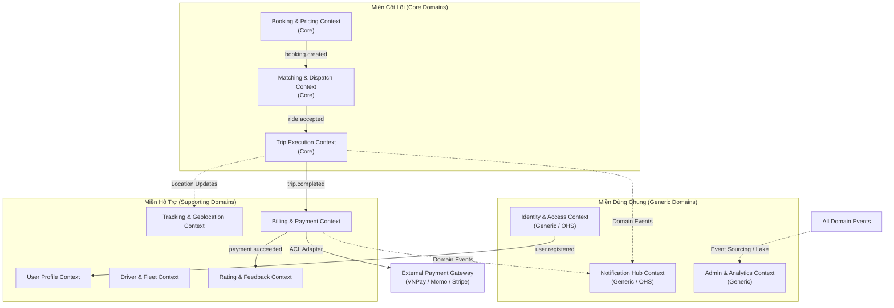

# BÁO CÁO THIẾT KẾ KIẾN TRÚC MICROSERVICES (BUỔI 4)
## HỆ THỐNG ĐẶT XE TRỰC TUYẾN (CAB SYSTEM)

- **Sinh viên thực hiện:** Võ Tất Thiện
- **Mã số sinh viên (MSSV):** 22652711
- **Học phần:** Lập trình Hướng Dịch vụ (LTHDV)
- **Phương pháp tiếp cận:** Domain-Driven Design (DDD) & Event-Driven Microservices Architecture
- **Mục tiêu:** Phân rã hệ thống lớn thành các Bounded Contexts (Domain con) độc lập, tự chủ về dữ liệu và có khả năng mở rộng, cô lập sự cố linh hoạt.

---

## 1. Phân tách Use Case theo miền nghiệp vụ

Bảng chuẩn hóa phân tách các Use Case từ hệ thống nguyên khối (Monolith) sang 11 Bounded Contexts theo phương pháp Domain-Driven Design:

| Bounded Context | Use Case liên quan | Năng lực nghiệp vụ | Khái niệm chính |
|---|---|---|---|
| **Identity & Access** | UC-01, UC-02, UC-03, UC-15, UC-23, UC-28, UC-31, UC-32 | Đăng ký, đăng nhập, quên mật khẩu, đổi mật khẩu, đăng xuất, cấp phát và thu hồi JWT Token, xác thực và phân quyền vai trò (RBAC). | Auth, Account, Credential, OTP, Session, Role, Permission, Token. |
| **User Profile** | UC-04, UC-14 | Quản lý thông tin hồ sơ cá nhân của khách hàng và tài xế (họ tên, SĐT, email liên hệ, ảnh đại diện, kiểm tra trạng thái kích hoạt tài khoản). | CustomerProfile, DriverProfile, ContactInfo, Avatar, VerificationStatus. |
| **Driver & Fleet** | UC-12, UC-13, UC-16, UC-24 | Đăng ký đối tác lái xe, khai báo phương tiện (Sedan/SUV/Van, biển số), xét duyệt/từ chối hồ sơ tài xế mới, quản lý ca làm việc (bật/tắt trạng thái Online/Offline). | Driver, Vehicle, License, VehicleType, ApprovalStatus, ShiftStatus. |
| **Booking & Pricing** | UC-05, UC-06, UC-10, UC-29 | Định vị địa chỉ đón/trả, ước tính cước phí chuyến đi theo khoảng cách và thời gian, áp dụng mã voucher giảm giá, khởi tạo yêu cầu đặt xe, cấu hình bảng giá cước. | Booking, Route, PickupLocation, DropoffLocation, FareEstimate, PricingConfig, PromoCode. |
| **Matching & Dispatch** | UC-17 | Quét tìm tài xế khả dụng quanh bán kính 5km, thuật toán chấm điểm xếp hạng ưu tiên, gửi lời mời nhận cuốc kèm đếm ngược 30 giây, khóa chống tranh chấp cuốc (`atomic lock`), xoay vòng cuốc khi từ chối hoặc quá giờ. | DispatchOrder, MatchCandidate, DispatchOffer, CountdownTimer, RetryCount, DispatchLock, NoDriverEvent. |
| **Trip Execution** | UC-08, UC-18, UC-21, UC-26 | Tiếp nhận chuyến đi, quản lý vòng đời chuyến (`accepted` $\rightarrow$ `driver_arrived` $\rightarrow$ `in_progress` $\rightarrow$ `completed`), xử lý chính sách hủy chuyến, can thiệp xử lý chuyến xe lỗi hoặc gặp sự cố trên đường. | Trip, TripState, PickupConfirmation, TripProgress, CancellationPolicy, IncidentReport. |
| **Tracking & Geolocation** | UC-07, UC-19, UC-25 | Thu nhận chuỗi tọa độ GPS định kỳ (5-10s) từ tài xế, phát sóng real-time qua WebSocket cho khách hàng và bản đồ điều hành tổng trạm, tính toán thời gian dự kiến đến (ETA). | LocationStream, GeoPoint, Speed, Bearing, LiveTrackingSession, ETA. |
| **Billing & Payment** | UC-09, UC-20, UC-27 | Tính toán cước phí thực tế dựa trên quãng đường và thời gian thực tế, tích hợp cổng thanh toán trực tuyến, xác nhận thu tiền mặt, tạo và xuất hóa đơn điện tử, đối soát giao dịch. | FareCalculation, Payment, Transaction, Invoice, PaymentMethod, PaymentGateway. |
| **Rating & Feedback** | UC-11, UC-22 | Tiếp nhận đánh giá sao (1-5 sao) và nhận xét góp ý của khách hàng sau chuyến đi, kiểm tra ràng buộc mỗi cuốc đánh giá 1 lần, tính toán cập nhật điểm rating trung bình cộng của tài xế. | Review, RatingScore, DriverReputation, FeedbackComment. |
| **Notification Hub** | UC-01, UC-06, UC-08, UC-09, UC-17, UC-18 | Phát thông báo đẩy in-app qua WebSocket (Socket.IO) theo thời gian thực (tài xế nhận cuốc, xe đến điểm đón), gửi email giao dịch tự động (chào mừng, hóa đơn thanh toán). | Notification, PushPayload, EmailTemplate, Recipient, DeliveryStatus, Channel. |
| **Admin & Analytics** | UC-30, UC-33 | Tổng hợp chỉ số KPI điều hành, báo cáo doanh thu theo mốc thời gian và loại xe, thống kê tỷ lệ hoàn thành và hủy chuyến, lưu vết bất biến nhật ký kiểm toán hệ thống (Audit Logs). | DashboardMetric, RevenueReport, DriverLeaderboard, AuditLog, EventStore. |

---

## 2. Ubiquitous Language (Ngôn ngữ phổ biến trong từng miền)

Xây dựng bộ từ điển thuật ngữ thống nhất giữa Đội ngũ Nghiệp vụ (Business Analyst/Product Owner) và Đội ngũ Kỹ thuật (Developers/Architects):

| Thuật ngữ | Ý nghĩa | Context |
|---|---|---|
| **Booking** | Yêu cầu đặt xe của khách hàng trước khi hệ thống điều phối tài xế. | Booking & Pricing |
| **Fare Estimate** | Cước phí dự kiến tính toán dựa trên khoảng cách định vị và bảng giá xe hiện hành. | Booking & Pricing |
| **Pricing Config** | Bảng quy tắc định giá gồm giá mở cửa, đơn giá mỗi km và đơn giá mỗi phút cho từng loại xe. | Booking & Pricing |
| **Promo Code** | Mã giảm giá ưu đãi áp dụng vào yêu cầu đặt xe để khấu trừ cước phí. | Booking & Pricing |
| **Account** | Bản ghi định danh duy nhất của người dùng quản lý thông tin đăng nhập và vai trò. | Identity & Access |
| **Credential** | Thông tin bí mật dùng để xác thực như mật khẩu băm Bcrypt, Refresh Token hoặc mã OTP. | Identity & Access |
| **RBAC** | Cơ chế phân quyền kiểm soát truy cập dựa trên vai trò (Customer, Driver, Operator, Admin). | Identity & Access |
| **Customer Profile** | Hồ sơ chứa thông tin cá nhân mở rộng, địa chỉ yêu thích và số liên lạc của khách hàng. | User Profile |
| **Driver Profile** | Hồ sơ mở rộng của tài xế gồm thông tin giấy phép lái xe, kinh nghiệm và trạng thái xét duyệt. | User Profile & Driver & Fleet |
| **Vehicle** | Phương tiện vận chuyển đã đăng ký với biển số, dòng xe, màu sắc và số ghế. | Driver & Fleet |
| **Shift Status** | Trạng thái ca trực của tài xế gồm Online (sẵn sàng đón khách), Busy (đang chở khách) và Offline (nghỉ). | Driver & Fleet |
| **Candidate Pool** | Tập hợp tài xế đang Online, đúng loại xe trong bán kính 5km tính từ điểm đón. | Matching & Dispatch |
| **Dispatch Offer** | Lời mời nhận cuốc gửi đến một tài xế cụ thể kèm khoảng thời gian đếm ngược 30 giây để phản hồi. | Matching & Dispatch |
| **Atomic Lock** | Cơ chế khóa giao dịch độc quyền đảm bảo chỉ một tài xế nhận thành công một cuốc xe duy nhất. | Matching & Dispatch |
| **Trip** | Thực thể đại diện cho chuyến đi chính thức sau khi tài xế đã chấp nhận lời mời điều phối. | Trip Execution |
| **Trip Lifecycle** | Vòng đời trạng thái của chuyến xe: `accepted` $\rightarrow$ `driver_arrived` $\rightarrow$ `in_progress` $\rightarrow$ `completed`. | Trip Execution |
| **Cancellation Policy** | Quy tắc xử lý hủy chuyến gồm điều kiện hủy miễn phí và ghi nhận lý do vi phạm. | Trip Execution |
| **Location Stream** | Dòng dữ liệu tọa độ GPS liên tục (kinh độ, vĩ độ, tốc độ, góc hướng) phát từ thiết bị tài xế. | Tracking & Geolocation |
| **ETA** | Thời gian ước tính phương tiện di chuyển đến điểm đón khách hoặc điểm trả khách. | Tracking & Geolocation |
| **Invoice** | Hóa đơn điện tử chi tiết bao gồm cước thực tế, phụ phí, tiền giảm trừ, thuế VAT và số tiền phải trả. | Billing & Payment |
| **Payment Transaction** | Giao dịch tài chính ghi nhận việc thanh toán qua Tiền mặt hoặc Cổng thanh toán điện tử. | Billing & Payment |
| **Driver Rating** | Điểm đánh giá chất lượng phục vụ trung bình cộng (1-5 sao) tích lũy của tài xế từ khách hàng. | Rating & Feedback |
| **Audit Log** | Bản ghi nhật ký kiểm toán bất biến (chỉ thêm mới) ghi nhận các thao tác quản trị quan trọng. | Admin & Analytics |

---

## 3. Bounded Context và Context Map

### 3.1. Phân loại các Miền nghiệp vụ (Domain Classification)
1. **Core Domains (Miền cốt lõi):** Các miền tạo nên giá trị kinh doanh và sự khác biệt cạnh tranh của nền tảng:
   - `Matching & Dispatch`: Thuật toán quét và gán tài xế tối ưu trong 5km.
   - `Trip Execution`: Quản lý quy trình vận chuyển hành khách an toàn, chính xác.
   - `Booking & Pricing`: Định giá lộ trình minh bạch, linh hoạt.
2. **Supporting Domains (Miền hỗ trợ):** Các miền cần thiết để phục vụ cho các miền cốt lõi:
   - `Driver & Fleet`, `Tracking & Geolocation`, `Billing & Payment`, `Rating & Feedback`, `User Profile`.
3. **Generic Domains (Miền dùng chung):** Các miền tiêu chuẩn hóa có thể tái sử dụng hoặc tích hợp dịch vụ ngoài:
   - `Identity & Access`, `Notification Hub`, `Admin & Analytics`.

### 3.2. Sơ đồ Context Map (Mermaid Architecture)

### 3.3. Các mối quan hệ tích hợp (Integration Patterns)
- **Customer / Supplier (C/S):** `Booking & Pricing` (Customer) yêu cầu `Matching & Dispatch` (Supplier) tìm xe; `Dispatch` chỉ đáp ứng khi có yêu cầu hợp lệ.
- **Upstream / Downstream (U/D):** `Trip Execution` (Upstream) phát sự kiện hoàn tất chuyến xe; `Billing & Payment` (Downstream) nhận sự kiện để sinh hóa đơn cước phí.
- **Anti-Corruption Layer (ACL):** `Billing & Payment` thiết lập tầng chuyển đổi ACL để bao bọc các thư viện SDK thanh toán bên thứ ba, bảo vệ mô hình dữ liệu nội bộ không bị phụ thuộc vào API nhà cung cấp ngoài.
- **Open Host Service / Published Language (OHS/PL):** `Notification Hub` và `Identity & Access` định nghĩa giao thức sự kiện chuẩn để tất cả các domain con gửi thông báo hoặc xác thực token mà không cần biết cấu trúc bên trong của nhau.

---

## 4. Aggregate và invariant nghiệp vụ

| Aggregate | Aggregate Root | Thành phần chính | Invariant (Ràng buộc bất biến) | Use Case liên quan |
|---|---|---|---|---|
| **Booking Aggregate** | `Booking` | PickupLocation, DropoffLocation, VehicleType, PaymentMethod, PricingSnapshot, VoucherCode | Booking chỉ được xác nhận khi thông tin điểm đón/trả hợp lệ và phương thức thanh toán thỏa điều kiện; giá cước ước tính không được nhỏ hơn giá mở cửa (`baseFare`). | UC-04, UC-05, UC-06, UC-10 |
| **Account Aggregate** | `UserAccount` | AccountID, Email, Phone, PasswordHash, Role, Status, Credentials, Sessions | Email và Số điện thoại là duy nhất trên toàn hệ thống; mật khẩu lưu dưới dạng băm bcrypt an toàn; tài khoản bị khóa không thể đăng nhập hoặc sinh phiên làm việc mới. | UC-01, UC-02, UC-03, UC-15, UC-23, UC-28, UC-31, UC-32 |
| **User Profile Aggregate** | `UserProfile` | ProfileID, UserID, FullName, ContactInfo, AddressBook, AvatarUrl, KYCStatus | Profile bắt buộc gắn liền với UserID hợp lệ; thông tin số điện thoại đúng định dạng chuẩn 10 chữ số. | UC-04, UC-14 |
| **Vehicle & Fleet Aggregate** | `Vehicle` | VehicleID, DriverID, PlateNumber, VehicleType, Seats, RegistrationDocs, Status | Biển số xe là duy nhất; hạng xe (Sedan/SUV/Van) phải khớp số chỗ ngồi; chỉ xe có trạng thái Approved mới được đưa vào ca trực nhận khách. | UC-12, UC-13, UC-16, UC-24 |
| **Dispatch Order Aggregate** | `DispatchOrder` | DispatchID, BookingID, CandidateList, CurrentOffer, RetryCount, DispatchStatus, LockTimestamp | Mỗi lượt điều phối chỉ gửi lời mời đến 1 tài xế tại một thời điểm; sau 30 giây không phản hồi tự động chuyển tài xế kế tiếp; số lần thử lại tối đa là 5 lần. | UC-17 |
| **Trip Aggregate** | `Trip` | TripID, BookingID, DriverID, CustomerID, VehicleSnapshot, RouteSnapshot, State, Timeline | Trạng thái chuyến đi chuyển đổi tuần tự không nhảy cóc (`accepted` $\rightarrow$ `driver_arrived` $\rightarrow$ `in_progress` $\rightarrow$ `completed`); tuyệt đối không cho phép hủy khi đang `in_progress`. | UC-08, UC-18, UC-21, UC-26 |
| **Payment Aggregate** | `Payment` | PaymentID, TripID, CustomerID, DriverID, TotalAmount, BaseAmount, DiscountAmount, Method, Status, GatewayTransactionID | Tổng số tiền thanh toán không được âm; một chuyến đi chỉ có 1 thanh toán hoàn tất thành công; nếu thanh toán điện tử thất bại phải cho phép chuyển sang tiền mặt. | UC-09, UC-20, UC-27 |
| **Rating Aggregate** | `RatingReview` | ReviewID, TripID, CustomerID, DriverID, Score (1-5), Comment, CreatedAt | Điểm đánh giá phải là số nguyên từ 1 đến 5; mỗi chuyến đi hoàn thành chỉ được phép đánh giá đúng 1 lần duy nhất (`Unique TripID`). | UC-11, UC-22 |

---

## 5. Domain Event phát sinh từ Use Case

Các sự kiện miền là xương sống kết nối các Bounded Contexts theo cơ chế vũ đạo bất đồng bộ (**Asynchronous Event-Driven Choreography**):

| Domain Event | Use Case nguồn | Producer Context | Consumer Context | Mục đích |
|---|---|---|---|---|
| `user.registered` | UC-01 | Identity & Access | User Profile, Notification Hub | Khởi tạo hồ sơ người dùng ban đầu sau khi đăng ký và gửi email chào mừng kích hoạt tài khoản. |
| `driver.application_submitted` | UC-13 | Driver & Fleet | Admin & Analytics, Notification Hub | Đưa hồ sơ tài xế vào danh sách chờ duyệt cho nhân viên vận hành và gửi thông báo đã nộp hồ sơ. |
| `driver.approved` | UC-24 | Driver & Fleet | Identity & Access, Notification Hub | Kích hoạt quyền bật trực tuyến Online cho tài xế và gửi email thông báo kết quả phê duyệt thành công. |
| `booking.created` | UC-06 | Booking & Pricing | Matching & Dispatch, Notification Hub | Kích hoạt tiến trình quét tìm tài xế khả dụng quanh bán kính 5km và hiển thị màn hình tìm xe cho khách. |
| `dispatch.offer_sent` | UC-17 | Matching & Dispatch | Notification Hub | Bắn popup mời nhận cuốc kèm đồng hồ đếm ngược 30 giây tới ứng dụng tài xế ưu tiên qua WebSocket. |
| `ride.accepted` | UC-17 | Matching & Dispatch | Trip Execution, Driver & Fleet, Notification Hub, Tracking | Khởi tạo thực thể chuyến đi chính thức (Trip), chuyển trạng thái tài xế sang Busy, thông báo thông tin xe cho khách. |
| `dispatch.exhausted_no_driver` | UC-17 | Matching & Dispatch | Booking & Pricing, Notification Hub | Cập nhật trạng thái booking sang `no_driver` và gửi thông báo xin lỗi khách hàng khi không tìm được tài xế sau 5 lượt thử. |
| `trip.driver_arrived` | UC-18 | Trip Execution | Notification Hub | Phát chuông thông báo cho khách hàng biết tài xế đã đến điểm hẹn đón xe. |
| `trip.started` | UC-18 | Trip Execution | Tracking & Geolocation, Notification Hub | Đánh dấu thời điểm bắt đầu di chuyển, kích hoạt tiến trình ghi vết lộ trình GPS. |
| `trip.completed` | UC-18 | Trip Execution | Billing & Payment, Driver & Fleet, Notification Hub | Kích hoạt tính toán cước phí thực tế chuyến đi, chuyển tài xế về trạng thái Available sẵn sàng đón khách mới. |
| `trip.cancelled` | UC-08, UC-21 | Trip Execution | Driver & Fleet, Notification Hub, Admin & Analytics | Giải phóng tài xế về trạng thái Available (hoặc Offline nếu xe hỏng), thông báo lý do hủy cho các bên liên quan. |
| `payment.succeeded` | UC-09, UC-20 | Billing & Payment | Rating & Feedback, Notification Hub, Admin & Analytics | Mở quyền đánh giá sao cho khách hàng, gửi hóa đơn điện tử qua email, cập nhật báo cáo doanh thu hệ thống. |
| `rating.submitted` | UC-11 | Rating & Feedback | Driver & Fleet, Admin & Analytics | Tính toán lại điểm đánh giá uy tín trung bình cộng của tài xế và cập nhật bảng xếp hạng thi đua. |

---

## 6. Ánh xạ Context sang Microservice

| Bounded Context | Service triển khai | Dữ liệu sở hữu | Giao tiếp chính |
|---|---|---|---|
| **Identity & Access** | `auth-service` | `auth_db` | REST qua Gateway, Event Bus |
| **User Profile** | `user-service` | `user_db` | REST qua Gateway, gRPC nội bộ |
| **Driver & Fleet** | `driver-service` | `driver_db` | REST qua Gateway, gRPC, Event Bus |
| **Booking & Pricing** | `booking-service` | `booking_db` | REST qua Gateway, Event Bus |
| **Matching & Dispatch** | `dispatch-service` | `dispatch_db` + Redis Cache | gRPC nội bộ, Event Bus (Kafka/RabbitMQ) |
| **Trip Execution** | `trip-service` | `trip_db` | REST qua Gateway, Event Bus |
| **Tracking & Geolocation** | `tracking-service` | `tracking_db` + Redis Cache | WebSocket (Socket.IO), gRPC |
| **Billing & Payment** | `payment-service` | `payment_db` | REST qua Gateway, Webhooks, Event Bus |
| **Rating & Feedback** | `rating-service` | `rating_db` | REST qua Gateway, Event Bus |
| **Notification Hub** | `notification-service` | `notification_db` | Event Consumer, WebSocket, SMTP Provider |
| **Admin & Analytics** | `analytics-service` | `analytics_db` | Event Consumer, REST qua Admin Portal |

---

## 7. Mô tả Service

| Bounded Context | Service triển khai | Trách nhiệm chính | Dữ liệu sở hữu |
|---|---|---|---|
| **Identity & Access** | `auth-service` | Xử lý đăng ký, đăng nhập, xác thực mật khẩu, cấp phát/thu hồi JWT & Refresh Token, đổi mật khẩu, phân quyền RBAC. | `auth_db` |
| **User Profile** | `user-service` | Quản lý thông tin hồ sơ người dùng khách hàng và đối tác, lưu trữ thông tin liên hệ, ảnh đại diện, kiểm tra tính hợp lệ tài khoản. | `user_db` |
| **Driver & Fleet** | `driver-service` | Quản lý hồ sơ đối tác tài xế, phương tiện xe (Sedan/SUV/Van, biển số), quy trình xét duyệt/từ chối hồ sơ mới, quản lý ca làm việc (bật/tắt Online/Offline). | `driver_db` |
| **Booking & Pricing** | `booking-service` | Tiếp nhận yêu cầu tìm địa chỉ, tính cước ước tính theo hạng xe, áp dụng mã voucher giảm giá, khởi tạo đơn đặt xe ban đầu, cấu hình bảng giá biểu phí. | `booking_db` |
| **Matching & Dispatch** | `dispatch-service` | Quét tìm tài xế phù hợp quanh bán kính 5km, thuật toán xếp hạng ưu tiên, gửi lời mời 30 giây kèm khóa tranh chấp (`atomic lock`), xoay vòng tài xế khi từ chối. | `dispatch_db` + Redis |
| **Trip Execution** | `trip-service` | Quản lý trạng thái vòng đời chuyến đi thực tế (`accepted` $\rightarrow$ `driver_arrived` $\rightarrow$ `in_progress` $\rightarrow$ `completed`), xử lý chính sách hủy chuyến, can thiệp sự cố chuyến lỗi. | `trip_db` |
| **Tracking & Geolocation** | `tracking-service` | Thu thập xung tọa độ GPS thời gian thực (5-10s) từ tài xế, phát sóng trực tiếp qua WebSocket cho khách hàng và bộ phận điều hành theo dõi, tính ETA. | `tracking_db` + Redis |
| **Billing & Payment** | `payment-service` | Tính toán cước phí thực tế dựa trên quãng đường và thời gian thực tế, tích hợp cổng thanh toán trực tuyến, tài xế xác nhận thu tiền mặt, xuất biên lai hóa đơn điện tử. | `payment_db` |
| **Rating & Feedback** | `rating-service` | Tiếp nhận đánh giá sao (1-5) và nhận xét góp ý của khách sau khi cuốc hoàn tất, ràng buộc 1 cuốc 1 đánh giá, tính toán lại điểm rating trung bình của tài xế. | `rating_db` |
| **Notification Hub** | `notification-service` | Phát thông báo đẩy in-app qua Socket.IO theo thời gian thực (tài xế nhận cuốc, xe đến điểm đón), gửi email giao dịch tự động (chúc mừng tài khoản, hóa đơn thanh toán). | `notification_db` |
| **Admin & Analytics** | `analytics-service` | Tổng hợp báo cáo KPI vận hành, báo cáo doanh thu theo mốc thời gian và loại xe, phân tích tỷ lệ hoàn thành/hủy chuyến, lưu trữ bất biến nhật ký kiểm toán hệ thống. | `analytics_db` |

---

## 8. Mô hình dữ liệu cho Service (Database per Service)

Mỗi Microservice sở hữu hoàn toàn cơ sở dữ liệu riêng, đảm bảo **Tính tự chủ (Autonomy)** và **Cô lập sự cố (Fault Isolation)** tuyệt đối:

### 8.1. Auth Service (`auth_db`)
- **Collection `accounts`:**
  - `id` (UUID, PK): Định danh tài khoản
  - `email` (String, Unique): Email đăng nhập
  - `phone` (String, Unique): Số điện thoại đăng nhập
  - `password_hash` (String): Mật khẩu băm Bcrypt
  - `role` (Enum: Customer | Driver | Operator | Admin): Quyền hạn
  - `is_active` (Boolean): Trạng thái hoạt động
  - `refresh_token` (String): Token làm mới phiên
  - `created_at` (Timestamp): Ngày tạo

### 8.2. User Profile Service (`user_db`)
- **Collection `customer_profiles`:**
  - `id` (UUID, PK): ID hồ sơ
  - `user_id` (UUID, Unique): Liên kết logic tới Auth Service
  - `full_name` (String): Họ tên hiển thị
  - `avatar_url` (String): Đường dẫn ảnh đại diện
  - `saved_addresses` (Array[Object]): Địa chỉ lưu sẵn
  - `emergency_phone` (String): Số điện thoại khẩn cấp

### 8.3. Driver & Fleet Service (`driver_db`)
- **Collection `driver_profiles`:**
  - `id` (UUID, PK): ID hồ sơ tài xế
  - `user_id` (UUID, Unique): Liên kết Auth
  - `license_number` (String, Unique): Số GPLX
  - `license_class` (Enum: B1/B2/C/D): Hạng bằng
  - `shift_status` (Enum: Online | Busy | Offline): Trạng thái làm việc
  - `is_approved` (Boolean): Trạng thái duyệt
  - `approved_at` (Timestamp): Thời điểm duyệt
  - `approved_by` (UUID): ID nhân viên duyệt
- **Collection `vehicles`:**
  - `id` (UUID, PK): ID xe
  - `driver_id` (UUID): ID tài xế sở hữu
  - `plate_number` (String, Unique): Biển số xe
  - `vehicle_type` (Enum: Sedan | SUV | Van): Hạng xe
  - `brand_model` (String): Hãng và dòng xe
  - `color` (String): Màu sắc
  - `is_active` (Boolean): Đang sử dụng

### 8.4. Booking & Pricing Service (`booking_db`)
- **Collection `bookings`:**
  - `id` (UUID, PK): Mã đặt xe
  - `customer_id` (UUID): Khách hàng đặt
  - `vehicle_type` (Enum: Sedan | SUV | Van): Loại xe yêu cầu
  - `pickup_address` (String), `pickup_location` (GeoPoint [lng, lat], 2dsphere index)
  - `dropoff_address` (String), `dropoff_location` (GeoPoint [lng, lat], 2dsphere index)
  - `estimated_distance` (Double), `estimated_duration` (Integer)
  - `estimated_fare` (Double): Cước ước tính snapshot
  - `booking_status` (Enum: Draft | Searching | Assigned | Cancelled | Expired)
  - `created_at` (Timestamp)
- **Collection `pricing_configs`:**
  - `vehicle_type` (Enum, PK): Hạng xe
  - `base_fare` (Double): Giá mở cửa
  - `price_per_km` (Double): Giá mỗi km
  - `price_per_min` (Double): Giá mỗi phút

### 8.5. Matching & Dispatch Service (`dispatch_db` + Redis)
- **Collection `dispatch_jobs`:**
  - `id` (UUID, PK): Mã tiến trình điều phối
  - `booking_id` (UUID, Unique): Mã booking nguồn
  - `candidate_driver_ids` (Array[UUID]): Danh sách tài xế ưu tiên
  - `current_offered_driver_id` (UUID): Tài xế đang được mời
  - `retry_count` (Integer, Max: 5): Số lần thử lại
  - `dispatch_status` (Enum: Scanning | Offering | Accepted | NoDriver)
  - `offer_timeout_at` (Timestamp): Hạn chót 30s
- **Redis In-Memory Keys:**
  - `geo:drivers:available` (Redis Geospatial Index): Lưu tọa độ để quét bán kính 5km
  - `lock:offer:<dispatch_id>`: Khóa độc quyền chống race condition nhận cuốc

### 8.6. Trip Execution Service (`trip_db`)
- **Collection `trips`:**
  - `id` (UUID, PK): Mã chuyến đi chính thức
  - `booking_id` (UUID, Unique): Booking nguồn
  - `customer_id` (UUID), `driver_id` (UUID)
  - `vehicle_snapshot` (Object): Bản chụp thông tin xe lúc nhận
  - `trip_state` (Enum: Accepted | DriverArrived | InProgress | Completed | Cancelled)
  - `actual_distance` (Double), `actual_duration` (Integer)
  - `accepted_at`, `arrived_at`, `started_at`, `completed_at`, `cancelled_at`

### 8.7. Tracking & Geolocation Service (`tracking_db` + Redis)
- **Collection `location_history`:**
  - `id` (UUID, PK): ID tọa độ
  - `trip_id` (UUID): Chuyến đi liên quan
  - `driver_id` (UUID): Tài xế phát sóng
  - `coordinate` (GeoPoint [lng, lat], 2dsphere)
  - `speed` (Double), `bearing` (Double)
  - `recorded_at` (Timestamp, B-Tree)

### 8.8. Billing & Payment Service (`payment_db`)
- **Collection `payments`:**
  - `id` (UUID, PK): Mã thanh toán
  - `trip_id` (UUID, Unique): Mã chuyến đi
  - `customer_id` (UUID), `driver_id` (UUID)
  - `total_amount` (Double, Min: 0)
  - `payment_method` (Enum: Cash | E-Payment)
  - `payment_status` (Enum: Pending | Completed | Failed | Refunded)
  - `gateway_transaction_id` (String): Mã giao dịch cổng thanh toán
  - `paid_at` (Timestamp)

### 8.9. Rating & Feedback Service (`rating_db`)
- **Collection `rating_reviews`:**
  - `id` (UUID, PK): Mã đánh giá
  - `trip_id` (UUID, Unique): Chuyến đi (mỗi chuyến 1 đánh giá)
  - `customer_id` (UUID), `driver_id` (UUID)
  - `score` (Integer: 1 - 5)
  - `comment` (String, Max 500)
  - `created_at` (Timestamp)

### 8.10. Notification Hub (`notification_db`)
- **Collection `notifications`:**
  - `id` (UUID, PK): Mã thông báo
  - `user_id` (UUID): Người nhận
  - `type` (Enum: RideUpdate | Payment | Promo | System)
  - `title` (String), `message` (String)
  - `is_read` (Boolean, Default: False)
  - `created_at` (Timestamp)

### 8.11. Admin & Analytics Service (`analytics_db`)
- **Collection `audit_logs` (Append-Only):**
  - `id` (UUID, PK): ID nhật ký kiểm toán
  - `user_id` (UUID): Người thực hiện
  - `action` (String): Hành động (APPROVE_DRIVER, UPDATE_PRICING, BLOCK_USER)
  - `entity` (String), `entity_id` (UUID)
  - `old_data` (JSON), `new_data` (JSON)
  - `ip_address` (String)
  - `created_at` (Timestamp, Bất biến không sửa/xóa)

---

