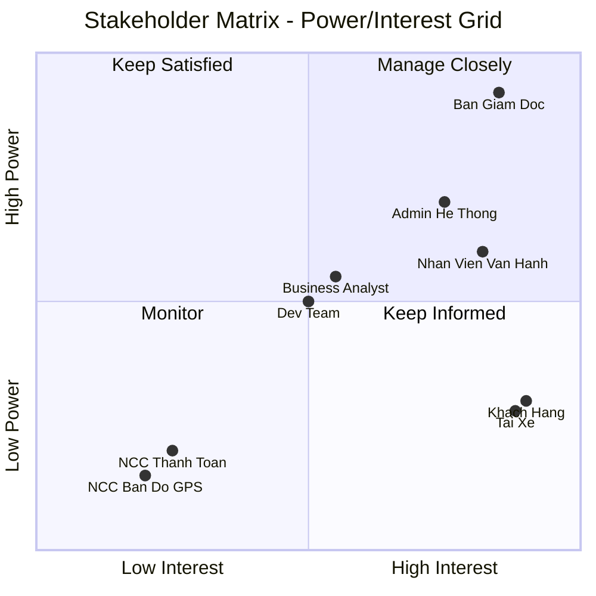
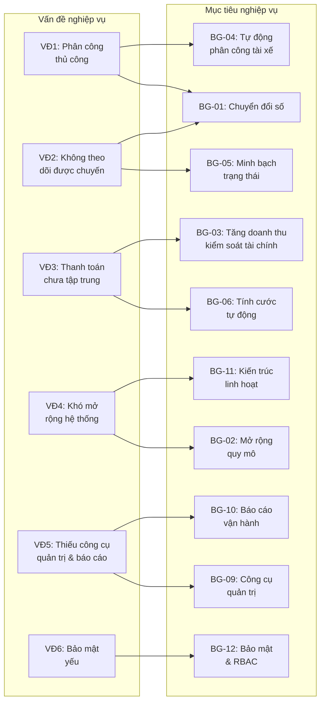
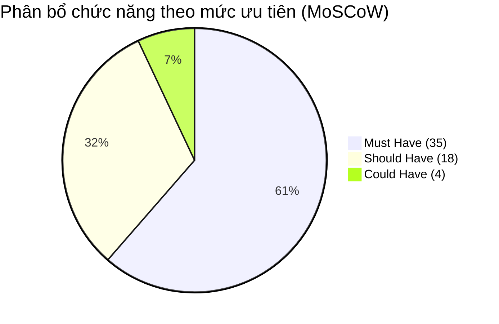
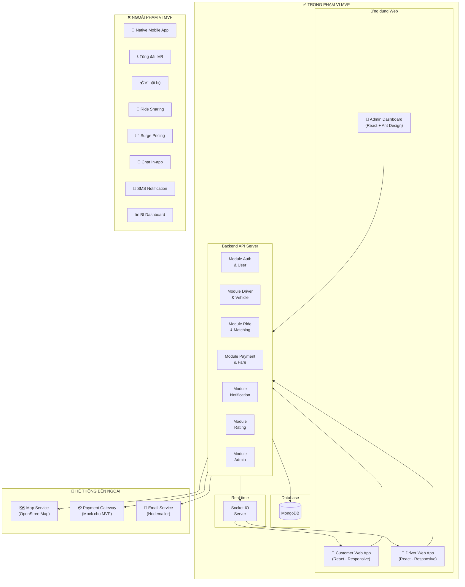

# Software Requirements Specification (SRS)

## CAB System – Nền tảng đặt xe trực tuyến

**Document Version:** 2.0  
**Date:** 2026-08-20  
**Author:** Vo Tat Thien – 22652711  
**Project Timeline:** 7 tuần  
**Client:** Công ty ABC  

---

## Mục lục

1. [Giai đoạn 1 – Phân tích yêu cầu sơ khởi](#giai-đoạn-1--phân-tích-yêu-cầu-sơ-khởi)
   - 1.1 [Business Context (Ngữ cảnh nghiệp vụ)](#11-business-context-ngữ-cảnh-nghiệp-vụ)
   - 1.2 [Business Problem (Vấn đề nghiệp vụ)](#12-business-problem-vấn-đề-nghiệp-vụ)
   - 1.3 [Stakeholders (Các bên liên quan)](#13-stakeholders-các-bên-liên-quan)
   - 1.4 [Business Objectives (Mục tiêu nghiệp vụ)](#14-business-objectives-mục-tiêu-nghiệp-vụ)
   - 1.5 [Phạm vi hệ thống (Scope)](#15-phạm-vi-hệ-thống-scope)
   - 1.6 [Các điểm chưa rõ cần xác nhận](#16-các-điểm-chưa-rõ-cần-xác-nhận-với-khách-hàng)

---

## Giai đoạn 1 – Phân tích yêu cầu sơ khởi

### 1.1 Business Context (Ngữ cảnh nghiệp vụ)

#### 1.1.1 Giới thiệu doanh nghiệp

Công ty ABC là một doanh nghiệp hoạt động trong lĩnh vực **cung cấp dịch vụ đặt xe trực tuyến**. Doanh nghiệp đã có sẵn:

- **Tổng đài điện thoại** để khách hàng gọi đặt xe.
- **Một ứng dụng đơn giản** cho phép khách hàng yêu cầu xe.
- **Đội ngũ tài xế** đang hoạt động.
- **Bộ phận vận hành** quản lý và điều phối xe.

#### 1.1.2 Hiện trạng hệ thống (AS-IS)

Quy trình vận hành hiện tại:

```
Khách hàng                  Tổng đài / App đơn giản             Bộ phận vận hành             Tài xế
    │                               │                                │                        │
    ├── Gọi điện / Dùng app ──────▶│                                │                        │
    │                               ├── Chuyển yêu cầu ───────────▶│                        │
    │                               │                                ├── THỦ CÔNG: Tìm và    │
    │                               │                                │   phân công tài xế ──▶│
    │                               │                                │                        ├── Nhận chuyến
    │                               │                                │                        │   (qua điện thoại)
    │◀──────────────────────────────│◀───────────────────────────────│◀───────────────────────│
    │     Thông báo tài xế đến     │                                │                        │
```

**Đặc điểm chính của hệ thống hiện tại:**
- Việc tiếp nhận yêu cầu qua **2 kênh**: tổng đài và app đơn giản.
- Phân công tài xế thực hiện **thủ công** bởi nhân viên vận hành.
- Thông tin chuyến đi **không được lưu trữ tập trung**.
- Thanh toán chủ yếu bằng **tiền mặt**, chưa quản lý tập trung.
- Không có công cụ **theo dõi chuyến đi** cho khách hàng.
- Dữ liệu vận hành **rời rạc**, khó báo cáo và phân tích.

#### 1.1.3 Bối cảnh thị trường

- Nhu cầu đặt xe trực tuyến ngày càng tăng.
- Khách hàng kỳ vọng trải nghiệm **nhanh, minh bạch, tiện lợi** (theo dõi real-time, thanh toán điện tử).
- Cạnh tranh từ các nền tảng đặt xe lớn đòi hỏi doanh nghiệp phải **số hóa và tự động hóa** quy trình.
- Doanh nghiệp muốn **mở rộng quy mô** phục vụ số lượng lớn khách hàng và tài xế.

---

### 1.2 Business Problem (Vấn đề nghiệp vụ)

Từ yêu cầu của khách hàng, xác định được **6 nhóm vấn đề chính** mà hệ thống hiện tại đang gặp phải:

#### Vấn đề 1: Phân công tài xế thủ công – Chậm, không hiệu quả

| Khía cạnh | Mô tả |
|-----------|-------|
| **Hiện trạng** | Nhân viên vận hành phải **tự tìm và gọi điện** cho tài xế để phân công chuyến |
| **Hậu quả** | Thời gian chờ của khách hàng **kéo dài**, phụ thuộc vào kinh nghiệm và tốc độ của nhân viên vận hành |
| **Tác động** | Khách hàng **không hài lòng**, tài xế gần có thể bị bỏ qua, doanh nghiệp **mất cơ hội doanh thu** |
| **Kỳ vọng** | Hệ thống **tự động tìm tài xế phù hợp** dựa trên vị trí, trạng thái và tiêu chí vận hành |

#### Vấn đề 2: Khách hàng không theo dõi được chuyến đi

| Khía cạnh | Mô tả |
|-----------|-------|
| **Hiện trạng** | Sau khi đặt xe, khách hàng **không biết** tài xế ở đâu, bao lâu sẽ đến, chuyến đi đang ở trạng thái nào |
| **Hậu quả** | Khách hàng **lo lắng, gọi lại tổng đài** liên tục để hỏi, tạo thêm tải cho bộ phận vận hành |
| **Tác động** | **Trải nghiệm khách hàng kém**, tốn chi phí nhân sự tổng đài |
| **Kỳ vọng** | Khách hàng có thể **theo dõi real-time** vị trí tài xế, biết trạng thái chuyến đi qua ứng dụng |

#### Vấn đề 3: Thanh toán chưa quản lý tập trung

| Khía cạnh | Mô tả |
|-----------|-------|
| **Hiện trạng** | Thanh toán chủ yếu bằng tiền mặt, **không có hệ thống ghi nhận tập trung** |
| **Hậu quả** | Khó kiểm soát doanh thu, **không đối soát** được giữa tài xế và công ty, khách hàng thiếu hóa đơn điện tử |
| **Tác động** | **Thất thoát doanh thu**, khó kiểm toán, không đáp ứng nhu cầu thanh toán điện tử |
| **Kỳ vọng** | Hỗ trợ **tiền mặt + thanh toán điện tử**, tích hợp cổng thanh toán bên ngoài, **không lưu thông tin nhạy cảm** |

#### Vấn đề 4: Khó mở rộng hệ thống

| Khía cạnh | Mô tả |
|-----------|-------|
| **Hiện trạng** | Hệ thống hiện tại **không có kiến trúc rõ ràng**, mọi thứ phụ thuộc vào quy trình thủ công |
| **Hậu quả** | Khi số lượng khách hàng/tài xế tăng, **bộ phận vận hành quá tải**, không thêm được tính năng mới |
| **Tác động** | **Không thể cạnh tranh** với các nền tảng lớn, giới hạn tăng trưởng doanh nghiệp |
| **Kỳ vọng** | Kiến trúc **linh hoạt, mở rộng độc lập** từng thành phần, triển khai tính năng mới **không ảnh hưởng** hệ thống đang chạy |

#### Vấn đề 5: Thiếu công cụ quản trị và báo cáo

| Khía cạnh | Mô tả |
|-----------|-------|
| **Hiện trạng** | Bộ phận vận hành **không có giao diện quản trị** tập trung, dữ liệu rời rạc |
| **Hậu quả** | Không nắm được **số liệu vận hành** (chuyến/ngày, doanh thu, tỷ lệ hủy), khó ra quyết định kinh doanh |
| **Tác động** | Ban lãnh đạo **thiếu dữ liệu** để đánh giá hiệu quả hoạt động và lập chiến lược |
| **Kỳ vọng** | Dashboard quản trị với **báo cáo**: số chuyến, doanh thu, tỷ lệ hoàn thành/hủy, hiệu quả tài xế |

#### Vấn đề 6: Bảo mật và kiểm soát truy cập yếu

| Khía cạnh | Mô tả |
|-----------|-------|
| **Hiện trạng** | Chưa có cơ chế **xác thực, phân quyền** rõ ràng, không ghi log các thao tác quan trọng |
| **Hậu quả** | **Rủi ro bảo mật** dữ liệu cá nhân, thông tin vị trí, giao dịch; không truy vết được khi có sự cố |
| **Tác động** | **Vi phạm quy định** bảo vệ dữ liệu, mất niềm tin khách hàng |
| **Kỳ vọng** | Xác thực người dùng, **phân quyền theo vai trò**, bảo vệ dữ liệu nhạy cảm, **audit log** các thao tác quan trọng |

---

### 1.3 Stakeholders (Các bên liên quan)

#### 1.3.1 Stakeholders Table

| # | Stakeholder | Vai trò & Trách nhiệm trong hệ thống | Mức độ quan trọng |
|---|------------|--------------------------------------|-------------------|
| 1 | **Ban giám đốc (Board of Directors)** | • Phê duyệt dự án và ngân sách đầu tư xây dựng hệ thống CAB<br>• Ra quyết định chiến lược về mô hình kinh doanh, chính sách giá<br>• Theo dõi báo cáo doanh thu, số lượng chuyến, tỷ lệ hoàn thành<br>• Đánh giá hiệu quả vận hành và định hướng mở rộng | 🔴 **Rất cao** – Sponsor dự án, quyết định sống còn của hệ thống |
| 2 | **Khách hàng (Customer)** | • Đăng ký tài khoản, đăng nhập, cập nhật thông tin cá nhân<br>• Nhập điểm đón và điểm đến, lựa chọn loại xe<br>• Gửi yêu cầu đặt xe và theo dõi trạng thái chuyến đi real-time<br>• Xem thông tin tài xế được phân công, thời gian dự kiến đến<br>• Thanh toán bằng tiền mặt hoặc thanh toán điện tử<br>• Xem lịch sử chuyến đi và số tiền đã thanh toán<br>• Đánh giá tài xế (1–5 sao) và viết nhận xét sau chuyến | 🔴 **Rất cao** – Người dùng chính, nguồn doanh thu trực tiếp |
| 3 | **Tài xế (Driver)** | • Đăng ký tài khoản hoặc được nhân viên vận hành tạo tài khoản<br>• Cập nhật hồ sơ cá nhân, thông tin phương tiện (biển số, loại xe, màu sắc)<br>• Bật/tắt trạng thái sẵn sàng nhận chuyến (online/offline)<br>• Nhận thông báo yêu cầu chuyến mới và chấp nhận hoặc từ chối<br>• Cập nhật trạng thái chuyến: đã đến điểm đón → đã đón khách → đang di chuyển → hoàn thành<br>• Cập nhật vị trí GPS liên tục để hệ thống tìm tài xế gần khách hàng<br>• Xem lịch sử chuyến đi và thu nhập | 🔴 **Rất cao** – Người thực hiện dịch vụ, quyết định chất lượng |
| 4 | **Nhân viên vận hành (Operator)** | • Quản lý danh sách khách hàng: xem, tìm kiếm, vô hiệu hóa tài khoản<br>• Quản lý tài xế: duyệt hồ sơ, kiểm tra trạng thái, xem vị trí<br>• Quản lý phương tiện: duyệt thông tin xe, kiểm tra tình trạng<br>• Giám sát chuyến đi đang diễn ra, hỗ trợ xử lý chuyến bị lỗi<br>• Tra cứu lịch sử giao dịch thanh toán<br>• Thực hiện các thao tác vận hành hàng ngày (không bao gồm thao tác nhạy cảm) | 🟠 **Cao** – Vận hành hệ thống hàng ngày |
| 5 | **Quản trị viên hệ thống (Admin)** | • Toàn quyền quản trị: quản lý người dùng, phân quyền, cấu hình hệ thống<br>• Xem báo cáo tổng hợp: số chuyến, doanh thu, tỷ lệ hoàn thành/hủy, hiệu quả tài xế<br>• Cấu hình chính sách giá, bán kính tìm tài xế, thời gian phản hồi<br>• Quản lý các thao tác nhạy cảm mà Operator không có quyền | 🟠 **Cao** – Kiểm soát toàn bộ hệ thống |
| 6 | **Business Analyst** | • Phân tích và làm rõ yêu cầu khách hàng với các bên liên quan<br>• Xác định phạm vi, tác nhân, quy trình nghiệp vụ<br>• Viết tài liệu SRS, use case, business rules<br>• Làm rõ các điểm chưa chốt trước khi chuyển cho Dev Team | 🟡 **Trung bình** – Cầu nối giữa doanh nghiệp và kỹ thuật |
| 7 | **Đội ngũ phát triển (Dev Team)** | • Thiết kế kiến trúc hệ thống đảm bảo mở rộng và bảo trì<br>• Phát triển backend API, frontend ứng dụng, tích hợp bên thứ 3<br>• Kiểm thử chức năng, hiệu năng, bảo mật<br>• Triển khai và bàn giao sản phẩm | 🟡 **Trung bình** – Xây dựng sản phẩm theo yêu cầu |
| 8 | **Nhà cung cấp cổng thanh toán (Payment Gateway Provider)** | • Cung cấp API thanh toán điện tử (thẻ, ví điện tử)<br>• Xử lý giao dịch, trả kết quả thành công/thất bại<br>• Lưu trữ thông tin nhạy cảm về thẻ/tài khoản (KHÔNG lưu trong CAB System)<br>• Hỗ trợ hoàn tiền (refund) khi cần | 🟢 **Thấp** – Bên ngoài, tích hợp qua API |
| 9 | **Nhà cung cấp dịch vụ bản đồ/GPS (Map Provider)** | • Cung cấp dịch vụ bản đồ, hiển thị vị trí trên map<br>• Tính khoảng cách và thời gian di chuyển giữa 2 điểm<br>• Hỗ trợ geocoding (chuyển địa chỉ → tọa độ) | 🟢 **Thấp** – Bên ngoài, tích hợp qua API |

#### 1.3.2 Stakeholder Matrix (Ma trận Power/Interest)

Ma trận phân loại stakeholder theo **mức độ quyền lực (Power)** và **mức độ quan tâm (Interest)** đối với dự án, giúp xác định chiến lược giao tiếp phù hợp:

- **Manage Closely** (Quản lý chặt chẽ): Power cao + Interest cao → Tham gia thường xuyên, báo cáo định kỳ
- **Keep Satisfied** (Giữ hài lòng): Power cao + Interest thấp → Cập nhật khi có thay đổi lớn
- **Keep Informed** (Giữ thông tin): Power thấp + Interest cao → Thông báo tiến độ, thu thập phản hồi
- **Monitor** (Theo dõi): Power thấp + Interest thấp → Giám sát tối thiểu



**Chiến lược giao tiếp theo ma trận:**

| Quadrant | Stakeholder | Chiến lược |
|----------|-----------|------------|
| **Manage Closely** (Power ↑ Interest ↑) | Ban giám đốc, Admin hệ thống, Nhân viên vận hành | Họp báo cáo tiến độ hàng tuần, tham gia review yêu cầu, phê duyệt thay đổi lớn |
| **Keep Satisfied** (Power ↑ Interest ↓) | Business Analyst, Dev Team | Cập nhật khi có thay đổi yêu cầu hoặc quyết định kỹ thuật quan trọng |
| **Keep Informed** (Power ↓ Interest ↑) | Khách hàng, Tài xế | Thu thập feedback qua khảo sát, thông báo tính năng mới, hỗ trợ sử dụng |
| **Monitor** (Power ↓ Interest ↓) | NCC Thanh toán, NCC Bản đồ/GPS | Liên hệ khi cần tích hợp kỹ thuật, theo dõi SLA dịch vụ |

---

### 1.4 Business Goals (Mục tiêu nghiệp vụ)

Dựa trên phân tích Business Context và Business Problem, xác định được các mục tiêu nghiệp vụ mà dự án CAB System cần đạt được. Các mục tiêu được phân theo **3 cấp độ**: Chiến lược (Strategic), Vận hành (Operational) và Hỗ trợ (Enabler).

---

#### 1.4.1 Mục tiêu chiến lược (Strategic Goals)

Các mục tiêu cấp cao, gắn với tầm nhìn kinh doanh dài hạn của Ban giám đốc.

| ID | Mục tiêu | Mô tả chi tiết | Chỉ số đo lường (KPI) | Liên quan |
|----|----------|----------------|----------------------|-----------|
| **BG-01** | **Chuyển đổi số toàn bộ quy trình đặt xe** | Thay thế quy trình thủ công (gọi tổng đài, điều phối bằng tay) bằng nền tảng số tự động hóa. Khách hàng tự đặt xe qua ứng dụng, hệ thống tự tìm và phân công tài xế, tự tính cước và xử lý thanh toán. | • ≥ 90% chuyến đi được xử lý hoàn toàn qua hệ thống (không cần can thiệp thủ công)<br>• Giảm ≥ 70% cuộc gọi vào tổng đài | Vấn đề 1, 2 |
| **BG-02** | **Mở rộng quy mô phục vụ** | Xây dựng nền tảng có khả năng phục vụ số lượng lớn khách hàng và tài xế đồng thời, không bị giới hạn bởi nhân lực vận hành như hệ thống cũ. | • Hệ thống hoạt động ổn định với ≥ 1.000 chuyến/ngày<br>• Hỗ trợ ≥ 500 tài xế hoạt động đồng thời<br>• Thời gian phản hồi API ≤ 2 giây dưới tải cao | Vấn đề 4 |
| **BG-03** | **Tăng doanh thu và kiểm soát tài chính** | Số hóa thanh toán để ghi nhận 100% giao dịch, loại bỏ thất thoát từ quy trình tiền mặt không kiểm soát. Đa dạng hóa phương thức thanh toán để tăng tỷ lệ chuyển đổi. | • 100% giao dịch được ghi nhận trong hệ thống<br>• ≥ 30% khách hàng sử dụng thanh toán điện tử trong 3 tháng đầu<br>• Giảm ≥ 50% sai lệch đối soát doanh thu giữa tài xế và công ty | Vấn đề 3 |

---

#### 1.4.2 Mục tiêu vận hành (Operational Goals)

Các mục tiêu liên quan trực tiếp đến hoạt động hàng ngày của hệ thống.

| ID | Mục tiêu | Mô tả chi tiết | Chỉ số đo lường (KPI) | Liên quan |
|----|----------|----------------|----------------------|-----------|
| **BG-04** | **Tự động hóa tìm và phân công tài xế** | Khi khách hàng đặt xe, hệ thống tự động xác định tài xế phù hợp dựa trên vị trí, trạng thái, loại xe. Nếu tài xế đầu tiên từ chối hoặc không phản hồi, hệ thống tự chuyển sang tài xế tiếp theo mà khách hàng không cần đặt lại. | • Thời gian từ đặt xe → có tài xế nhận chuyến ≤ 2 phút<br>• Tỷ lệ tìm được tài xế thành công ≥ 85%<br>• 0% trường hợp cần nhân viên vận hành phân công thủ công | Vấn đề 1 |
| **BG-05** | **Minh bạch trạng thái chuyến đi cho khách hàng** | Khách hàng theo dõi được toàn bộ hành trình: hệ thống đang tìm tài xế → tài xế nào nhận → tài xế ở đâu → dự kiến bao lâu đến → đã đón → đang di chuyển → hoàn thành. | • 100% chuyến đi có thông tin trạng thái real-time<br>• Cập nhật vị trí tài xế mỗi 5–10 giây<br>• Giảm ≥ 80% cuộc gọi hỏi "tài xế ở đâu rồi" vào tổng đài | Vấn đề 2 |
| **BG-06** | **Tính cước chính xác và tự động** | Sau khi chuyến hoàn thành, hệ thống tự động tính cước dựa trên loại dịch vụ, khoảng cách, thời gian. Khách hàng biết trước cước ước tính khi đặt xe. Quy tắc tính cước có thể cấu hình mà không cần sửa code. | • 100% chuyến đi được tính cước tự động<br>• Sai số cước ước tính so với thực tế ≤ 15%<br>• Thay đổi bảng giá trong ≤ 5 phút (qua cấu hình) | Vấn đề 3 |
| **BG-07** | **Quản lý tài xế và phương tiện hiệu quả** | Hệ thống quản lý đầy đủ thông tin tài xế (hồ sơ, giấy phép, trạng thái), phương tiện (biển số, loại xe, tình trạng). Tài xế tự quản lý trạng thái online/offline. Nhân viên vận hành can thiệp khi cần. | • 100% tài xế được quản lý hồ sơ trên hệ thống<br>• 100% phương tiện được đăng ký và xác minh<br>• Thời gian duyệt hồ sơ tài xế mới ≤ 24 giờ | Vấn đề 1, 5 |
| **BG-08** | **Thông báo kịp thời cho tất cả các bên** | Khách hàng, tài xế đều nhận thông báo tại mỗi bước quan trọng của chuyến đi. Hệ thống thông báo được thiết kế theo Provider Pattern, dễ dàng bổ sung kênh mới (SMS, Push) mà không thay đổi logic nghiệp vụ. | • 100% sự kiện quan trọng có thông báo (≥ 8 loại event)<br>• Thời gian gửi thông báo ≤ 3 giây sau sự kiện<br>• Bổ sung kênh thông báo mới trong ≤ 1 ngày phát triển | Vấn đề 2, 4 |

---

#### 1.4.3 Mục tiêu hỗ trợ quản lý và ra quyết định (Management & Decision Support Goals)

| ID | Mục tiêu | Mô tả chi tiết | Chỉ số đo lường (KPI) | Liên quan |
|----|----------|----------------|----------------------|-----------|
| **BG-09** | **Cung cấp công cụ quản trị tập trung** | Nhân viên vận hành và Admin có dashboard quản lý khách hàng, tài xế, phương tiện, chuyến đi. Hỗ trợ xử lý sự cố (chuyến lỗi, thanh toán thất bại). Phân quyền rõ ràng: Operator chỉ vận hành, Admin có toàn quyền. | • 100% thao tác quản lý thực hiện qua hệ thống (không dùng Excel/giấy)<br>• Thời gian xử lý sự cố chuyến đi ≤ 10 phút<br>• Phân quyền ít nhất 2 cấp: Operator và Admin | Vấn đề 5 |
| **BG-10** | **Báo cáo dữ liệu vận hành cho Ban lãnh đạo** | Hệ thống cung cấp báo cáo tổng hợp để Ban giám đốc theo dõi hiệu quả kinh doanh và ra quyết định. Bao gồm: số chuyến, doanh thu, tỷ lệ hoàn thành, tỷ lệ hủy, hiệu quả từng tài xế. | • Báo cáo tự động theo ngày/tuần/tháng<br>• ≥ 5 loại báo cáo: chuyến, doanh thu, hoàn thành, hủy, hiệu quả tài xế<br>• Dữ liệu báo cáo trễ tối đa 1 giờ so với thực tế | Vấn đề 5 |

---

#### 1.4.4 Mục tiêu kỹ thuật và bảo mật (Technology & Security Goals)

| ID | Mục tiêu | Mô tả chi tiết | Chỉ số đo lường (KPI) | Liên quan |
|----|----------|----------------|----------------------|-----------|
| **BG-11** | **Kiến trúc linh hoạt, dễ mở rộng** | Hệ thống được thiết kế modular, các thành phần tách biệt (đặt xe, thanh toán, thông báo) có thể mở rộng độc lập. Lỗi ở một thành phần (VD: thanh toán) không làm sập toàn bộ hệ thống đặt xe. Tính năng mới triển khai từng phần mà không ảnh hưởng chức năng đang hoạt động. | • Lỗi module thanh toán/thông báo không ảnh hưởng module đặt xe<br>• Thêm loại dịch vụ xe mới trong ≤ 2 ngày phát triển<br>• Thêm phương thức thanh toán mới trong ≤ 3 ngày phát triển<br>• Uptime hệ thống ≥ 99% | Vấn đề 4 |
| **BG-12** | **Bảo mật dữ liệu và kiểm soát truy cập** | Tất cả người dùng phải xác thực trước khi sử dụng. Phân quyền theo vai trò (RBAC). Thông tin cá nhân, vị trí, giao dịch được bảo vệ. Thông tin thanh toán nhạy cảm KHÔNG lưu trong hệ thống CAB. Ghi log tất cả thao tác quan trọng để truy vết khi có sự cố. | • 100% API yêu cầu xác thực (trừ đăng ký/đăng nhập)<br>• 0 thông tin thẻ/tài khoản thanh toán lưu trong DB<br>• 100% thao tác nhạy cảm được ghi audit log<br>• Mật khẩu mã hóa (hashed), token có thời hạn | Vấn đề 6 |
| **BG-13** | **Nâng cao trải nghiệm người dùng** | Giao diện trực quan, dễ sử dụng cho cả khách hàng lần đầu. Thao tác đặt xe tối đa 3 bước. Tài xế thao tác đơn giản, ít phân tán khi lái xe. Responsive trên cả desktop và mobile. | • Khách hàng hoàn thành đặt xe trong ≤ 3 bước (≤ 60 giây)<br>• Tài xế nhận/từ chối chuyến trong 1 chạm<br>• Giao diện responsive, hoạt động tốt trên mobile | Vấn đề 2 |

---

#### 1.4.5 Tổng hợp Business Goals – Bản đồ liên kết

Sơ đồ thể hiện mối liên hệ giữa **Vấn đề nghiệp vụ → Mục tiêu → Nhóm chức năng**:



---

#### 1.4.6 Ưu tiên triển khai Business Goals

Phân loại mức độ ưu tiên theo mô hình **MoSCoW**:

| Mức ưu tiên | Business Goals | Lý do |
|-------------|---------------|-------|
| **Must Have** (Bắt buộc) | BG-01, BG-04, BG-05, BG-06, BG-07, BG-12 | Nếu thiếu, hệ thống không thể vận hành được. Đây là lõi nghiệp vụ: đặt xe → tìm tài xế → chạy chuyến → tính cước + bảo mật cơ bản |
| **Should Have** (Nên có) | BG-03, BG-08, BG-09, BG-13 | Quan trọng cho vận hành hàng ngày: thanh toán điện tử, thông báo, quản trị, UX. Có thể MVP trước rồi nâng cấp |
| **Could Have** (Có thì tốt) | BG-02, BG-10, BG-11 | Mở rộng quy mô, báo cáo nâng cao, kiến trúc tối ưu – triển khai sau khi core ổn định |
| **Won't Have** (Chưa làm) | Surge pricing tự động, Ví nội bộ, Ride sharing, Chat in-app | Ngoài phạm vi MVP, xem xét cho các phiên bản sau |

---

### 1.5 Phạm vi hệ thống (Scope)

#### 1.5.1 Trong phạm vi (In Scope) – MVP Phase 1

Hệ thống CAB MVP bao gồm **3 ứng dụng web** và **1 backend API**, phục vụ quy trình cốt lõi: **Đặt xe → Tìm tài xế → Thực hiện chuyến → Tính cước → Thanh toán → Đánh giá**.

**A. Actors (Tác nhân tương tác với hệ thống):**

| # | Actor | Loại | Mô tả |
|---|-------|------|-------|
| 1 | **Khách hàng (Customer)** | Primary – External | Người đặt xe, sử dụng dịch vụ, thanh toán và đánh giá |
| 2 | **Tài xế (Driver)** | Primary – External | Người nhận và thực hiện chuyến đi |
| 3 | **Nhân viên vận hành (Operator)** | Primary – Internal | Quản lý vận hành hàng ngày (quyền hạn chế) |
| 4 | **Quản trị viên (Admin)** | Primary – Internal | Quản trị toàn bộ hệ thống (toàn quyền) |
| 5 | **Cổng thanh toán (Payment Gateway)** | Secondary – External System | Xử lý giao dịch thanh toán điện tử |
| 6 | **Dịch vụ bản đồ (Map Service)** | Secondary – External System | Cung cấp bản đồ, tính khoảng cách, geocoding |
| 7 | **Dịch vụ Email (Email Service)** | Secondary – External System | Gửi email thông báo |

**B. Chức năng chi tiết theo module:**

---

**Module 1: Quản lý tài khoản & Xác thực (Authentication & User Management)**

| # | Chức năng | Actor | Mức ưu tiên | Mô tả |
|---|----------|-------|-------------|-------|
| F-01 | Đăng ký tài khoản khách hàng | Customer | Must Have | Đăng ký bằng email, SĐT, mật khẩu. Xác thực email |
| F-02 | Đăng ký tài khoản tài xế | Driver | Must Have | Đăng ký kèm thông tin bằng lái, phương tiện. Chờ duyệt |
| F-03 | Đăng nhập / Đăng xuất | Customer, Driver, Operator, Admin | Must Have | Đăng nhập bằng email + mật khẩu, nhận JWT token |
| F-04 | Cập nhật thông tin cá nhân | Customer, Driver | Must Have | Sửa tên, SĐT, avatar, địa chỉ |
| F-05 | Đổi mật khẩu | Customer, Driver, Operator, Admin | Must Have | Đổi mật khẩu khi đang đăng nhập |
| F-06 | Quên mật khẩu / Reset | Customer, Driver | Should Have | Gửi link reset qua email |
| F-07 | Admin tạo tài khoản tài xế | Operator, Admin | Must Have | Tạo tài khoản cho tài xế từ phía vận hành |

---

**Module 2: Quản lý tài xế & Phương tiện (Driver & Vehicle Management)**

| # | Chức năng | Actor | Mức ưu tiên | Mô tả |
|---|----------|-------|-------------|-------|
| F-08 | Cập nhật hồ sơ tài xế | Driver | Must Have | Bằng lái, CMND/CCCD, ảnh đại diện |
| F-09 | Đăng ký / Cập nhật thông tin phương tiện | Driver | Must Have | Biển số, hãng xe, model, màu, loại xe (Sedan/SUV/Van), số ghế |
| F-10 | Chuyển trạng thái hoạt động | Driver | Must Have | Toggle: Offline ↔ Available. Khi đang chở khách tự chuyển sang Busy |
| F-11 | Cập nhật vị trí GPS | Driver | Must Have | Gửi tọa độ GPS liên tục qua Socket.IO khi ở trạng thái Available/Busy |
| F-12 | Duyệt hồ sơ tài xế | Operator, Admin | Must Have | Xem và phê duyệt/từ chối hồ sơ tài xế đăng ký mới |
| F-13 | Xem danh sách phương tiện | Operator, Admin | Should Have | Danh sách xe đã đăng ký, lọc theo loại, trạng thái |
| F-14 | Vô hiệu hóa tài xế / phương tiện | Admin | Should Have | Tạm khóa tài xế vi phạm hoặc xe hết hạn đăng kiểm |

---

**Module 3: Đặt xe & Quản lý chuyến đi (Ride Booking & Management) ⭐ Core**

| # | Chức năng | Actor | Mức ưu tiên | Mô tả |
|---|----------|-------|-------------|-------|
| F-15 | Nhập điểm đón và điểm đến | Customer | Must Have | Nhập địa chỉ hoặc chọn trên bản đồ, hệ thống geocoding sang tọa độ |
| F-16 | Chọn loại xe | Customer | Must Have | Chọn loại xe (Sedan/SUV/Van), hiển thị giá ước tính tương ứng |
| F-17 | Xem cước phí ước tính | Customer | Must Have | Hiển thị giá ước tính trước khi xác nhận đặt xe |
| F-18 | Gửi yêu cầu đặt xe | Customer | Must Have | Xác nhận đặt xe, tạo ride với status = `requested` |
| F-19 | Theo dõi trạng thái chuyến đi | Customer | Must Have | Hiển thị trạng thái: Đang tìm tài xế → Tài xế nhận → Đang đến → Đã đón → Đang di chuyển → Hoàn thành |
| F-20 | Theo dõi vị trí tài xế trên bản đồ | Customer | Must Have | Hiển thị real-time vị trí tài xế trên bản đồ sau khi có tài xế nhận chuyến |
| F-21 | Xem thông tin tài xế được phân công | Customer | Must Have | Tên, SĐT, ảnh, biển số xe, loại xe, rating |
| F-22 | Hủy chuyến | Customer | Must Have | Hủy chuyến trước khi tài xế đến điểm đón (miễn phí cho MVP) |
| F-23 | Xem lịch sử chuyến đi | Customer, Driver | Must Have | Danh sách chuyến đã hoàn thành/hủy, chi tiết từng chuyến |
| F-24 | Xem chi tiết chuyến đi | Customer, Driver | Must Have | Điểm đón/trả, khoảng cách, thời gian, cước phí, trạng thái, tài xế |

---

**Module 4: Tìm & Phân công tài xế (Driver Matching) ⭐ Core**

| # | Chức năng | Actor | Mức ưu tiên | Mô tả |
|---|----------|-------|-------------|-------|
| F-25 | Tự động tìm tài xế phù hợp | System | Must Have | Tìm tài xế Available trong bán kính, đúng loại xe, sắp xếp theo khoảng cách gần nhất |
| F-26 | Gửi yêu cầu chuyến cho tài xế | System → Driver | Must Have | Gửi thông báo real-time qua Socket.IO cho tài xế được chọn |
| F-27 | Chấp nhận chuyến | Driver | Must Have | Tài xế nhấn chấp nhận, status chuyển sang `accepted` |
| F-28 | Từ chối chuyến | Driver | Must Have | Tài xế nhấn từ chối, hệ thống tự động tìm tài xế tiếp theo |
| F-29 | Tự động chuyển tài xế khi hết thời gian | System | Must Have | Nếu tài xế không phản hồi trong 30s, tự chuyển sang tài xế kế tiếp |
| F-30 | Thông báo không tìm được tài xế | System → Customer | Must Have | Sau khi thử hết (tối đa 5 tài xế), thông báo cho khách hàng |
| F-31 | Cập nhật trạng thái chuyến đi | Driver | Must Have | Driver cập nhật: `driver_arrived` → `in_progress` → `completed` |

---

**Module 5: Tính cước & Thanh toán (Fare & Payment)**

| # | Chức năng | Actor | Mức ưu tiên | Mô tả |
|---|----------|-------|-------------|-------|
| F-32 | Tính cước tự động | System | Must Have | Tính cước khi hoàn thành: `baseFare + (km × ratePerKm) + (phút × ratePerMin)` |
| F-33 | Cấu hình bảng giá theo loại xe | Admin | Must Have | Thiết lập giá cơ bản, đơn giá/km, đơn giá/phút cho từng loại xe |
| F-34 | Thanh toán tiền mặt | Customer | Must Have | Ghi nhận chuyến thanh toán bằng tiền mặt, tài xế xác nhận đã nhận tiền |
| F-35 | Thanh toán điện tử (Mock) | Customer | Should Have | Tích hợp cổng thanh toán giả lập, không lưu thông tin thẻ trong hệ thống |
| F-36 | Xử lý thanh toán thất bại | System | Should Have | Thông báo khách hàng, cho phép thử lại hoặc chuyển sang tiền mặt |
| F-37 | Xem hóa đơn / chi tiết thanh toán | Customer | Should Have | Hiển thị chi tiết cước: giá cơ bản, phí km, phí thời gian, tổng cộng |

---

**Module 6: Thông báo (Notification)**

| # | Chức năng | Actor | Mức ưu tiên | Mô tả |
|---|----------|-------|-------------|-------|
| F-38 | Thông báo in-app (real-time) | Customer, Driver | Must Have | Thông báo qua Socket.IO: đặt xe thành công, có tài xế, trạng thái chuyến |
| F-39 | Thông báo email | Customer, Driver | Should Have | Email xác nhận đăng ký, hoàn thành chuyến, hóa đơn |
| F-40 | Danh sách thông báo | Customer, Driver | Should Have | Xem lịch sử thông báo, đánh dấu đã đọc |

**Danh sách sự kiện thông báo MVP:**

| Sự kiện | Customer nhận | Driver nhận | Kênh |
|---------|:---:|:---:|------|
| Yêu cầu đặt xe được tiếp nhận | ✅ | | In-app |
| Có chuyến mới cần nhận | | ✅ | In-app |
| Tài xế nhận chuyến | ✅ | | In-app |
| Tài xế đến điểm đón | ✅ | | In-app |
| Chuyến đi hoàn thành | ✅ | ✅ | In-app + Email |
| Kết quả thanh toán | ✅ | | In-app |
| Chuyến bị hủy | ✅ | ✅ | In-app |
| Không tìm được tài xế | ✅ | | In-app |

---

**Module 7: Đánh giá & Phản hồi (Rating & Review)**

| # | Chức năng | Actor | Mức ưu tiên | Mô tả |
|---|----------|-------|-------------|-------|
| F-41 | Đánh giá tài xế sau chuyến | Customer | Must Have | Chấm điểm 1–5 sao + nhận xét sau khi chuyến hoàn thành |
| F-42 | Xem rating trung bình | Customer, Driver | Should Have | Hiển thị rating trung bình của tài xế trên hồ sơ |
| F-43 | Xem danh sách đánh giá | Driver | Should Have | Tài xế xem các đánh giá khách hàng đã để lại |

---

**Module 8: Quản trị hệ thống (Admin Dashboard)**

| # | Chức năng | Actor | Mức ưu tiên | Mô tả |
|---|----------|-------|-------------|-------|
| F-44 | Dashboard tổng quan | Operator, Admin | Must Have | Số chuyến hôm nay, tài xế đang online, doanh thu hôm nay, chuyến đang diễn ra |
| F-45 | Quản lý khách hàng | Operator, Admin | Must Have | Xem danh sách, tìm kiếm, xem chi tiết, vô hiệu hóa tài khoản |
| F-46 | Quản lý tài xế | Operator, Admin | Must Have | Xem danh sách, duyệt hồ sơ, xem trạng thái, vô hiệu hóa |
| F-47 | Quản lý chuyến đi | Operator, Admin | Must Have | Xem chuyến đang diễn ra, chuyến lỗi, can thiệp xử lý |
| F-48 | Tra cứu lịch sử giao dịch | Operator, Admin | Should Have | Tìm kiếm giao dịch theo khách hàng, tài xế, thời gian, trạng thái |
| F-49 | Báo cáo số lượng chuyến | Admin | Should Have | Thống kê chuyến theo ngày/tuần/tháng, tỷ lệ hoàn thành/hủy |
| F-50 | Báo cáo doanh thu | Admin | Should Have | Tổng doanh thu, doanh thu theo loại xe, theo phương thức thanh toán |
| F-51 | Báo cáo hiệu quả tài xế | Admin | Could Have | Số chuyến, rating, tỷ lệ từ chối, thu nhập của từng tài xế |
| F-52 | Phân quyền Operator / Admin | Admin | Must Have | Operator: chỉ xem + vận hành. Admin: toàn quyền bao gồm cấu hình, phân quyền |

---

**Module 9: Bảo mật & Hạ tầng (Security & Infrastructure)**

| # | Chức năng | Actor | Mức ưu tiên | Mô tả |
|---|----------|-------|-------------|-------|
| F-53 | Xác thực JWT | System | Must Have | Access token (15 phút) + Refresh token (7 ngày) |
| F-54 | Phân quyền RBAC | System | Must Have | 4 roles: Customer, Driver, Operator, Admin. Middleware kiểm tra quyền |
| F-55 | Mã hóa mật khẩu | System | Must Have | Hash mật khẩu bằng bcrypt trước khi lưu DB |
| F-56 | Audit Log | System | Should Have | Ghi log thao tác nhạy cảm: tạo/hủy chuyến, thanh toán, thay đổi quyền, khóa tài khoản |
| F-57 | Seed Data | System | Should Have | Dữ liệu mẫu: tài khoản test, tài xế, phương tiện, chuyến đi mẫu |

---

**C. Tổng hợp In Scope:**

| Thống kê | Số lượng |
|----------|---------|
| Tổng số chức năng | 57 |
| Must Have | 35 |
| Should Have | 18 |
| Could Have | 4 |
| Actors (Primary) | 4 (Customer, Driver, Operator, Admin) |
| Actors (Secondary) | 3 (Payment Gateway, Map Service, Email Service) |
| Modules | 9 |



---

#### 1.5.2 Ngoài phạm vi (Out of Scope) – Giai đoạn MVP

Các tính năng sau **KHÔNG nằm trong phạm vi MVP** nhưng có thể xem xét cho phiên bản tiếp theo:

| # | Tính năng | Lý do loại khỏi MVP | Phiên bản dự kiến |
|---|----------|---------------------|-------------------|
| OS-01 | **Ứng dụng mobile native (iOS/Android)** | Tốn thời gian phát triển, MVP dùng web responsive thay thế. Trải nghiệm đủ tốt trên mobile browser | v2.0 |
| OS-02 | **Tích hợp tổng đài điện thoại (IVR)** | Cần hạ tầng viễn thông, chi phí cao. Hệ thống mới hướng đến self-service qua app | v3.0 |
| OS-03 | **Chia sẻ chuyến đi (Ride Sharing / Carpooling)** | Logic phức tạp (ghép khách, tính cước chia sẻ, tối ưu lộ trình). Cần core ổn định trước | v2.0 |
| OS-04 | **Ví điện tử nội bộ (Internal Wallet)** | Cần license tài chính, quy trình nạp/rút tiền. MVP dùng thanh toán trực tiếp | v2.0 |
| OS-05 | **Surge pricing tự động** | Cần dữ liệu lịch sử lớn và thuật toán phức tạp. MVP dùng bảng giá cố định có thể cấu hình | v2.0 |
| OS-06 | **Đa ngôn ngữ (i18n)** | MVP chỉ hỗ trợ tiếng Việt. Thêm tiếng Anh và các ngôn ngữ khác sau | v2.0 |
| OS-07 | **Chat in-app giữa Customer và Driver** | Không thiết yếu cho MVP, Customer đã có SĐT tài xế để liên lạc | v2.0 |
| OS-08 | **Đặt xe hẹn giờ (Scheduled Ride)** | Logic lên lịch, nhắc nhở, tìm tài xế theo lịch phức tạp. MVP chỉ hỗ trợ đặt xe tức thì | v2.0 |
| OS-09 | **Mã khuyến mãi / Voucher** | Cần module quản lý campaign, validation, tính cước kết hợp | v2.0 |
| OS-10 | **Chương trình khách hàng thân thiết (Loyalty)** | Tích điểm, đổi thưởng – cần hệ thống riêng, phụ thuộc chiến lược marketing | v3.0 |
| OS-11 | **Tích hợp cổng thanh toán thật (VNPay, MoMo)** | MVP dùng Mock Gateway. Tích hợp thật cần hợp đồng và sandbox testing | v1.1 |
| OS-12 | **Push Notification (Firebase/APNs)** | Cần native app hoặc PWA. MVP dùng Socket.IO in-app + Email | v2.0 |
| OS-13 | **Notification qua SMS** | Chi phí gửi SMS, cần tích hợp nhà cung cấp SMS (Twilio, Vonage) | v1.1 |
| OS-14 | **Báo cáo nâng cao (BI Dashboard)** | Biểu đồ phức tạp, drill-down, export PDF/Excel. MVP chỉ báo cáo cơ bản | v2.0 |
| OS-15 | **Quản lý khiếu nại / Dispute** | Quy trình xử lý phức tạp, cần policy rõ từ doanh nghiệp | v2.0 |
| OS-16 | **Định tuyến / Navigation cho tài xế** | Cần tích hợp sâu Maps API (Directions), chi phí API cao. MVP hiển thị điểm đón/trả trên bản đồ | v2.0 |
| OS-17 | **Đánh giá khách hàng bởi tài xế** | Two-way rating phức tạp hơn. MVP chỉ Customer đánh giá Driver | v1.1 |

---

#### 1.5.3 Ranh giới hệ thống (System Boundary)



---

### 1.6 Các điểm chưa rõ cần xác nhận với khách hàng

Dựa trên mô tả yêu cầu, doanh nghiệp **chưa chốt** các vấn đề sau. Business Analyst cần làm rõ trước khi phát triển:

| # | Vấn đề | Câu hỏi cần xác nhận | Giả định tạm thời cho MVP |
|---|--------|----------------------|--------------------------|
| Q-01 | **Cách tính cước** | Công thức tính cước chi tiết? Có phụ thu giờ cao điểm không? Phụ thu đêm? | `Cước = Giá cơ bản + (Km × Đơn giá/km) + (Phút × Đơn giá/phút)` theo loại xe |
| Q-02 | **Tiêu chí ưu tiên tài xế** | Ngoài khoảng cách, có ưu tiên theo rating, số chuyến hoàn thành, thâm niên không? | Ưu tiên theo khoảng cách gần nhất, sau đó rating |
| Q-03 | **Thời gian phản hồi** | Tài xế có bao lâu để chấp nhận/từ chối chuyến? | 30 giây |
| Q-04 | **Số lần thử tài xế** | Tìm tối đa bao nhiêu tài xế trước khi báo "không tìm được"? | Tối đa 5 tài xế |
| Q-05 | **Bán kính tìm kiếm** | Bán kính tìm tài xế tối đa bao nhiêu km? | 5 km |
| Q-06 | **Chính sách hủy chuyến** | Khách/tài xế hủy chuyến bị phạt không? Hủy trước/sau khi match khác nhau? | Hủy miễn phí trước khi tài xế đến điểm đón |
| Q-07 | **Xử lý mất kết nối** | Khi tài xế/khách hàng mất mạng giữa chuyến thì xử lý thế nào? | Giữ trạng thái chuyến, chờ kết nối lại trong 5 phút |
| Q-08 | **Thời gian lưu trữ dữ liệu** | Dữ liệu chuyến đi, giao dịch lưu bao lâu? | Lưu vĩnh viễn (soft delete) |
| Q-09 | **Loại xe** | Doanh nghiệp có bao nhiêu loại xe? Tên gọi và mức giá? | 3 loại: Sedan (4 chỗ), SUV (7 chỗ), VAN (16 chỗ) |
| Q-10 | **Phương thức thanh toán điện tử** | Tích hợp cổng thanh toán nào? (VNPay, MoMo, ZaloPay?) | Mock gateway cho MVP |

---

*Document prepared by: Vo Tat Thien (22652711)*  
*Last updated: 2026-08-20*  
*Phase: Giai đoạn 1 – Phân tích yêu cầu sơ khởi*
