# Software Requirements Specification (SRS)

## CAB System – Nền tảng đặt xe trực tuyến

**Document Version:** 2.0  
**Date:** 2026-08-20  
**Author:** Vo Tat Thien – 22652711  
**Project Timeline:** 7 tuần  
**Client:** Công ty ABC  

---

## Mục lục

1. [Giai đoạn 1 – Phân tích yêu cầu sơ khởi](#giai-đoạn-1--phân-tích-yêu-cầu-sơ-khởi)
   - 1.1 [Business Context (Ngữ cảnh nghiệp vụ)](#11-business-context-ngữ-cảnh-nghiệp-vụ)
   - 1.2 [Business Problem (Vấn đề nghiệp vụ)](#12-business-problem-vấn-đề-nghiệp-vụ)
   - 1.3 [Stakeholders (Các bên liên quan)](#13-stakeholders-các-bên-liên-quan)
   - 1.4 [Business Goals (Mục tiêu nghiệp vụ)](#14-business-goals-mục-tiêu-nghiệp-vụ)
   - 1.5 [Phạm vi hệ thống (Scope)](#15-phạm-vi-hệ-thống-scope)
   - 1.6 [Business Requirements (Yêu cầu nghiệp vụ)](#16-business-requirements-yêu-cầu-nghiệp-vụ)
   - 1.7 [Business Processes (Quy trình nghiệp vụ)](#17-business-processes-quy-trình-nghiệp-vụ)
   - 1.8 [Các điểm chưa rõ cần xác nhận](#18-các-điểm-chưa-rõ-cần-xác-nhận-với-khách-hàng)
2. [Giai đoạn 2 – Phân rã yêu cầu chức năng (Functional Requirements Decomposition)](#giai-đoạn-2--phân-rã-yêu-cầu-chức-năng-functional-requirements-decomposition)
   - 2.1 [Cây phân rã chức năng (Functional Decomposition Tree)](#21-cây-phân-rã-chức-năng-functional-decomposition-tree)
   - 2.2 [Bảng phân rã chi tiết yêu cầu chức năng theo từng phân hệ](#22-bảng-phân-rã-chi-tiết-yêu-cầu-chức-năng-theo-từng-phân-hệ)
   - 2.3 [Ma trận liên kết chức năng và tác nhân (Function-Actor Matrix)](#23-ma-trận-liên-kết-chức-năng-và-tác-nhân-function-actor-matrix)
3. [Giai đoạn 3 – Quy tắc nghiệp vụ (Business Rules) & Xử lý ngoại lệ (Exception Handling)](#giai-đoạn-3--quy-tắc-nghiệp-vụ-business-rules--xử-lý-ngoại-lệ-exception-handling)
   - 3.1 [Danh mục Quy tắc nghiệp vụ (Business Rules Catalog)](#31-danh-mục-quy-tắc-nghiệp-vụ-business-rules-catalog)
   - 3.2 [Danh mục Trường hợp ngoại lệ & Cơ chế xử lý (Exception Handling & Edge Cases)](#32-danh-mục-trường-hợp-ngoại-lệ--cơ-chế-xử-lý-exception-handling--edge-cases)
   - 3.3 [Ma trận liên kết Quy tắc nghiệp vụ & Trường hợp ngoại lệ (Rule-Exception Traceability Matrix)](#33-ma-trận-liên-kết-quy-tắc-nghiệp-vụ--trường-hợp-ngoại-lệ-rule-exception-traceability-matrix)
4. [Giai đoạn 4 – Mô hình hóa dữ liệu (Data Modeling & Database Design)](#giai-đoạn-4--mô-hình-hóa-dữ-liệu-data-modeling--database-design)
   - 4.1 [Sơ đồ thực thể liên kết (Entity Relationship Diagram - ERD)](#41-sơ-đồ-thực-thể-liên-kết-entity-relationship-diagram---erd)
   - 4.2 [Từ điển dữ liệu chi tiết (Data Dictionary / Schema Specification)](#42-từ-điển-dữ-liệu-chi-tiết-data-dictionary--schema-specification)
   - 4.3 [Chiến lược chỉ mục & Tối ưu hóa truy vấn địa không gian (Indexes & Geospatial Strategy)](#43-chiến-lược-chỉ-mục--tối-ưu-hóa-truy-vấn-địa-không-gian-indexes--geospatial-strategy)
5. [Giai đoạn 5 – Yêu cầu phi chức năng (Non-Functional Requirements - NFRs)](#giai-đoạn-5--yêu-cầu-phi-chức-năng-non-functional-requirements---nfrs)
   - 5.1 [Hiệu năng & Khả năng đáp ứng (Performance & Latency)](#51-hiệu-năng--khả-năng-đáp-ứng-performance--latency)
   - 5.2 [Bảo mật & Quyền riêng tư (Security & Privacy)](#52-bảo-mật--quyền-riêng-tư-security--privacy)
   - 5.3 [Độ tin cậy & Tính sẵn sàng (Reliability & Availability)](#53-độ-tin-cậy--tính-sẵn-sàng-reliability--availability)
   - 5.4 [Khả năng mở rộng & Kiến trúc (Scalability & Architecture)](#54-khả-năng-mở-rộng--kiến-trúc-scalability--architecture)
   - 5.5 [Khả năng sử dụng & Trải nghiệm (Usability & User Experience)](#55-khả-năng-sử-dụng--trải-nghiệm-usability--user-experience)
   - 5.6 [Khả năng bảo trì & Giám sát (Maintainability & Observability)](#56-khả-năng-bảo-trì--giám-sát-maintainability--observability)
   - 5.7 [Ma trận truy xuất NFRs với Business Goals (NFR-BG Traceability Matrix)](#57-ma-trận-truy-xuất-nfrs-với-business-goals-nfr-bg-traceability-matrix)
6. [Giai đoạn 6 – Mô hình hóa Use Case (Use Case Modeling & Diagrams)](#giai-đoạn-6--mô-hình-hóa-use-case-use-case-modeling--diagrams)
   - 6.1 [Danh mục Tác nhân (Actor Catalog)](#61-danh-mục-tác-nhân-actor-catalog)
   - 6.2 [Sơ đồ Use Case Tổng thể (System-Level Use Case Diagram)](#62-sơ-đồ-use-case-tổng-thể-system-level-use-case-diagram)
   - 6.3 [Sơ đồ Use Case theo từng Nhóm Tác nhân](#63-sơ-đồ-use-case-theo-từng-nhóm-tác-nhân)
   - 6.4 [Bảng đặc tả chi tiết các Use Case cốt lõi (Use Case Specifications)](#64-bảng-đặc-tả-chi-tiết-các-use-case-cốt-lõi-use-case-specifications)

---

## Giai đoạn 1 – Phân tích yêu cầu sơ khởi

### 1.1 Business Context (Ngữ cảnh nghiệp vụ)

#### 1.1.1 Giới thiệu doanh nghiệp

Công ty ABC là một doanh nghiệp hoạt động trong lĩnh vực **cung cấp dịch vụ đặt xe trực tuyến**. Doanh nghiệp đã có sẵn:

- **Tổng đài điện thoại** để khách hàng gọi đặt xe.
- **Một ứng dụng đơn giản** cho phép khách hàng yêu cầu xe.
- **Đội ngũ tài xế** đang hoạt động.
- **Bộ phận vận hành** quản lý và điều phối xe.

#### 1.1.2 Hiện trạng hệ thống (AS-IS)

Quy trình vận hành hiện tại:

```
Khách hàng                  Tổng đài / App đơn giản             Bộ phận vận hành             Tài xế
    │                               │                                │                        │
    ├── Gọi điện / Dùng app ──────▶│                                │                        │
    │                               ├── Chuyển yêu cầu ───────────▶│                        │
    │                               │                                ├── THỦ CÔNG: Tìm và    │
    │                               │                                │   phân công tài xế ──▶│
    │                               │                                │                        ├── Nhận chuyến
    │                               │                                │                        │   (qua điện thoại)
    │◀──────────────────────────────│◀───────────────────────────────│◀───────────────────────│
    │     Thông báo tài xế đến     │                                │                        │
```

**Đặc điểm chính của hệ thống hiện tại:**
- Việc tiếp nhận yêu cầu qua **2 kênh**: tổng đài và app đơn giản.
- Phân công tài xế thực hiện **thủ công** bởi nhân viên vận hành.
- Thông tin chuyến đi **không được lưu trữ tập trung**.
- Thanh toán chủ yếu bằng **tiền mặt**, chưa quản lý tập trung.
- Không có công cụ **theo dõi chuyến đi** cho khách hàng.
- Dữ liệu vận hành **rời rạc**, khó báo cáo và phân tích.

#### 1.1.3 Bối cảnh thị trường

- Nhu cầu đặt xe trực tuyến ngày càng tăng.
- Khách hàng kỳ vọng trải nghiệm **nhanh, minh bạch, tiện lợi** (theo dõi real-time, thanh toán điện tử).
- Cạnh tranh từ các nền tảng đặt xe lớn đòi hỏi doanh nghiệp phải **số hóa và tự động hóa** quy trình.
- Doanh nghiệp muốn **mở rộng quy mô** phục vụ số lượng lớn khách hàng và tài xế.

---

### 1.2 Business Problem (Vấn đề nghiệp vụ)

Từ yêu cầu của khách hàng, xác định được **6 nhóm vấn đề chính** mà hệ thống hiện tại đang gặp phải:

#### Vấn đề 1: Phân công tài xế thủ công – Chậm, không hiệu quả

| Khía cạnh | Mô tả |
|-----------|-------|
| **Hiện trạng** | Nhân viên vận hành phải **tự tìm và gọi điện** cho tài xế để phân công chuyến |
| **Hậu quả** | Thời gian chờ của khách hàng **kéo dài**, phụ thuộc vào kinh nghiệm và tốc độ của nhân viên vận hành |
| **Tác động** | Khách hàng **không hài lòng**, tài xế gần có thể bị bỏ qua, doanh nghiệp **mất cơ hội doanh thu** |
| **Kỳ vọng** | Hệ thống **tự động tìm tài xế phù hợp** dựa trên vị trí, trạng thái và tiêu chí vận hành |

#### Vấn đề 2: Khách hàng không theo dõi được chuyến đi

| Khía cạnh | Mô tả |
|-----------|-------|
| **Hiện trạng** | Sau khi đặt xe, khách hàng **không biết** tài xế ở đâu, bao lâu sẽ đến, chuyến đi đang ở trạng thái nào |
| **Hậu quả** | Khách hàng **lo lắng, gọi lại tổng đài** liên tục để hỏi, tạo thêm tải cho bộ phận vận hành |
| **Tác động** | **Trải nghiệm khách hàng kém**, tốn chi phí nhân sự tổng đài |
| **Kỳ vọng** | Khách hàng có thể **theo dõi real-time** vị trí tài xế, biết trạng thái chuyến đi qua ứng dụng |

#### Vấn đề 3: Thanh toán chưa quản lý tập trung

| Khía cạnh | Mô tả |
|-----------|-------|
| **Hiện trạng** | Thanh toán chủ yếu bằng tiền mặt, **không có hệ thống ghi nhận tập trung** |
| **Hậu quả** | Khó kiểm soát doanh thu, **không đối soát** được giữa tài xế và công ty, khách hàng thiếu hóa đơn điện tử |
| **Tác động** | **Thất thoát doanh thu**, khó kiểm toán, không đáp ứng nhu cầu thanh toán điện tử |
| **Kỳ vọng** | Hỗ trợ **tiền mặt + thanh toán điện tử**, tích hợp cổng thanh toán bên ngoài, **không lưu thông tin nhạy cảm** |

#### Vấn đề 4: Khó mở rộng hệ thống

| Khía cạnh | Mô tả |
|-----------|-------|
| **Hiện trạng** | Hệ thống hiện tại **không có kiến trúc rõ ràng**, mọi thứ phụ thuộc vào quy trình thủ công |
| **Hậu quả** | Khi số lượng khách hàng/tài xế tăng, **bộ phận vận hành quá tải**, không thêm được tính năng mới |
| **Tác động** | **Không thể cạnh tranh** với các nền tảng lớn, giới hạn tăng trưởng doanh nghiệp |
| **Kỳ vọng** | Kiến trúc **linh hoạt, mở rộng độc lập** từng thành phần, triển khai tính năng mới **không ảnh hưởng** hệ thống đang chạy |

#### Vấn đề 5: Thiếu công cụ quản trị và báo cáo

| Khía cạnh | Mô tả |
|-----------|-------|
| **Hiện trạng** | Bộ phận vận hành **không có giao diện quản trị** tập trung, dữ liệu rời rạc |
| **Hậu quả** | Không nắm được **số liệu vận hành** (chuyến/ngày, doanh thu, tỷ lệ hủy), khó ra quyết định kinh doanh |
| **Tác động** | Ban lãnh đạo **thiếu dữ liệu** để đánh giá hiệu quả hoạt động và lập chiến lược |
| **Kỳ vọng** | Dashboard quản trị với **báo cáo**: số chuyến, doanh thu, tỷ lệ hoàn thành/hủy, hiệu quả tài xế |

#### Vấn đề 6: Bảo mật và kiểm soát truy cập yếu

| Khía cạnh | Mô tả |
|-----------|-------|
| **Hiện trạng** | Chưa có cơ chế **xác thực, phân quyền** rõ ràng, không ghi log các thao tác quan trọng |
| **Hậu quả** | **Rủi ro bảo mật** dữ liệu cá nhân, thông tin vị trí, giao dịch; không truy vết được khi có sự cố |
| **Tác động** | **Vi phạm quy định** bảo vệ dữ liệu, mất niềm tin khách hàng |
| **Kỳ vọng** | Xác thực người dùng, **phân quyền theo vai trò**, bảo vệ dữ liệu nhạy cảm, **audit log** các thao tác quan trọng |

---

### 1.3 Stakeholders (Các bên liên quan)

#### 1.3.1 Stakeholders Table

| # | Stakeholder | Vai trò & Trách nhiệm trong hệ thống | Mức độ quan trọng |
|---|------------|--------------------------------------|-------------------|
| 1 | **Ban giám đốc (Board of Directors)** | • Phê duyệt dự án và ngân sách đầu tư xây dựng hệ thống CAB<br>• Ra quyết định chiến lược về mô hình kinh doanh, chính sách giá<br>• Theo dõi báo cáo doanh thu, số lượng chuyến, tỷ lệ hoàn thành<br>• Đánh giá hiệu quả vận hành và định hướng mở rộng | 🔴 **Rất cao** – Sponsor dự án, quyết định sống còn của hệ thống |
| 2 | **Khách hàng (Customer)** | • Đăng ký tài khoản, đăng nhập, cập nhật thông tin cá nhân<br>• Nhập điểm đón và điểm đến, lựa chọn loại xe<br>• Gửi yêu cầu đặt xe và theo dõi trạng thái chuyến đi real-time<br>• Xem thông tin tài xế được phân công, thời gian dự kiến đến<br>• Thanh toán bằng tiền mặt hoặc thanh toán điện tử<br>• Xem lịch sử chuyến đi và số tiền đã thanh toán<br>• Đánh giá tài xế (1–5 sao) và viết nhận xét sau chuyến | 🔴 **Rất cao** – Người dùng chính, nguồn doanh thu trực tiếp |
| 3 | **Tài xế (Driver)** | • Đăng ký tài khoản hoặc được nhân viên vận hành tạo tài khoản<br>• Cập nhật hồ sơ cá nhân, thông tin phương tiện (biển số, loại xe, màu sắc)<br>• Bật/tắt trạng thái sẵn sàng nhận chuyến (online/offline)<br>• Nhận thông báo yêu cầu chuyến mới và chấp nhận hoặc từ chối<br>• Cập nhật trạng thái chuyến: đã đến điểm đón → đã đón khách → đang di chuyển → hoàn thành<br>• Cập nhật vị trí GPS liên tục để hệ thống tìm tài xế gần khách hàng<br>• Xem lịch sử chuyến đi và thu nhập | 🔴 **Rất cao** – Người thực hiện dịch vụ, quyết định chất lượng |
| 4 | **Nhân viên vận hành (Operator)** | • Quản lý danh sách khách hàng: xem, tìm kiếm, vô hiệu hóa tài khoản<br>• Quản lý tài xế: duyệt hồ sơ, kiểm tra trạng thái, xem vị trí<br>• Quản lý phương tiện: duyệt thông tin xe, kiểm tra tình trạng<br>• Giám sát chuyến đi đang diễn ra, hỗ trợ xử lý chuyến bị lỗi<br>• Tra cứu lịch sử giao dịch thanh toán<br>• Thực hiện các thao tác vận hành hàng ngày (không bao gồm thao tác nhạy cảm) | 🟠 **Cao** – Vận hành hệ thống hàng ngày |
| 5 | **Quản trị viên hệ thống (Admin)** | • Toàn quyền quản trị: quản lý người dùng, phân quyền, cấu hình hệ thống<br>• Xem báo cáo tổng hợp: số chuyến, doanh thu, tỷ lệ hoàn thành/hủy, hiệu quả tài xế<br>• Cấu hình chính sách giá, bán kính tìm tài xế, thời gian phản hồi<br>• Quản lý các thao tác nhạy cảm mà Operator không có quyền | 🟠 **Cao** – Kiểm soát toàn bộ hệ thống |
| 6 | **Business Analyst** | • Phân tích và làm rõ yêu cầu khách hàng với các bên liên quan<br>• Xác định phạm vi, tác nhân, quy trình nghiệp vụ<br>• Viết tài liệu SRS, use case, business rules<br>• Làm rõ các điểm chưa chốt trước khi chuyển cho Dev Team | 🟡 **Trung bình** – Cầu nối giữa doanh nghiệp và kỹ thuật |
| 7 | **Đội ngũ phát triển (Dev Team)** | • Thiết kế kiến trúc hệ thống đảm bảo mở rộng và bảo trì<br>• Phát triển backend API, frontend ứng dụng, tích hợp bên thứ 3<br>• Kiểm thử chức năng, hiệu năng, bảo mật<br>• Triển khai và bàn giao sản phẩm | 🟡 **Trung bình** – Xây dựng sản phẩm theo yêu cầu |
| 8 | **Nhà cung cấp cổng thanh toán (Payment Gateway Provider)** | • Cung cấp API thanh toán điện tử (thẻ, ví điện tử)<br>• Xử lý giao dịch, trả kết quả thành công/thất bại<br>• Lưu trữ thông tin nhạy cảm về thẻ/tài khoản (KHÔNG lưu trong CAB System)<br>• Hỗ trợ hoàn tiền (refund) khi cần | 🟢 **Thấp** – Bên ngoài, tích hợp qua API |
| 9 | **Nhà cung cấp dịch vụ bản đồ/GPS (Map Provider)** | • Cung cấp dịch vụ bản đồ, hiển thị vị trí trên map<br>• Tính khoảng cách và thời gian di chuyển giữa 2 điểm<br>• Hỗ trợ geocoding (chuyển địa chỉ → tọa độ) | 🟢 **Thấp** – Bên ngoài, tích hợp qua API |

#### 1.3.2 Stakeholder Matrix (Ma trận Power/Interest)

Ma trận phân loại stakeholder theo **mức độ quyền lực (Power)** và **mức độ quan tâm (Interest)** đối với dự án, giúp xác định chiến lược giao tiếp phù hợp:

- **Manage Closely** (Quản lý chặt chẽ): Power cao + Interest cao → Tham gia thường xuyên, báo cáo định kỳ
- **Keep Satisfied** (Giữ hài lòng): Power cao + Interest thấp → Cập nhật khi có thay đổi lớn
- **Keep Informed** (Giữ thông tin): Power thấp + Interest cao → Thông báo tiến độ, thu thập phản hồi
- **Monitor** (Theo dõi): Power thấp + Interest thấp → Giám sát tối thiểu

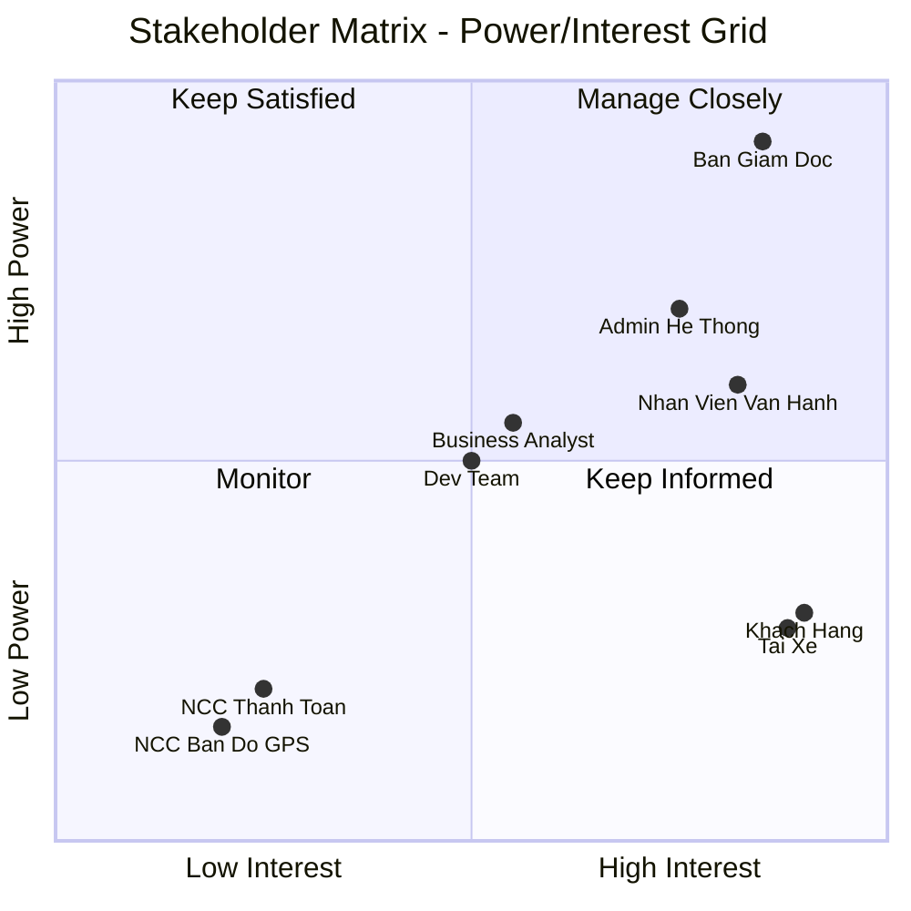
```mermaid
quadrantChart
    title Stakeholder Matrix - Power/Interest Grid
    x-axis Low Interest --> High Interest
    y-axis Low Power --> High Power
    quadrant-1 Manage Closely
    quadrant-2 Keep Satisfied
    quadrant-3 Monitor
    quadrant-4 Keep Informed
    Ban Giam Doc: [0.85, 0.92]
    Admin He Thong: [0.75, 0.70]
    Nhan Vien Van Hanh: [0.82, 0.60]
    Khach Hang: [0.90, 0.30]
    Tai Xe: [0.88, 0.28]
    Business Analyst: [0.55, 0.55]
    Dev Team: [0.50, 0.50]
    NCC Thanh Toan: [0.25, 0.20]
    NCC Ban Do GPS: [0.20, 0.15]
```

**Chiến lược giao tiếp theo ma trận:**

| Quadrant | Stakeholder | Chiến lược |
|----------|-----------|------------|
| **Manage Closely** (Power ↑ Interest ↑) | Ban giám đốc, Admin hệ thống, Nhân viên vận hành | Họp báo cáo tiến độ hàng tuần, tham gia review yêu cầu, phê duyệt thay đổi lớn |
| **Keep Satisfied** (Power ↑ Interest ↓) | Business Analyst, Dev Team | Cập nhật khi có thay đổi yêu cầu hoặc quyết định kỹ thuật quan trọng |
| **Keep Informed** (Power ↓ Interest ↑) | Khách hàng, Tài xế | Thu thập feedback qua khảo sát, thông báo tính năng mới, hỗ trợ sử dụng |
| **Monitor** (Power ↓ Interest ↓) | NCC Thanh toán, NCC Bản đồ/GPS | Liên hệ khi cần tích hợp kỹ thuật, theo dõi SLA dịch vụ |

---

### 1.4 Business Goals (Mục tiêu nghiệp vụ)

Dựa trên phân tích Business Context và Business Problem, xác định được các mục tiêu nghiệp vụ mà dự án CAB System cần đạt được. Các mục tiêu được phân theo **3 cấp độ**: Chiến lược (Strategic), Vận hành (Operational) và Hỗ trợ (Enabler).

---

#### 1.4.1 Mục tiêu chiến lược (Strategic Goals)

Các mục tiêu cấp cao, gắn với tầm nhìn kinh doanh dài hạn của Ban giám đốc.

| ID | Mục tiêu | Mô tả chi tiết | Chỉ số đo lường (KPI) | Liên quan |
|----|----------|----------------|----------------------|-----------|
| **BG-01** | **Chuyển đổi số toàn bộ quy trình đặt xe** | Thay thế quy trình thủ công (gọi tổng đài, điều phối bằng tay) bằng nền tảng số tự động hóa. Khách hàng tự đặt xe qua ứng dụng, hệ thống tự tìm và phân công tài xế, tự tính cước và xử lý thanh toán. | • ≥ 90% chuyến đi được xử lý hoàn toàn qua hệ thống (không cần can thiệp thủ công)<br>• Giảm ≥ 70% cuộc gọi vào tổng đài | Vấn đề 1, 2 |
| **BG-02** | **Mở rộng quy mô phục vụ** | Xây dựng nền tảng có khả năng phục vụ số lượng lớn khách hàng và tài xế đồng thời, không bị giới hạn bởi nhân lực vận hành như hệ thống cũ. | • Hệ thống hoạt động ổn định với ≥ 1.000 chuyến/ngày<br>• Hỗ trợ ≥ 500 tài xế hoạt động đồng thời<br>• Thời gian phản hồi API ≤ 2 giây dưới tải cao | Vấn đề 4 |
| **BG-03** | **Tăng doanh thu và kiểm soát tài chính** | Số hóa thanh toán để ghi nhận 100% giao dịch, loại bỏ thất thoát từ quy trình tiền mặt không kiểm soát. Đa dạng hóa phương thức thanh toán để tăng tỷ lệ chuyển đổi. | • 100% giao dịch được ghi nhận trong hệ thống<br>• ≥ 30% khách hàng sử dụng thanh toán điện tử trong 3 tháng đầu<br>• Giảm ≥ 50% sai lệch đối soát doanh thu giữa tài xế và công ty | Vấn đề 3 |

---

#### 1.4.2 Mục tiêu vận hành (Operational Goals)

Các mục tiêu liên quan trực tiếp đến hoạt động hàng ngày của hệ thống.

| ID | Mục tiêu | Mô tả chi tiết | Chỉ số đo lường (KPI) | Liên quan |
|----|----------|----------------|----------------------|-----------|
| **BG-04** | **Tự động hóa tìm và phân công tài xế** | Khi khách hàng đặt xe, hệ thống tự động xác định tài xế phù hợp dựa trên vị trí, trạng thái, loại xe. Nếu tài xế đầu tiên từ chối hoặc không phản hồi, hệ thống tự chuyển sang tài xế tiếp theo mà khách hàng không cần đặt lại. | • Thời gian từ đặt xe → có tài xế nhận chuyến ≤ 2 phút<br>• Tỷ lệ tìm được tài xế thành công ≥ 85%<br>• 0% trường hợp cần nhân viên vận hành phân công thủ công | Vấn đề 1 |
| **BG-05** | **Minh bạch trạng thái chuyến đi cho khách hàng** | Khách hàng theo dõi được toàn bộ hành trình: hệ thống đang tìm tài xế → tài xế nào nhận → tài xế ở đâu → dự kiến bao lâu đến → đã đón → đang di chuyển → hoàn thành. | • 100% chuyến đi có thông tin trạng thái real-time<br>• Cập nhật vị trí tài xế mỗi 5–10 giây<br>• Giảm ≥ 80% cuộc gọi hỏi "tài xế ở đâu rồi" vào tổng đài | Vấn đề 2 |
| **BG-06** | **Tính cước chính xác và tự động** | Sau khi chuyến hoàn thành, hệ thống tự động tính cước dựa trên loại dịch vụ, khoảng cách, thời gian. Khách hàng biết trước cước ước tính khi đặt xe. Quy tắc tính cước có thể cấu hình mà không cần sửa code. | • 100% chuyến đi được tính cước tự động<br>• Sai số cước ước tính so với thực tế ≤ 15%<br>• Thay đổi bảng giá trong ≤ 5 phút (qua cấu hình) | Vấn đề 3 |
| **BG-07** | **Quản lý tài xế và phương tiện hiệu quả** | Hệ thống quản lý đầy đủ thông tin tài xế (hồ sơ, giấy phép, trạng thái), phương tiện (biển số, loại xe, tình trạng). Tài xế tự quản lý trạng thái online/offline. Nhân viên vận hành can thiệp khi cần. | • 100% tài xế được quản lý hồ sơ trên hệ thống<br>• 100% phương tiện được đăng ký và xác minh<br>• Thời gian duyệt hồ sơ tài xế mới ≤ 24 giờ | Vấn đề 1, 5 |
| **BG-08** | **Thông báo kịp thời cho tất cả các bên** | Khách hàng, tài xế đều nhận thông báo tại mỗi bước quan trọng của chuyến đi. Hệ thống thông báo được thiết kế theo Provider Pattern, dễ dàng bổ sung kênh mới (SMS, Push) mà không thay đổi logic nghiệp vụ. | • 100% sự kiện quan trọng có thông báo (≥ 8 loại event)<br>• Thời gian gửi thông báo ≤ 3 giây sau sự kiện<br>• Bổ sung kênh thông báo mới trong ≤ 1 ngày phát triển | Vấn đề 2, 4 |

---

#### 1.4.3 Mục tiêu hỗ trợ quản lý và ra quyết định (Management & Decision Support Goals)

| ID | Mục tiêu | Mô tả chi tiết | Chỉ số đo lường (KPI) | Liên quan |
|----|----------|----------------|----------------------|-----------|
| **BG-09** | **Cung cấp công cụ quản trị tập trung** | Nhân viên vận hành và Admin có dashboard quản lý khách hàng, tài xế, phương tiện, chuyến đi. Hỗ trợ xử lý sự cố (chuyến lỗi, thanh toán thất bại). Phân quyền rõ ràng: Operator chỉ vận hành, Admin có toàn quyền. | • 100% thao tác quản lý thực hiện qua hệ thống (không dùng Excel/giấy)<br>• Thời gian xử lý sự cố chuyến đi ≤ 10 phút<br>• Phân quyền ít nhất 2 cấp: Operator và Admin | Vấn đề 5 |
| **BG-10** | **Báo cáo dữ liệu vận hành cho Ban lãnh đạo** | Hệ thống cung cấp báo cáo tổng hợp để Ban giám đốc theo dõi hiệu quả kinh doanh và ra quyết định. Bao gồm: số chuyến, doanh thu, tỷ lệ hoàn thành, tỷ lệ hủy, hiệu quả từng tài xế. | • Báo cáo tự động theo ngày/tuần/tháng<br>• ≥ 5 loại báo cáo: chuyến, doanh thu, hoàn thành, hủy, hiệu quả tài xế<br>• Dữ liệu báo cáo trễ tối đa 1 giờ so với thực tế | Vấn đề 5 |

---

#### 1.4.4 Mục tiêu kỹ thuật và bảo mật (Technology & Security Goals)

| ID | Mục tiêu | Mô tả chi tiết | Chỉ số đo lường (KPI) | Liên quan |
|----|----------|----------------|----------------------|-----------|
| **BG-11** | **Kiến trúc linh hoạt, dễ mở rộng** | Hệ thống được thiết kế modular, các thành phần tách biệt (đặt xe, thanh toán, thông báo) có thể mở rộng độc lập. Lỗi ở một thành phần (VD: thanh toán) không làm sập toàn bộ hệ thống đặt xe. Tính năng mới triển khai từng phần mà không ảnh hưởng chức năng đang hoạt động. | • Lỗi module thanh toán/thông báo không ảnh hưởng module đặt xe<br>• Thêm loại dịch vụ xe mới trong ≤ 2 ngày phát triển<br>• Thêm phương thức thanh toán mới trong ≤ 3 ngày phát triển<br>• Uptime hệ thống ≥ 99% | Vấn đề 4 |
| **BG-12** | **Bảo mật dữ liệu và kiểm soát truy cập** | Tất cả người dùng phải xác thực trước khi sử dụng. Phân quyền theo vai trò (RBAC). Thông tin cá nhân, vị trí, giao dịch được bảo vệ. Thông tin thanh toán nhạy cảm KHÔNG lưu trong hệ thống CAB. Ghi log tất cả thao tác quan trọng để truy vết khi có sự cố. | • 100% API yêu cầu xác thực (trừ đăng ký/đăng nhập)<br>• 0 thông tin thẻ/tài khoản thanh toán lưu trong DB<br>• 100% thao tác nhạy cảm được ghi audit log<br>• Mật khẩu mã hóa (hashed), token có thời hạn | Vấn đề 6 |
| **BG-13** | **Nâng cao trải nghiệm người dùng** | Giao diện trực quan, dễ sử dụng cho cả khách hàng lần đầu. Thao tác đặt xe tối đa 3 bước. Tài xế thao tác đơn giản, ít phân tán khi lái xe. Responsive trên cả desktop và mobile. | • Khách hàng hoàn thành đặt xe trong ≤ 3 bước (≤ 60 giây)<br>• Tài xế nhận/từ chối chuyến trong 1 chạm<br>• Giao diện responsive, hoạt động tốt trên mobile | Vấn đề 2 |

---

#### 1.4.5 Tổng hợp Business Goals – Bản đồ liên kết

Sơ đồ thể hiện mối liên hệ giữa **Vấn đề nghiệp vụ → Mục tiêu → Nhóm chức năng**:

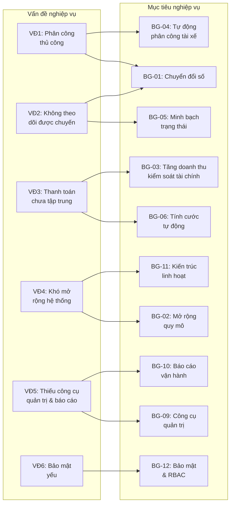
```mermaid
flowchart LR
    subgraph Problems["Vấn đề nghiệp vụ"]
        P1["VĐ1: Phân công\nthủ công"]
        P2["VĐ2: Không theo\ndõi được chuyến"]
        P3["VĐ3: Thanh toán\nchưa tập trung"]
        P4["VĐ4: Khó mở\nrộng hệ thống"]
        P5["VĐ5: Thiếu công cụ\nquản trị & báo cáo"]
        P6["VĐ6: Bảo mật\nyếu"]
    end

    subgraph Goals["Mục tiêu nghiệp vụ"]
        BG01["BG-01: Chuyển đổi số"]
        BG04["BG-04: Tự động\nphân công tài xế"]
        BG05["BG-05: Minh bạch\ntrạng thái"]
        BG06["BG-06: Tính cước\ntự động"]
        BG03["BG-03: Tăng doanh thu\nkiểm soát tài chính"]
        BG02["BG-02: Mở rộng\nquy mô"]
        BG09["BG-09: Công cụ\nquản trị"]
        BG10["BG-10: Báo cáo\nvận hành"]
        BG11["BG-11: Kiến trúc\nlinh hoạt"]
        BG12["BG-12: Bảo mật\n& RBAC"]
    end

    P1 --> BG01
    P1 --> BG04
    P2 --> BG05
    P2 --> BG01
    P3 --> BG06
    P3 --> BG03
    P4 --> BG02
    P4 --> BG11
    P5 --> BG09
    P5 --> BG10
    P6 --> BG12
```

---

#### 1.4.6 Ưu tiên triển khai Business Goals

Phân loại mức độ ưu tiên theo mô hình **MoSCoW**:

| Mức ưu tiên | Business Goals | Lý do |
|-------------|---------------|-------|
| **Must Have** (Bắt buộc) | BG-01, BG-04, BG-05, BG-06, BG-07, BG-12 | Nếu thiếu, hệ thống không thể vận hành được. Đây là lõi nghiệp vụ: đặt xe → tìm tài xế → chạy chuyến → tính cước + bảo mật cơ bản |
| **Should Have** (Nên có) | BG-03, BG-08, BG-09, BG-13 | Quan trọng cho vận hành hàng ngày: thanh toán điện tử, thông báo, quản trị, UX. Có thể MVP trước rồi nâng cấp |
| **Could Have** (Có thì tốt) | BG-02, BG-10, BG-11 | Mở rộng quy mô, báo cáo nâng cao, kiến trúc tối ưu – triển khai sau khi core ổn định |
| **Won't Have** (Chưa làm) | Surge pricing tự động, Ví nội bộ, Ride sharing, Chat in-app | Ngoài phạm vi MVP, xem xét cho các phiên bản sau |

---

### 1.5 Phạm vi hệ thống (Scope)

#### 1.5.1 Trong phạm vi (In Scope) – MVP Phase 1

Hệ thống CAB MVP bao gồm **3 ứng dụng web** và **1 backend API**, phục vụ quy trình cốt lõi: **Đặt xe → Tìm tài xế → Thực hiện chuyến → Tính cước → Thanh toán → Đánh giá**.

**A. Actors (Tác nhân tương tác với hệ thống):**

| # | Actor | Loại | Mô tả |
|---|-------|------|-------|
| 1 | **Khách hàng (Customer)** | Primary – External | Người đặt xe, sử dụng dịch vụ, thanh toán và đánh giá |
| 2 | **Tài xế (Driver)** | Primary – External | Người nhận và thực hiện chuyến đi |
| 3 | **Nhân viên vận hành (Operator)** | Primary – Internal | Quản lý vận hành hàng ngày (quyền hạn chế) |
| 4 | **Quản trị viên (Admin)** | Primary – Internal | Quản trị toàn bộ hệ thống (toàn quyền) |
| 5 | **Cổng thanh toán (Payment Gateway)** | Secondary – External System | Xử lý giao dịch thanh toán điện tử |
| 6 | **Dịch vụ bản đồ (Map Service)** | Secondary – External System | Cung cấp bản đồ, tính khoảng cách, geocoding |
| 7 | **Dịch vụ Email (Email Service)** | Secondary – External System | Gửi email thông báo |

**B. Chức năng chi tiết theo module:**

---

**Module 1: Quản lý tài khoản & Xác thực (Authentication & User Management)**

| # | Chức năng | Actor | Mức ưu tiên | Mô tả |
|---|----------|-------|-------------|-------|
| F-01 | Đăng ký tài khoản khách hàng | Customer | Must Have | Đăng ký bằng email, SĐT, mật khẩu. Xác thực email |
| F-02 | Đăng ký tài khoản tài xế | Driver | Must Have | Đăng ký kèm thông tin bằng lái, phương tiện. Chờ duyệt |
| F-03 | Đăng nhập / Đăng xuất | Customer, Driver, Operator, Admin | Must Have | Đăng nhập bằng email + mật khẩu, nhận JWT token |
| F-04 | Cập nhật thông tin cá nhân | Customer, Driver | Must Have | Sửa tên, SĐT, avatar, địa chỉ |
| F-05 | Đổi mật khẩu | Customer, Driver, Operator, Admin | Must Have | Đổi mật khẩu khi đang đăng nhập |
| F-06 | Quên mật khẩu / Reset | Customer, Driver | Should Have | Gửi link reset qua email |
| F-07 | Admin tạo tài khoản tài xế | Operator, Admin | Must Have | Tạo tài khoản cho tài xế từ phía vận hành |

---

**Module 2: Quản lý tài xế & Phương tiện (Driver & Vehicle Management)**

| # | Chức năng | Actor | Mức ưu tiên | Mô tả |
|---|----------|-------|-------------|-------|
| F-08 | Cập nhật hồ sơ tài xế | Driver | Must Have | Bằng lái, CMND/CCCD, ảnh đại diện |
| F-09 | Đăng ký / Cập nhật thông tin phương tiện | Driver | Must Have | Biển số, hãng xe, model, màu, loại xe (Sedan/SUV/Van), số ghế |
| F-10 | Chuyển trạng thái hoạt động | Driver | Must Have | Toggle: Offline ↔ Available. Khi đang chở khách tự chuyển sang Busy |
| F-11 | Cập nhật vị trí GPS | Driver | Must Have | Gửi tọa độ GPS liên tục qua Socket.IO khi ở trạng thái Available/Busy |
| F-12 | Duyệt hồ sơ tài xế | Operator, Admin | Must Have | Xem và phê duyệt/từ chối hồ sơ tài xế đăng ký mới |
| F-13 | Xem danh sách phương tiện | Operator, Admin | Should Have | Danh sách xe đã đăng ký, lọc theo loại, trạng thái |
| F-14 | Vô hiệu hóa tài xế / phương tiện | Admin | Should Have | Tạm khóa tài xế vi phạm hoặc xe hết hạn đăng kiểm |

---

**Module 3: Đặt xe & Quản lý chuyến đi (Ride Booking & Management) ⭐ Core**

| # | Chức năng | Actor | Mức ưu tiên | Mô tả |
|---|----------|-------|-------------|-------|
| F-15 | Nhập điểm đón và điểm đến | Customer | Must Have | Nhập địa chỉ hoặc chọn trên bản đồ, hệ thống geocoding sang tọa độ |
| F-16 | Chọn loại xe | Customer | Must Have | Chọn loại xe (Sedan/SUV/Van), hiển thị giá ước tính tương ứng |
| F-17 | Xem cước phí ước tính | Customer | Must Have | Hiển thị giá ước tính trước khi xác nhận đặt xe |
| F-18 | Gửi yêu cầu đặt xe | Customer | Must Have | Xác nhận đặt xe, tạo ride với status = `requested` |
| F-19 | Theo dõi trạng thái chuyến đi | Customer | Must Have | Hiển thị trạng thái: Đang tìm tài xế → Tài xế nhận → Đang đến → Đã đón → Đang di chuyển → Hoàn thành |
| F-20 | Theo dõi vị trí tài xế trên bản đồ | Customer | Must Have | Hiển thị real-time vị trí tài xế trên bản đồ sau khi có tài xế nhận chuyến |
| F-21 | Xem thông tin tài xế được phân công | Customer | Must Have | Tên, SĐT, ảnh, biển số xe, loại xe, rating |
| F-22 | Hủy chuyến | Customer | Must Have | Hủy chuyến trước khi tài xế đến điểm đón (miễn phí cho MVP) |
| F-23 | Xem lịch sử chuyến đi | Customer, Driver | Must Have | Danh sách chuyến đã hoàn thành/hủy, chi tiết từng chuyến |
| F-24 | Xem chi tiết chuyến đi | Customer, Driver | Must Have | Điểm đón/trả, khoảng cách, thời gian, cước phí, trạng thái, tài xế |

---

**Module 4: Tìm & Phân công tài xế (Driver Matching) ⭐ Core**

| # | Chức năng | Actor | Mức ưu tiên | Mô tả |
|---|----------|-------|-------------|-------|
| F-25 | Tự động tìm tài xế phù hợp | System | Must Have | Tìm tài xế Available trong bán kính, đúng loại xe, sắp xếp theo khoảng cách gần nhất |
| F-26 | Gửi yêu cầu chuyến cho tài xế | System → Driver | Must Have | Gửi thông báo real-time qua Socket.IO cho tài xế được chọn |
| F-27 | Chấp nhận chuyến | Driver | Must Have | Tài xế nhấn chấp nhận, status chuyển sang `accepted` |
| F-28 | Từ chối chuyến | Driver | Must Have | Tài xế nhấn từ chối, hệ thống tự động tìm tài xế tiếp theo |
| F-29 | Tự động chuyển tài xế khi hết thời gian | System | Must Have | Nếu tài xế không phản hồi trong 30s, tự chuyển sang tài xế kế tiếp |
| F-30 | Thông báo không tìm được tài xế | System → Customer | Must Have | Sau khi thử hết (tối đa 5 tài xế), thông báo cho khách hàng |
| F-31 | Cập nhật trạng thái chuyến đi | Driver | Must Have | Driver cập nhật: `driver_arrived` → `in_progress` → `completed` |

---

**Module 5: Tính cước & Thanh toán (Fare & Payment)**

| # | Chức năng | Actor | Mức ưu tiên | Mô tả |
|---|----------|-------|-------------|-------|
| F-32 | Tính cước tự động | System | Must Have | Tính cước khi hoàn thành: `baseFare + (km × ratePerKm) + (phút × ratePerMin)` |
| F-33 | Cấu hình bảng giá theo loại xe | Admin | Must Have | Thiết lập giá cơ bản, đơn giá/km, đơn giá/phút cho từng loại xe |
| F-34 | Thanh toán tiền mặt | Customer | Must Have | Ghi nhận chuyến thanh toán bằng tiền mặt, tài xế xác nhận đã nhận tiền |
| F-35 | Thanh toán điện tử (Mock) | Customer | Should Have | Tích hợp cổng thanh toán giả lập, không lưu thông tin thẻ trong hệ thống |
| F-36 | Xử lý thanh toán thất bại | System | Should Have | Thông báo khách hàng, cho phép thử lại hoặc chuyển sang tiền mặt |
| F-37 | Xem hóa đơn / chi tiết thanh toán | Customer | Should Have | Hiển thị chi tiết cước: giá cơ bản, phí km, phí thời gian, tổng cộng |

---

**Module 6: Thông báo (Notification)**

| # | Chức năng | Actor | Mức ưu tiên | Mô tả |
|---|----------|-------|-------------|-------|
| F-38 | Thông báo in-app (real-time) | Customer, Driver | Must Have | Thông báo qua Socket.IO: đặt xe thành công, có tài xế, trạng thái chuyến |
| F-39 | Thông báo email | Customer, Driver | Should Have | Email xác nhận đăng ký, hoàn thành chuyến, hóa đơn |
| F-40 | Danh sách thông báo | Customer, Driver | Should Have | Xem lịch sử thông báo, đánh dấu đã đọc |

**Danh sách sự kiện thông báo MVP:**

| Sự kiện | Customer nhận | Driver nhận | Kênh |
|---------|:---:|:---:|------|
| Yêu cầu đặt xe được tiếp nhận | ✅ | | In-app |
| Có chuyến mới cần nhận | | ✅ | In-app |
| Tài xế nhận chuyến | ✅ | | In-app |
| Tài xế đến điểm đón | ✅ | | In-app |
| Chuyến đi hoàn thành | ✅ | ✅ | In-app + Email |
| Kết quả thanh toán | ✅ | | In-app |
| Chuyến bị hủy | ✅ | ✅ | In-app |
| Không tìm được tài xế | ✅ | | In-app |

---

**Module 7: Đánh giá & Phản hồi (Rating & Review)**

| # | Chức năng | Actor | Mức ưu tiên | Mô tả |
|---|----------|-------|-------------|-------|
| F-41 | Đánh giá tài xế sau chuyến | Customer | Must Have | Chấm điểm 1–5 sao + nhận xét sau khi chuyến hoàn thành |
| F-42 | Xem rating trung bình | Customer, Driver | Should Have | Hiển thị rating trung bình của tài xế trên hồ sơ |
| F-43 | Xem danh sách đánh giá | Driver | Should Have | Tài xế xem các đánh giá khách hàng đã để lại |

---

**Module 8: Quản trị hệ thống (Admin Dashboard)**

| # | Chức năng | Actor | Mức ưu tiên | Mô tả |
|---|----------|-------|-------------|-------|
| F-44 | Dashboard tổng quan | Operator, Admin | Must Have | Số chuyến hôm nay, tài xế đang online, doanh thu hôm nay, chuyến đang diễn ra |
| F-45 | Quản lý khách hàng | Operator, Admin | Must Have | Xem danh sách, tìm kiếm, xem chi tiết, vô hiệu hóa tài khoản |
| F-46 | Quản lý tài xế | Operator, Admin | Must Have | Xem danh sách, duyệt hồ sơ, xem trạng thái, vô hiệu hóa |
| F-47 | Quản lý chuyến đi | Operator, Admin | Must Have | Xem chuyến đang diễn ra, chuyến lỗi, can thiệp xử lý |
| F-48 | Tra cứu lịch sử giao dịch | Operator, Admin | Should Have | Tìm kiếm giao dịch theo khách hàng, tài xế, thời gian, trạng thái |
| F-49 | Báo cáo số lượng chuyến | Admin | Should Have | Thống kê chuyến theo ngày/tuần/tháng, tỷ lệ hoàn thành/hủy |
| F-50 | Báo cáo doanh thu | Admin | Should Have | Tổng doanh thu, doanh thu theo loại xe, theo phương thức thanh toán |
| F-51 | Báo cáo hiệu quả tài xế | Admin | Could Have | Số chuyến, rating, tỷ lệ từ chối, thu nhập của từng tài xế |
| F-52 | Phân quyền Operator / Admin | Admin | Must Have | Operator: chỉ xem + vận hành. Admin: toàn quyền bao gồm cấu hình, phân quyền |

---

**Module 9: Bảo mật & Hạ tầng (Security & Infrastructure)**

| # | Chức năng | Actor | Mức ưu tiên | Mô tả |
|---|----------|-------|-------------|-------|
| F-53 | Xác thực JWT | System | Must Have | Access token (15 phút) + Refresh token (7 ngày) |
| F-54 | Phân quyền RBAC | System | Must Have | 4 roles: Customer, Driver, Operator, Admin. Middleware kiểm tra quyền |
| F-55 | Mã hóa mật khẩu | System | Must Have | Hash mật khẩu bằng bcrypt trước khi lưu DB |
| F-56 | Audit Log | System | Should Have | Ghi log thao tác nhạy cảm: tạo/hủy chuyến, thanh toán, thay đổi quyền, khóa tài khoản |
| F-57 | Seed Data | System | Should Have | Dữ liệu mẫu: tài khoản test, tài xế, phương tiện, chuyến đi mẫu |

---

**C. Tổng hợp In Scope:**

| Thống kê | Số lượng |
|----------|---------|
| Tổng số chức năng | 57 |
| Must Have | 35 |
| Should Have | 18 |
| Could Have | 4 |
| Actors (Primary) | 4 (Customer, Driver, Operator, Admin) |
| Actors (Secondary) | 3 (Payment Gateway, Map Service, Email Service) |
| Modules | 9 |

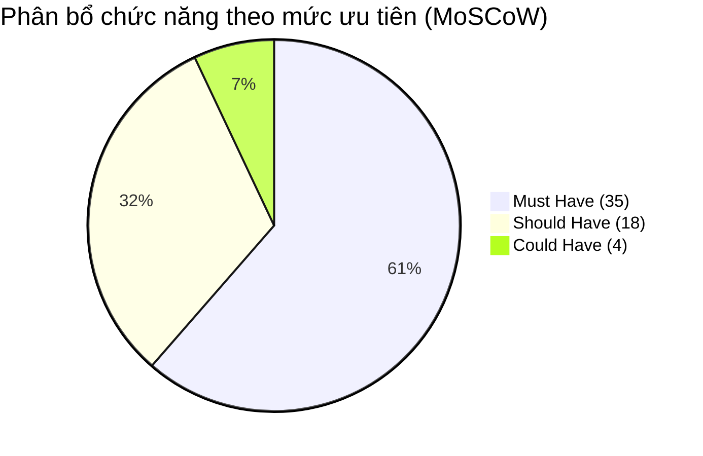
```mermaid
pie title Phân bổ chức năng theo mức ưu tiên (MoSCoW)
    "Must Have (35)" : 35
    "Should Have (18)" : 18
    "Could Have (4)" : 4
```

---

#### 1.5.2 Ngoài phạm vi (Out of Scope) – Giai đoạn MVP

Các tính năng sau **KHÔNG nằm trong phạm vi MVP** nhưng có thể xem xét cho phiên bản tiếp theo:

| # | Tính năng | Lý do loại khỏi MVP | Phiên bản dự kiến |
|---|----------|---------------------|-------------------|
| OS-01 | **Ứng dụng mobile native (iOS/Android)** | Tốn thời gian phát triển, MVP dùng web responsive thay thế. Trải nghiệm đủ tốt trên mobile browser | v2.0 |
| OS-02 | **Tích hợp tổng đài điện thoại (IVR)** | Cần hạ tầng viễn thông, chi phí cao. Hệ thống mới hướng đến self-service qua app | v3.0 |
| OS-03 | **Chia sẻ chuyến đi (Ride Sharing / Carpooling)** | Logic phức tạp (ghép khách, tính cước chia sẻ, tối ưu lộ trình). Cần core ổn định trước | v2.0 |
| OS-04 | **Ví điện tử nội bộ (Internal Wallet)** | Cần license tài chính, quy trình nạp/rút tiền. MVP dùng thanh toán trực tiếp | v2.0 |
| OS-05 | **Surge pricing tự động** | Cần dữ liệu lịch sử lớn và thuật toán phức tạp. MVP dùng bảng giá cố định có thể cấu hình | v2.0 |
| OS-06 | **Đa ngôn ngữ (i18n)** | MVP chỉ hỗ trợ tiếng Việt. Thêm tiếng Anh và các ngôn ngữ khác sau | v2.0 |
| OS-07 | **Chat in-app giữa Customer và Driver** | Không thiết yếu cho MVP, Customer đã có SĐT tài xế để liên lạc | v2.0 |
| OS-08 | **Đặt xe hẹn giờ (Scheduled Ride)** | Logic lên lịch, nhắc nhở, tìm tài xế theo lịch phức tạp. MVP chỉ hỗ trợ đặt xe tức thì | v2.0 |
| OS-09 | **Mã khuyến mãi / Voucher** | Cần module quản lý campaign, validation, tính cước kết hợp | v2.0 |
| OS-10 | **Chương trình khách hàng thân thiết (Loyalty)** | Tích điểm, đổi thưởng – cần hệ thống riêng, phụ thuộc chiến lược marketing | v3.0 |
| OS-11 | **Tích hợp cổng thanh toán thật (VNPay, MoMo)** | MVP dùng Mock Gateway. Tích hợp thật cần hợp đồng và sandbox testing | v1.1 |
| OS-12 | **Push Notification (Firebase/APNs)** | Cần native app hoặc PWA. MVP dùng Socket.IO in-app + Email | v2.0 |
| OS-13 | **Notification qua SMS** | Chi phí gửi SMS, cần tích hợp nhà cung cấp SMS (Twilio, Vonage) | v1.1 |
| OS-14 | **Báo cáo nâng cao (BI Dashboard)** | Biểu đồ phức tạp, drill-down, export PDF/Excel. MVP chỉ báo cáo cơ bản | v2.0 |
| OS-15 | **Quản lý khiếu nại / Dispute** | Quy trình xử lý phức tạp, cần policy rõ từ doanh nghiệp | v2.0 |
| OS-16 | **Định tuyến / Navigation cho tài xế** | Cần tích hợp sâu Maps API (Directions), chi phí API cao. MVP hiển thị điểm đón/trả trên bản đồ | v2.0 |
| OS-17 | **Đánh giá khách hàng bởi tài xế** | Two-way rating phức tạp hơn. MVP chỉ Customer đánh giá Driver | v1.1 |

---

#### 1.5.3 Ranh giới hệ thống (System Boundary)

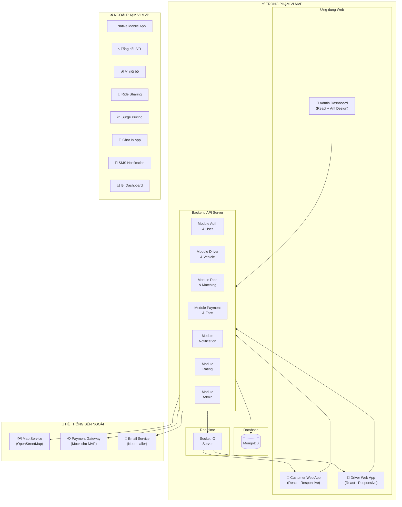
```mermaid
flowchart TB
    subgraph InScope["✅ TRONG PHẠM VI MVP"]
        subgraph Apps["Ứng dụng Web"]
            CApp["🧑 Customer Web App\n(React - Responsive)"]
            DApp["🚗 Driver Web App\n(React - Responsive)"]
            AApp["🔧 Admin Dashboard\n(React + Ant Design)"]
        end

        subgraph Backend["Backend API Server"]
            Auth["Module Auth\n& User"]
            Driver["Module Driver\n& Vehicle"]
            Ride["Module Ride\n& Matching"]
            Pay["Module Payment\n& Fare"]
            Notif["Module\nNotification"]
            Rating["Module\nRating"]
            Admin["Module\nAdmin"]
        end

        subgraph Data["Database"]
            DB[(MongoDB)]
        end

        subgraph Realtime["Real-time"]
            Socket["Socket.IO\nServer"]
        end
    end

    subgraph OutScope["❌ NGOÀI PHẠM VI MVP"]
        Mobile["📱 Native Mobile App"]
        IVR["📞 Tổng đài IVR"]
        Wallet["💰 Ví nội bộ"]
        RideShare["🤝 Ride Sharing"]
        Surge["📈 Surge Pricing"]
        Chat["💬 Chat In-app"]
        SMS["📨 SMS Notification"]
        BI["📊 BI Dashboard"]
    end

    subgraph External["🔗 HỆ THỐNG BÊN NGOÀI"]
        MapAPI["🗺️ Map Service\n(OpenStreetMap)"]
        PayGW["💳 Payment Gateway\n(Mock cho MVP)"]
        EmailSvc["📧 Email Service\n(Nodemailer)"]
    end

    CApp --> Backend
    DApp --> Backend
    AApp --> Backend
    Backend --> DB
    Backend --> Socket
    Backend --> MapAPI
    Backend --> PayGW
    Backend --> EmailSvc
    Socket --> CApp
    Socket --> DApp
```

---

### 1.6 Business Requirements (Yêu cầu nghiệp vụ)

Các yêu cầu nghiệp vụ (Business Requirements) được xác định từ mô tả yêu cầu khách hàng, phân nhóm theo lĩnh vực nghiệp vụ.

---

#### 1.6.1 Quản lý tài khoản & Xác thực

| Ký hiệu | Tên | Diễn giải |
|----------|-----|-----------|
| BR-001 | Đăng ký tài khoản khách hàng | Hệ thống phải cho phép khách hàng tự đăng ký tài khoản bằng thông tin cá nhân (họ tên, email, số điện thoại, mật khẩu). Tài khoản phải được xác thực trước khi sử dụng dịch vụ. |
| BR-002 | Đăng ký tài khoản tài xế | Hệ thống phải cho phép tài xế tự đăng ký tài khoản hoặc được nhân viên vận hành tạo tài khoản. Hồ sơ tài xế phải bao gồm thông tin bằng lái và phương tiện, và phải được duyệt trước khi hoạt động. |
| BR-003 | Đăng nhập hệ thống | Hệ thống phải xác thực người dùng (khách hàng, tài xế, nhân viên vận hành) trước khi cho phép truy cập các chức năng yêu cầu tài khoản. Mỗi nhóm người dùng chỉ được truy cập chức năng phù hợp với vai trò. |
| BR-004 | Cập nhật thông tin cá nhân | Khách hàng và tài xế phải có khả năng cập nhật thông tin cá nhân của mình bất kỳ lúc nào sau khi đăng nhập (họ tên, số điện thoại, ảnh đại diện). |

---

#### 1.6.2 Đặt xe & Quản lý chuyến đi

| Ký hiệu | Tên | Diễn giải |
|----------|-----|-----------|
| BR-005 | Tạo yêu cầu đặt xe | Khách hàng phải có thể đặt xe bằng cách nhập điểm đón, điểm đến và lựa chọn loại xe mong muốn. Hệ thống phải hiển thị cước phí ước tính trước khi khách hàng xác nhận đặt xe. |
| BR-006 | Lựa chọn loại xe | Hệ thống phải hỗ trợ ít nhất 3 loại xe (Sedan 4 chỗ, SUV 7 chỗ, Van 16 chỗ) với mức giá khác nhau. Khách hàng được chọn loại xe phù hợp nhu cầu khi đặt xe. |
| BR-007 | Theo dõi trạng thái chuyến đi | Sau khi đặt xe, khách hàng phải biết được hệ thống đang tìm tài xế, tài xế nào đã nhận chuyến, thời gian dự kiến tài xế đến, và trạng thái hiện tại của chuyến đi (đang đến đón, đã đón, đang di chuyển, hoàn thành). |
| BR-008 | Theo dõi vị trí tài xế real-time | Khách hàng phải có thể xem vị trí tài xế trên bản đồ theo thời gian thực sau khi có tài xế nhận chuyến, bao gồm thời gian dự kiến tài xế đến điểm đón. |
| BR-009 | Xem thông tin tài xế | Khi có tài xế nhận chuyến, khách hàng phải xem được thông tin tài xế gồm: tên, số điện thoại, ảnh, biển số xe, loại xe và đánh giá trung bình. |
| BR-010 | Hủy chuyến đi | Khách hàng phải có khả năng hủy chuyến đi. Chính sách hủy chuyến phải được quy định rõ ràng (MVP: miễn phí trước khi tài xế đến điểm đón). |
| BR-011 | Xem lịch sử chuyến đi | Khách hàng phải có thể xem lịch sử tất cả chuyến đi đã thực hiện, bao gồm chi tiết từng chuyến: điểm đón/trả, khoảng cách, thời gian, cước phí, tài xế và trạng thái. |
| BR-012 | Quy trình chuyến đi hoàn chỉnh | Hệ thống phải hỗ trợ đầy đủ quy trình chuyến đi: Khách đặt xe → Hệ thống tìm tài xế → Tài xế nhận chuyến → Tài xế đến điểm đón → Đón khách → Di chuyển đến điểm đến → Hoàn thành → Tính cước → Thanh toán → Đánh giá. |

---

#### 1.6.3 Quản lý tài xế & Phương tiện

| Ký hiệu | Tên | Diễn giải |
|----------|-----|-----------|
| BR-013 | Cập nhật hồ sơ tài xế | Tài xế phải có khả năng cập nhật hồ sơ cá nhân và thông tin phương tiện (biển số, hãng xe, model, màu sắc, loại xe, số ghế) sau khi đăng nhập. |
| BR-014 | Quản lý trạng thái hoạt động | Tài xế phải có thể chuyển sang trạng thái sẵn sàng nhận chuyến khi đang làm việc và chuyển về trạng thái offline khi nghỉ. Hệ thống chỉ gửi yêu cầu chuyến đến tài xế đang ở trạng thái sẵn sàng. |
| BR-015 | Cập nhật vị trí tài xế | Hệ thống phải lưu thông tin vị trí GPS của tài xế khi đang ở trạng thái sẵn sàng hoặc đang thực hiện chuyến, để hỗ trợ tìm tài xế gần khách hàng và dự kiến thời gian đến. |
| BR-016 | Duyệt hồ sơ tài xế | Nhân viên vận hành hoặc Admin phải duyệt hồ sơ tài xế mới đăng ký trước khi tài xế được phép hoạt động trên hệ thống. |
| BR-017 | Quản lý phương tiện | Mỗi tài xế phải đăng ký ít nhất một phương tiện. Thông tin phương tiện phải được xác minh bao gồm: biển số xe, loại xe, hình ảnh xe. |

---

#### 1.6.4 Tìm & Phân công tài xế

| Ký hiệu | Tên | Diễn giải |
|----------|-----|-----------|
| BR-018 | Tự động tìm tài xế phù hợp | Khi khách hàng tạo chuyến đi, hệ thống phải tự động xác định các tài xế phù hợp dựa trên: vị trí hiện tại (trong bán kính cho phép), trạng thái sẵn sàng, loại xe phù hợp, và các tiêu chí vận hành khác. |
| BR-019 | Ưu tiên tài xế gần nhất | Hệ thống phải ưu tiên gửi yêu cầu chuyến cho tài xế gần khách hàng nhất trước, sau đó xét thêm tiêu chí phụ (rating, số chuyến hoàn thành) nếu có nhiều tài xế cùng khoảng cách. |
| BR-020 | Cơ chế retry khi tài xế từ chối | Nếu tài xế được đề xuất không phản hồi hoặc từ chối chuyến, hệ thống phải tiếp tục tìm tài xế khác mà không yêu cầu khách hàng tạo lại yêu cầu. Tối đa thử 5 tài xế (cấu hình được). |
| BR-021 | Giới hạn thời gian phản hồi | Tài xế phải phản hồi (chấp nhận hoặc từ chối) yêu cầu chuyến trong khoảng thời gian quy định (mặc định 30 giây). Hết thời gian mà không phản hồi được xem như từ chối. |
| BR-022 | Thông báo không tìm được tài xế | Trong trường hợp không tìm được tài xế nào sau khi đã thử hết danh sách, khách hàng phải được thông báo rõ ràng rằng hiện tại không có tài xế phù hợp. |
| BR-023 | Cập nhật trạng thái bởi tài xế | Trong quá trình thực hiện chuyến, tài xế phải cập nhật trạng thái theo từng bước: đã đến điểm đón → đã đón khách → đang di chuyển → hoàn thành chuyến. Mỗi trạng thái được ghi nhận thời gian. |

---

#### 1.6.5 Tính cước & Thanh toán

| Ký hiệu | Tên | Diễn giải |
|----------|-----|-----------|
| BR-024 | Tính cước tự động | Sau khi chuyến đi hoàn thành, hệ thống phải tự động xác định số tiền khách hàng phải trả dựa trên loại dịch vụ (loại xe), khoảng cách thực tế và thời gian di chuyển. |
| BR-025 | Cước phí ước tính | Hệ thống phải hiển thị cước phí ước tính cho khách hàng trước khi xác nhận đặt xe, dựa trên loại xe, khoảng cách ước tính từ điểm đón đến điểm đến. |
| BR-026 | Cấu hình bảng giá | Bảng giá (giá cơ bản, đơn giá/km, đơn giá/phút) phải có thể cấu hình theo từng loại xe mà không cần sửa mã nguồn. Doanh nghiệp có thể điều chỉnh giá khi cần. |
| BR-027 | Hỗ trợ nhiều phương thức thanh toán | Khách hàng phải có thể thanh toán bằng tiền mặt hoặc phương thức thanh toán điện tử. Hệ thống phải có khả năng tích hợp thêm phương thức thanh toán mới trong tương lai. |
| BR-028 | Tích hợp cổng thanh toán bên ngoài | Doanh nghiệp muốn tích hợp với nhà cung cấp thanh toán bên ngoài cho thanh toán điện tử. Thông tin nhạy cảm của thẻ hoặc tài khoản thanh toán KHÔNG được lưu trực tiếp trong hệ thống CAB. |
| BR-029 | Xử lý thanh toán thất bại | Nếu giao dịch thanh toán điện tử thất bại, hệ thống phải thông báo cho khách hàng và cho phép xử lý lại (retry hoặc chuyển sang phương thức khác) theo chính sách của doanh nghiệp. |
| BR-030 | Xem chi tiết thanh toán | Khách hàng phải xem được chi tiết cước phí sau chuyến: cước cơ bản, phí theo km, phí theo thời gian, tổng cộng, phương thức thanh toán, trạng thái thanh toán. |

---

#### 1.6.6 Thông báo

| Ký hiệu | Tên | Diễn giải |
|----------|-----|-----------|
| BR-031 | Thông báo cho khách hàng | Khách hàng phải nhận được thông báo tại các thời điểm quan trọng: yêu cầu đặt xe được tiếp nhận, có tài xế nhận chuyến, tài xế đến điểm đón, chuyến hoàn thành, kết quả thanh toán, và khi không tìm được tài xế. |
| BR-032 | Thông báo cho tài xế | Tài xế phải nhận được thông báo khi có chuyến mới phù hợp cần nhận, khi chuyến bị hủy bởi khách hàng, và các thay đổi liên quan đến chuyến đang thực hiện. |
| BR-033 | Khả năng mở rộng kênh thông báo | Hệ thống thông báo phải được thiết kế linh hoạt để doanh nghiệp có thể bổ sung thêm các kênh thông báo mới (SMS, Push Notification) trong tương lai mà không phải thay đổi toàn bộ hệ thống. |

---

#### 1.6.7 Đánh giá & Phản hồi

| Ký hiệu | Tên | Diễn giải |
|----------|-----|-----------|
| BR-034 | Đánh giá tài xế sau chuyến | Khách hàng phải có khả năng đánh giá tài xế (1–5 sao) và viết nhận xét sau khi hoàn thành chuyến đi. Điểm đánh giá phải được tổng hợp thành rating trung bình hiển thị trên hồ sơ tài xế. |
| BR-035 | Xem lịch sử đánh giá | Tài xế phải xem được các đánh giá mà khách hàng đã để lại, bao gồm điểm số và nhận xét, để cải thiện chất lượng dịch vụ. |

---

#### 1.6.8 Quản trị & Báo cáo

| Ký hiệu | Tên | Diễn giải |
|----------|-----|-----------|
| BR-036 | Giao diện quản trị tập trung | Doanh nghiệp phải có một giao diện quản trị (dashboard) để nhân viên vận hành và quản trị viên quản lý khách hàng, tài xế, phương tiện và chuyến đi từ một nơi duy nhất. |
| BR-037 | Giám sát chuyến đi | Nhân viên vận hành phải có thể xem các chuyến đang diễn ra, kiểm tra trạng thái tài xế, và hỗ trợ xử lý các trường hợp chuyến bị lỗi hoặc có vấn đề. |
| BR-038 | Tra cứu lịch sử giao dịch | Nhân viên vận hành phải có thể tra cứu lịch sử giao dịch thanh toán theo khách hàng, tài xế, khoảng thời gian hoặc trạng thái giao dịch. |
| BR-039 | Phân quyền quản trị | Một số chức năng quản trị phải được phân quyền: nhân viên vận hành thông thường (Operator) không được thực hiện các thao tác nhạy cảm (xóa dữ liệu, thay đổi cấu hình, phân quyền). Chỉ Admin mới có toàn quyền. |
| BR-040 | Báo cáo vận hành | Ban lãnh đạo phải có báo cáo về: số lượng chuyến (theo ngày/tuần/tháng), doanh thu, tỷ lệ chuyến hoàn thành, tỷ lệ hủy, và hiệu quả hoạt động của từng tài xế. |

---

#### 1.6.9 Bảo mật, Hiệu năng & Kiến trúc

| Ký hiệu | Tên | Diễn giải |
|----------|-----|-----------|
| BR-041 | Xác thực bắt buộc | Khách hàng và tài xế phải được xác thực trước khi sử dụng các chức năng yêu cầu tài khoản. Các thao tác quản trị phải được kiểm soát quyền truy cập theo vai trò. |
| BR-042 | Bảo vệ dữ liệu | Thông tin cá nhân, thông tin phương tiện, dữ liệu vị trí và dữ liệu giao dịch phải được bảo vệ. Mật khẩu phải được mã hóa. Thông tin thanh toán nhạy cảm không được lưu trong hệ thống. |
| BR-043 | Ghi log thao tác quan trọng | Doanh nghiệp cần lưu vết (audit log) các thao tác quan trọng (tạo/hủy chuyến, thanh toán, khóa tài khoản, thay đổi quyền) để phục vụ kiểm tra khi có sự cố. |
| BR-044 | Hoạt động ổn định và cách ly lỗi | Hệ thống phải hoạt động ổn định vào các thời điểm nhu cầu tăng cao. Lỗi xảy ra ở chức năng thanh toán hoặc thông báo KHÔNG được làm toàn bộ hệ thống đặt xe ngừng hoạt động. Các thành phần phải có khả năng mở rộng độc lập khi tải tăng. |
| BR-045 | Kiến trúc linh hoạt và triển khai từng phần | Hệ thống phải có kiến trúc đủ linh hoạt để trong tương lai có thể bổ sung loại dịch vụ mới, thêm phương thức thanh toán, thêm nhà cung cấp thông báo hoặc thay đổi thành phần kỹ thuật mà không phải xây dựng lại toàn bộ. Các chức năng mới phải có thể triển khai từng phần mà hạn chế ảnh hưởng đến các chức năng đang hoạt động. |

---

#### 1.6.10 Tổng hợp Business Requirements

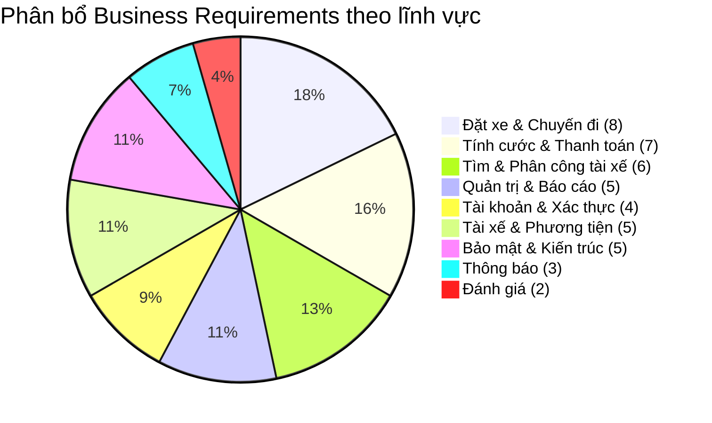
```mermaid
pie title Phân bổ Business Requirements theo lĩnh vực
    "Đặt xe & Chuyến đi (8)" : 8
    "Tính cước & Thanh toán (7)" : 7
    "Tìm & Phân công tài xế (6)" : 6
    "Quản trị & Báo cáo (5)" : 5
    "Tài khoản & Xác thực (4)" : 4
    "Tài xế & Phương tiện (5)" : 5
    "Bảo mật & Kiến trúc (5)" : 5
    "Thông báo (3)" : 3
    "Đánh giá (2)" : 2
```

**Ma trận truy xuất Business Requirements → Business Goals:**

| Business Requirement | Business Goal liên quan |
|---------------------|------------------------|
| BR-001 → BR-004 | BG-01 (Chuyển đổi số), BG-12 (Bảo mật) |
| BR-005 → BR-012 | BG-01 (Chuyển đổi số), BG-05 (Minh bạch trạng thái), BG-13 (UX) |
| BR-013 → BR-017 | BG-07 (Quản lý tài xế & phương tiện) |
| BR-018 → BR-023 | BG-04 (Tự động phân công tài xế), BG-01 (Chuyển đổi số) |
| BR-024 → BR-030 | BG-06 (Tính cước tự động), BG-03 (Tăng doanh thu) |
| BR-031 → BR-033 | BG-08 (Thông báo kịp thời), BG-11 (Kiến trúc linh hoạt) |
| BR-034 → BR-035 | BG-05 (Minh bạch trạng thái), BG-13 (UX) |
| BR-036 → BR-040 | BG-09 (Công cụ quản trị), BG-10 (Báo cáo vận hành) |
| BR-041 → BR-045 | BG-11 (Kiến trúc linh hoạt), BG-12 (Bảo mật), BG-02 (Mở rộng quy mô) |

### 1.7 Business Processes (Quy trình nghiệp vụ)

Quy trình nghiệp vụ mô tả chi tiết các luồng hoạt động từ đầu đến cuối (End-to-End) của hệ thống CAB, thể hiện sự phối hợp nhịp nhàng giữa **Khách hàng (Customer)**, **Tài xế (Driver)**, **Hệ thống (CAB Platform)**, **Nhân viên vận hành (Operator/Admin)** và **Hệ thống bên ngoài (External Services)**.

---

#### 1.7.1 Sơ đồ Quy trình Tổng thể (End-to-End Business Flow)

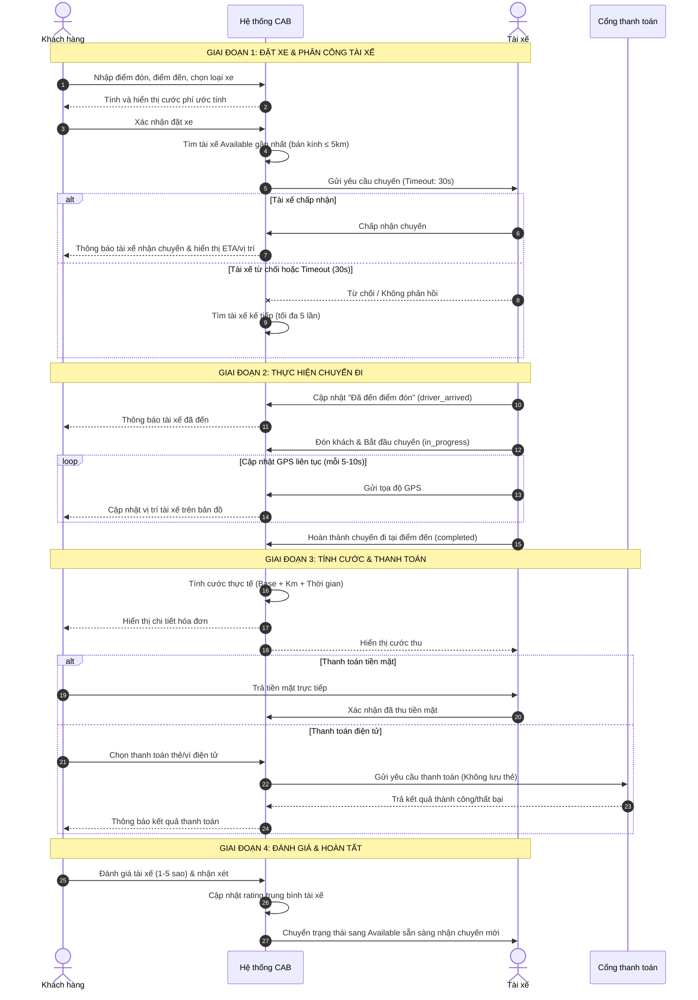
```mermaid
sequenceDiagram
    autonumber
    actor C as Khách hàng
    participant S as Hệ thống CAB
    actor D as Tài xế
    participant P as Cổng thanh toán

    Note over C,D: GIAI ĐOẠN 1: ĐẶT XE & PHÂN CÔNG TÀI XẾ
    C->>S: Nhập điểm đón, điểm đến, chọn loại xe
    S-->>C: Tính và hiển thị cước phí ước tính
    C->>S: Xác nhận đặt xe
    S->>S: Tìm tài xế Available gần nhất (bán kính ≤ 5km)
    S->>D: Gửi yêu cầu chuyến (Timeout: 30s)
    alt Tài xế chấp nhận
        D->>S: Chấp nhận chuyến
        S-->>C: Thông báo tài xế nhận chuyến & hiển thị ETA/vị trí
    else Tài xế từ chối hoặc Timeout (30s)
        D--xS: Từ chối / Không phản hồi
        S->>S: Tìm tài xế kế tiếp (tối đa 5 lần)
    end

    Note over C,D: GIAI ĐOẠN 2: THỰC HIỆN CHUYẾN ĐI
    D->>S: Cập nhật "Đã đến điểm đón" (driver_arrived)
    S-->>C: Thông báo tài xế đã đến
    D->>S: Đón khách & Bắt đầu chuyến (in_progress)
    loop Cập nhật GPS liên tục (mỗi 5-10s)
        D->>S: Gửi tọa độ GPS
        S-->>C: Cập nhật vị trí tài xế trên bản đồ
    end
    D->>S: Hoàn thành chuyến đi tại điểm đến (completed)

    Note over C,P: GIAI ĐOẠN 3: TÍNH CƯỚC & THANH TOÁN
    S->>S: Tính cước thực tế (Base + Km + Thời gian)
    S-->>C: Hiển thị chi tiết hóa đơn
    S-->>D: Hiển thị cước thu
    alt Thanh toán tiền mặt
        C->>D: Trả tiền mặt trực tiếp
        D->>S: Xác nhận đã thu tiền mặt
    else Thanh toán điện tử
        C->>S: Chọn thanh toán thẻ/ví điện tử
        S->>P: Gửi yêu cầu thanh toán (Không lưu thẻ)
        P-->>S: Trả kết quả thành công/thất bại
        S-->>C: Thông báo kết quả thanh toán
    end

    Note over C,D: GIAI ĐOẠN 4: ĐÁNH GIÁ & HOÀN TẤT
    C->>S: Đánh giá tài xế (1-5 sao) & nhận xét
    S->>S: Cập nhật rating trung bình tài xế
    S->>D: Chuyển trạng thái sang Available sẵn sàng nhận chuyến mới
```

---

#### 1.7.2 BP-01: Quy trình Đăng ký & Onboarding Tài khoản

Quy trình quản lý vòng đời tài khoản từ khi đăng ký đến khi sẵn sàng hoạt động.

| Thuộc tính | Chi tiết |
|------------|----------|
| **Mục đích** | Cho phép Khách hàng tự đăng ký và Tài xế đăng ký kèm hồ sơ xe để được phê duyệt hoạt động |
| **Actor** | Khách hàng, Tài xế, Nhân viên vận hành (Operator), Hệ thống CAB |
| **Tiền điều kiện (Precondition)** | Người dùng chưa có tài khoản trên hệ thống |
| **Hậu điều kiện (Postcondition)** | Khách hàng có tài khoản kích hoạt ngay; Tài xế có hồ sơ chờ duyệt hoặc đã duyệt |

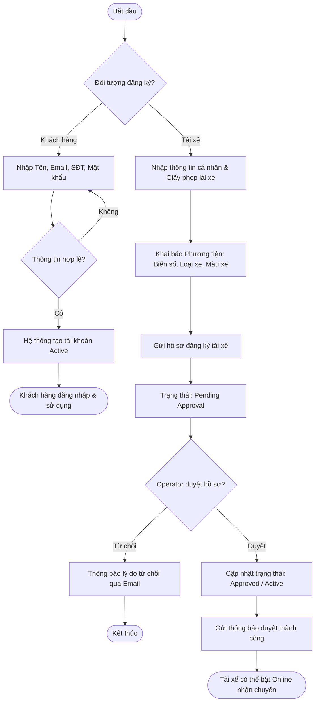
```mermaid
flowchart TD
    Start([Bắt đầu]) --> Choice{Đối tượng đăng ký?}
    
    Choice -- Khách hàng --> RegCust[Nhập Tên, Email, SĐT, Mật khẩu]
    RegCust --> ValidCust{Thông tin hợp lệ?}
    ValidCust -- Không --> RegCust
    ValidCust -- Có --> CreateCust[Hệ thống tạo tài khoản Active]
    CreateCust --> EndCust([Khách hàng đăng nhập & sử dụng])

    Choice -- Tài xế --> RegDrv[Nhập thông tin cá nhân & Giấy phép lái xe]
    RegDrv --> RegVeh[Khai báo Phương tiện: Biển số, Loại xe, Màu xe]
    RegVeh --> SubmitDrv[Gửi hồ sơ đăng ký tài xế]
    SubmitDrv --> Pending[Trạng thái: Pending Approval]
    
    Pending --> OpReview{Operator duyệt hồ sơ?}
    OpReview -- Từ chối --> RejectDrv[Thông báo lý do từ chối qua Email]
    RejectDrv --> EndReject([Kết thúc])
    
    OpReview -- Duyệt --> ApproveDrv[Cập nhật trạng thái: Approved / Active]
    ApproveDrv --> NotifyDrv[Gửi thông báo duyệt thành công]
    NotifyDrv --> EndDrv([Tài xế có thể bật Online nhận chuyến])
```

---

#### 1.7.3 BP-02: Quy trình Đặt xe, Tìm kiếm & Phân công Tài xế (Core Matching)

Quy trình lõi xử lý yêu cầu đặt xe của khách hàng và tự động gán tài xế phù hợp.

| Thuộc tính | Chi tiết |
|------------|----------|
| **Mục đích** | Tự động hóa tìm tài xế gần nhất mà không cần tổng đài can thiệp |
| **Actor** | Khách hàng, Tài xế, Hệ thống CAB (Matching Service) |
| **Tiền điều kiện** | Khách hàng đã đăng nhập; Có tài xế trong trạng thái `Available` |
| **Hậu điều kiện** | Chuyến đi được tạo và chuyển sang trạng thái `accepted` hoặc `no_driver` |

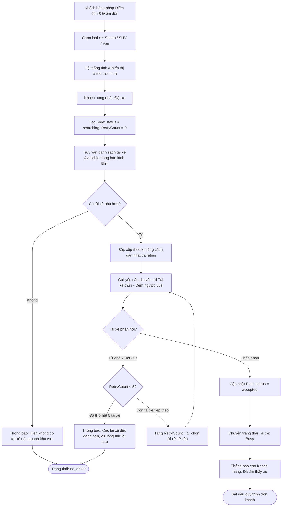
```mermaid
flowchart TD
    A[Khách hàng nhập Điểm đón & Điểm đến] --> B[Chọn loại xe: Sedan / SUV / Van]
    B --> C[Hệ thống tính & hiển thị cước ước tính]
    C --> D[Khách hàng nhấn Đặt xe]
    D --> E[Tạo Ride: status = searching, RetryCount = 0]
    
    E --> F[Truy vấn danh sách tài xế Available trong bán kính 5km]
    F --> G{Có tài xế phù hợp?}
    
    G -- Không --> NoDrv[Thông báo: Hiện không có tài xế nào quanh khu vực]
    NoDrv --> EndFail([Trạng thái: no_driver])
    
    G -- Có --> SortDrv[Sắp xếp theo khoảng cách gần nhất và rating]
    SortDrv --> SendReq[Gửi yêu cầu chuyến tới Tài xế thứ i - Đếm ngược 30s]
    
    SendReq --> WaitResp{Tài xế phản hồi?}
    
    WaitResp -- Chấp nhận --> Accept[Cập nhật Ride: status = accepted]
    Accept --> SetDrvBusy[Chuyển trạng thái Tài xế: Busy]
    SetDrvBusy --> NotifyMatched[Thông báo cho Khách hàng: Đã tìm thấy xe]
    NotifyMatched --> EndSuccess([Bắt đầu quy trình đón khách])
    
    WaitResp -- Từ chối / Hết 30s --> CheckRetry{RetryCount < 5?}
    CheckRetry -- Còn tài xế tiếp theo --> NextDrv[Tăng RetryCount + 1, chọn tài xế kế tiếp]
    NextDrv --> SendReq
    CheckRetry -- Đã thử hết 5 tài xế --> MaxFail[Thông báo: Các tài xế đều đang bận, vui lòng thử lại sau]
    MaxFail --> EndFail
```

---

#### 1.7.4 BP-03: Quy trình Thực hiện Chuyến đi & Giám sát Real-time

Quy trình quản lý toàn bộ vòng đời di chuyển từ khi tài xế nhận chuyến đến khi trả khách an toàn.

| Thuộc tính | Chi tiết |
|------------|----------|
| **Mục đích** | Đảm bảo tính minh bạch, hiển thị vị trí liên tục cho khách hàng và lưu vết lộ trình |
| **Actor** | Tài xế, Khách hàng, Hệ thống CAB (Socket Server) |
| **Tiền điều kiện** | Chuyến đi đang ở trạng thái `accepted` |
| **Hậu điều kiện** | Chuyến đi chuyển sang `completed`, sẵn sàng tính cước |

**Các bước thực hiện:**
1. **Di chuyển đến điểm đón**: Tài xế bấm "Bắt đầu di chuyển tới đón". Hệ thống phát socket tọa độ GPS cho Khách hàng thấy tài xế đang chạy đến.
2. **Đến điểm đón**: Khi tới nơi, Tài xế bấm **"Đã đến điểm đón"** (`driver_arrived`). Khách hàng nhận thông báo "Tài xế đã có mặt tại điểm hẹn".
3. **Đón khách & Bắt đầu hành trình**: Khách lên xe, Tài xế bấm **"Bắt đầu chuyến đi"** (`in_progress`). Hệ thống ghi nhận mốc thời gian bắt đầu (`startedAt`).
4. **Hành trình di chuyển**: GPS phát liên tục mỗi 5-10s. Khách hàng theo dõi đường đi trực tiếp trên bản đồ.
5. **Đến nơi & Hoàn thành**: Tới điểm đến, Tài xế bấm **"Hoàn thành chuyến"** (`completed`). Hệ thống ghi nhận mốc thời gian kết thúc (`completedAt`) và quãng đường thực tế.

---

#### 1.7.5 BP-04: Quy trình Tính cước & Thanh toán

Quy trình xác định cước phí chính xác và thanh toán đa kênh an toàn.

| Thuộc tính | Chi tiết |
|------------|----------|
| **Mục đích** | Tự động tính cước minh bạch và thu tiền an toàn, không lưu dữ liệu thẻ nhạy cảm |
| **Actor** | Khách hàng, Tài xế, Hệ thống CAB, Cổng thanh toán |
| **Tiền điều kiện** | Chuyến đi vừa chuyển trạng thái `completed` |
| **Hậu điều kiện** | Hóa đơn được thanh toán thành công (`payment_status = completed`) |

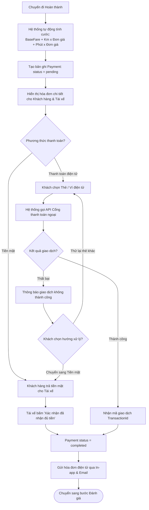
```mermaid
flowchart TD
    A[Chuyến đi Hoàn thành] --> B[Hệ thống tự động tính cước:<br/>BaseFare + Km x Đơn giá + Phút x Đơn giá]
    B --> C[Tạo bản ghi Payment: status = pending]
    C --> D[Hiển thị hóa đơn chi tiết cho Khách hàng & Tài xế]
    
    D --> E{Phương thức thanh toán?}
    
    E -- Tiền mặt --> Cash[Khách hàng trả tiền mặt cho Tài xế]
    Cash --> CashConfirm[Tài xế bấm 'Xác nhận đã nhận đủ tiền']
    CashConfirm --> PaySuccess[Payment status = completed]
    
    E -- Thanh toán điện tử --> OnlinePay[Khách chọn Thẻ / Ví điện tử]
    OnlinePay --> GatewayReq[Hệ thống gọi API Cổng thanh toán ngoại]
    GatewayReq --> GatewayProcess{Kết quả giao dịch?}
    
    GatewayProcess -- Thành công --> TokenRes[Nhận mã giao dịch TransactionId]
    TokenRes --> PaySuccess
    
    GatewayProcess -- Thất bại --> PayFail[Thông báo giao dịch không thành công]
    PayFail --> RetryChoice{Khách chọn hướng xử lý?}
    RetryChoice -- Thử lại thẻ khác --> OnlinePay
    RetryChoice -- Chuyển sang Tiền mặt --> Cash
    
    PaySuccess --> SendReceipt[Gửi hóa đơn điện tử qua In-app & Email]
    SendReceipt --> NextStep([Chuyển sang bước Đánh giá])
```

---

#### 1.7.6 BP-05: Quy trình Đánh giá & Phản hồi sau Chuyến đi

| Thuộc tính | Chi tiết |
|------------|----------|
| **Mục đích** | Thu thập đánh giá chất lượng phục vụ và cập nhật uy tín của tài xế |
| **Actor** | Khách hàng, Hệ thống CAB |
| **Tiền điều kiện** | Chuyến đi đã thanh toán thành công |
| **Hậu điều kiện** | Rating trung bình của tài xế được tính toán lại |

1. **Hiển thị Form đánh giá**: Sau khi thanh toán xong, màn hình khách hàng tự động hiển thị giao diện chấm điểm (1 đến 5 sao) và ô nhập nhận xét góp ý.
2. **Khách gửi đánh giá**: Khách hàng chọn số sao và gửi phản hồi (hoặc có thể bấm "Bỏ qua").
3. **Tổng hợp Rating**: Hệ thống lưu đánh giá vào cơ sở dữ liệu và tính lại điểm số trung bình của Tài xế:
   $$\text{Rating Mới} = \frac{\text{Tổng điểm đánh giá}}{\text{Tổng số lượt đánh giá}}$$
4. **Giải phóng trạng thái**: Hệ thống chuyển trạng thái của Tài xế về `Available` sẵn sàng nhận các cuốc xe tiếp theo.

---

#### 1.7.7 BP-06: Quy trình Hủy chuyến (Cancellation Flow)

Quy trình giải quyết các trường hợp ngoại lệ khi Khách hàng hoặc Tài xế hủy chuyến.

| Thuộc tính | Chi tiết |
|------------|----------|
| **Mục đích** | Xử lý hủy chuyến minh bạch, giải phóng tài xế và bảo vệ quyền lợi đôi bên |
| **Actor** | Khách hàng, Tài xế, Hệ thống CAB |
| **Quy tắc MVP** | Cho phép hủy miễn phí khi tài xế chưa đến điểm đón |

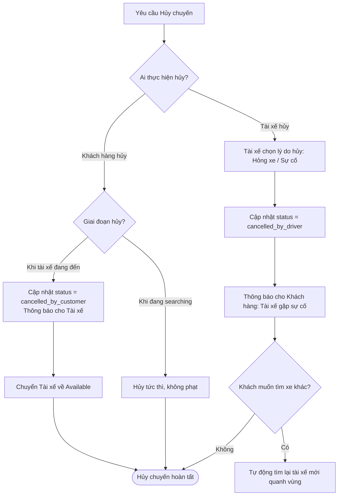
```mermaid
flowchart TD
    A[Yêu cầu Hủy chuyến] --> B{Ai thực hiện hủy?}
    
    B -- Khách hàng hủy --> CheckCustPhase{Giai đoạn hủy?}
    CheckCustPhase -- Khi đang searching --> CancelDirect1[Hủy tức thì, không phạt]
    CheckCustPhase -- Khi tài xế đang đến --> CancelMatched[Cập nhật status = cancelled_by_customer<br/>Thông báo cho Tài xế]
    CancelMatched --> FreeDriver1[Chuyển Tài xế về Available]
    
    B -- Tài xế hủy --> DriverCancel[Tài xế chọn lý do hủy: Hỏng xe / Sự cố]
    DriverCancel --> CheckDrvPhase[Cập nhật status = cancelled_by_driver]
    CheckDrvPhase --> NotifyCust[Thông báo cho Khách hàng: Tài xế gặp sự cố]
    NotifyCust --> AutoReMatch{Khách muốn tìm xe khác?}
    AutoReMatch -- Có --> ReSearch[Tự động tìm lại tài xế mới quanh vùng]
    AutoReMatch -- Không --> EndCancel([Hủy chuyến hoàn tất])
    
    CancelDirect1 --> EndCancel
    FreeDriver1 --> EndCancel
```

---

#### 1.7.8 BP-07: Quy trình Giám sát Vận hành & Xử lý Sự cố (Operations & Support)

Quy trình dành cho bộ phận vận hành (Operator/Admin) để kiểm soát chất lượng và hỗ trợ người dùng.

| Thuộc tính | Chi tiết |
|------------|----------|
| **Mục đích** | Giám sát toàn bộ chuyến đi đang chạy, can thiệp sự cố và xem báo cáo kinh doanh |
| **Actor** | Nhân viên vận hành (Operator), Quản trị viên (Admin), Hệ thống CAB |

1. **Giám sát thời gian thực**: Nhân viên vận hành theo dõi bản đồ trực quan:
   - Các xe đang `Available` (màu xanh lá)
   - Các xe đang `Busy` chở khách (màu vàng)
   - Các chuyến đi đang ở trạng thái `searching` lâu hơn bình thường
2. **Can thiệp sự cố**:
   - Khi có khiếu nại hoặc chuyến bị kẹt (mất kết nối > 5 phút), Operator có thể xem chi tiết chuyến, liên hệ trực tiếp khách hàng/tài xế và thực hiện hủy cưỡng chế hoặc điều phối lại nếu cần.
3. **Báo cáo định kỳ**:
   - Admin truy cập trang Báo cáo để xuất số liệu: tổng chuyến đi trong ngày, doanh thu thực thu, tỷ lệ cuốc thành công vs cuốc hủy, và bảng xếp hạng tài xế hiệu quả.

---

### 1.8 Các điểm chưa rõ cần xác nhận với khách hàng

Dựa trên mô tả yêu cầu, doanh nghiệp **chưa chốt** các vấn đề sau. Business Analyst cần làm rõ trước khi phát triển:

| # | Vấn đề | Câu hỏi cần xác nhận | Giả định tạm thời cho MVP |
|---|--------|----------------------|--------------------------|
| Q-01 | **Cách tính cước** | Công thức tính cước chi tiết? Có phụ thu giờ cao điểm không? Phụ thu đêm? | `Cước = Giá cơ bản + (Km × Đơn giá/km) + (Phút × Đơn giá/phút)` theo loại xe |
| Q-02 | **Tiêu chí ưu tiên tài xế** | Ngoài khoảng cách, có ưu tiên theo rating, số chuyến hoàn thành, thâm niên không? | Ưu tiên theo khoảng cách gần nhất, sau đó rating |
| Q-03 | **Thời gian phản hồi** | Tài xế có bao lâu để chấp nhận/từ chối chuyến? | 30 giây |
| Q-04 | **Số lần thử tài xế** | Tìm tối đa bao nhiêu tài xế trước khi báo "không tìm được"? | Tối đa 5 tài xế |
| Q-05 | **Bán kính tìm kiếm** | Bán kính tìm tài xế tối đa bao nhiêu km? | 5 km |
| Q-06 | **Chính sách hủy chuyến** | Khách/tài xế hủy chuyến bị phạt không? Hủy trước/sau khi match khác nhau? | Hủy miễn phí trước khi tài xế đến điểm đón |
| Q-07 | **Xử lý mất kết nối** | Khi tài xế/khách hàng mất mạng giữa chuyến thì xử lý thế nào? | Giữ trạng thái chuyến, chờ kết nối lại trong 5 phút |
| Q-08 | **Thời gian lưu trữ dữ liệu** | Dữ liệu chuyến đi, giao dịch lưu bao lâu? | Lưu vĩnh viễn (soft delete) |
| Q-09 | **Loại xe** | Doanh nghiệp có bao nhiêu loại xe? Tên gọi và mức giá? | 3 loại: Sedan (4 chỗ), SUV (7 chỗ), VAN (16 chỗ) |
| Q-10 | **Phương thức thanh toán điện tử** | Tích hợp cổng thanh toán nào? (VNPay, MoMo, ZaloPay?) | Mock gateway cho MVP |

---

## Giai đoạn 2 – Phân rã yêu cầu chức năng (Functional Requirements Decomposition)

Phân rã yêu cầu chức năng (Functional Decomposition) là kỹ thuật phân tách hệ thống cấp cao thành các phân hệ (L1), nhóm chức năng (L2), và các yêu cầu chức năng chi tiết ở mức nguyên tử (L3 - Atomic Requirements). Kỹ thuật này giúp đảm bảo không bỏ sót bất kỳ yêu cầu nghiệp vụ nào và làm tiền đề cho việc xây dựng kiến trúc kỹ thuật và lập trình.

---

### 2.1 Cây phân rã chức năng (Functional Decomposition Tree)


```mermaid
graph TD
    L0["<b>CAB System Platform (L0)</b>"]
    
    %% L1 Modules
    L0 --> M1["1.0 Quản lý Xác thực & Tài khoản"]
    L0 --> M2["2.0 Quản lý Tài xế & Phương tiện"]
    L0 --> M3["3.0 Đặt xe & Vòng đời Chuyến đi"]
    L0 --> M4["4.0 Phân công & Ghép nối Tài xế"]
    L0 --> M5["5.0 Tính cước & Thanh toán"]
    L0 --> M6["6.0 Định vị & Giám sát Real-time"]
    L0 --> M7["7.0 Trung tâm Thông báo Đa kênh"]
    L0 --> M8["8.0 Đánh giá & Phản hồi"]
    L0 --> M9["9.0 Quản trị Vận hành & Báo cáo"]
    L0 --> M10["10.0 Bảo mật, RBAC & Audit Log"]

    %% L2 Sub-functions
    M1 --> M1_1["1.1 Đăng ký đa kênh"]
    M1 --> M1_2["1.2 Xác thực JWT & Phiên"]
    M1 --> M1_3["1.3 Quản lý Hồ sơ cá nhân"]

    M2 --> M2_1["2.1 Đăng ký hồ sơ lái xe"]
    M2 --> M2_2["2.2 Quản lý hồ sơ phương tiện"]
    M2 --> M2_3["2.3 Quản lý trạng thái Online/Offline"]
    M2 --> M2_4["2.4 Xét duyệt hồ sơ (Operator)"]

    M3 --> M3_1["3.1 Khởi tạo yêu cầu chuyến"]
    M3 --> M3_2["3.2 Lựa chọn hạng xe & Ước tính cước"]
    M3 --> M3_3["3.3 Quản lý trạng thái chuyến đi"]
    M3 --> M3_4["3.4 Xử lý hủy chuyến"]
    M3 --> M3_5["3.5 Tra cứu lịch sử chuyến đi"]

    M4 --> M4_1["4.1 Quét tài xế quanh vùng 5km"]
    M4 --> M4_2["4.2 Thuật toán xếp hạng ưu tiên"]
    M4 --> M4_3["4.3 Điều phối yêu cầu & Timeout 30s"]
    M4 --> M4_4["4.4 Cơ chế thử lại tự động (Retry Max 5)"]

    M5 --> M5_1["5.1 Tính cước tự động theo công thức"]
    M5 --> M5_2["5.2 Quản lý cấu hình biểu phí xe"]
    M5 --> M5_3["5.3 Xử lý thanh toán Tiền mặt"]
    M5 --> M5_4["5.4 Xử lý thanh toán Điện tử (Mock Gateway)"]
    M5 --> M5_5["5.5 Xử lý lỗi & Thử lại giao dịch"]

    M6 --> M6_1["6.1 Thu nhận GPS tài xế liên tục"]
    M6 --> M6_2["6.2 Phát sóng vị trí qua WebSocket"]
    M6 --> M6_3["6.3 Tính toán khoảng cách & ETA"]

    M7 --> M7_1["7.1 Thông báo Real-time In-App (Socket)"]
    M7 --> M7_2["7.2 Thông báo qua Email (Nodemailer)"]
    M7 --> M7_3["7.3 Trung tâm quản lý thông báo người dùng"]

    M8 --> M8_1["8.1 Gửi đánh giá sao & Nhận xét"]
    M8 --> M8_2["8.2 Cập nhật Rating trung bình"]

    M9 --> M9_1["9.1 Dashboard Giám sát Real-time"]
    M9 --> M9_2["9.2 Quản lý Khách hàng & Tài xế"]
    M9 --> M9_3["9.3 Can thiệp & Xử lý chuyến đi"]
    M9 --> M9_4["9.4 Báo cáo thống kê & Doanh thu"]

    M10 --> M10_1["10.1 Phân quyền vai trò RBAC"]
    M10 --> M10_2["10.2 Ghi nhật ký kiểm toán Audit Log"]
    M10 --> M10_3["10.3 Mã hóa dữ liệu nhạy cảm"]
```

---

### 2.2 Bảng phân rã chi tiết yêu cầu chức năng theo từng phân hệ

---

#### 2.2.1 Phân hệ 1.0: Quản lý Xác thực & Tài khoản (Authentication & User Management)

| Mã FR | Tên chức năng | User Story / Mô tả chi tiết | Dữ liệu đầu vào (Input) | Xử lý & Quy tắc (Processing) | Đầu ra (Output) | BR liên quan | Ưu tiên |
|---|---|---|---|---|---|---|---|
| **FR-AUTH-01** | Đăng ký tài khoản Khách hàng | Là khách hàng, tôi muốn tạo tài khoản bằng Email/SĐT để sử dụng dịch vụ. | Họ tên, Email, Số điện thoại, Mật khẩu | Kiểm tra định dạng email, SĐT hợp lệ, kiểm tra trùng lặp trong DB, hash mật khẩu bằng bcrypt. | Tài khoản được tạo ở trạng thái `Active`, gửi email chào mừng. | BR-001 | Must Have |
| **FR-AUTH-02** | Đăng ký tài khoản Tài xế | Là tài xế, tôi muốn đăng ký tài khoản kèm giấy tờ để xin gia nhập hệ thống. | Họ tên, SĐT, Email, Mật khẩu, Số GPLX, Hạng bằng lái, Ảnh chụp bằng lái | Kiểm tra tính hợp lệ dữ liệu, lưu hồ sơ ở trạng thái `Pending_Approval`. | Bản ghi tài xế được tạo, chờ duyệt từ Operator. | BR-002 | Must Have |
| **FR-AUTH-03** | Đăng nhập hệ thống | Là người dùng, tôi muốn đăng nhập bằng Email/SĐT và mật khẩu để truy cập chức năng. | Email/SĐT, Mật khẩu | So khớp thông tin trong DB, kiểm tra trạng thái tài khoản không bị khóa, phát sinh Access Token (JWT - 15p) và Refresh Token (7 ngày). | Token xác thực, thông tin Role và Profile trả về Client. | BR-003, BR-041 | Must Have |
| **FR-AUTH-04** | Cập nhật hồ sơ cá nhân | Là người dùng, tôi muốn cập nhật thông tin cá nhân của mình. | Tên hiển thị, Số điện thoại, Ảnh đại diện (Avatar) | Xác thực token, cập nhật DB, không cho phép đổi email định danh. | Hồ sơ cập nhật thành công. | BR-004 | Must Have |
| **FR-AUTH-05** | Đổi mật khẩu | Là người dùng, tôi muốn đổi mật khẩu mới để bảo mật tài khoản. | Mật khẩu hiện tại, Mật khẩu mới | So khớp mật khẩu cũ, kiểm tra mật khẩu mới đủ độ dài (≥ 6 ký tự), mã hóa và lưu DB. | Mật khẩu được cập nhật, hủy bỏ các token cũ. | BR-042 | Must Have |
| **FR-AUTH-06** | Đăng xuất & Thu hồi phiên | Là người dùng, tôi muốn đăng xuất khỏi ứng dụng. | Refresh Token | Xóa refresh token khỏi cơ sở dữ liệu/blacklist. | Phiên làm việc kết thúc an toàn. | BR-041 | Must Have |

---

#### 2.2.2 Phân hệ 2.0: Quản lý Tài xế & Phương tiện (Driver & Vehicle Management)

| Mã FR | Tên chức năng | User Story / Mô tả chi tiết | Dữ liệu đầu vào (Input) | Xử lý & Quy tắc (Processing) | Đầu ra (Output) | BR liên quan | Ưu tiên |
|---|---|---|---|---|---|---|---|
| **FR-DRV-01** | Đăng ký thông tin phương tiện | Là tài xế, tôi muốn khai báo xe của mình để phục vụ chở khách. | Biển số xe, Hãng xe, Dòng xe (Model), Màu sắc, Phân loại xe (Sedan/SUV/Van), Số ghế ngồi | Kiểm tra biển số xe duy nhất, liên kết thông tin phương tiện với Driver ID. | Bản ghi xe được lưu, trạng thái `Active`. | BR-017 | Must Have |
| **FR-DRV-02** | Bật/Tắt trạng thái trực tuyến (Online/Offline) | Là tài xế, tôi muốn bật chế độ sẵn sàng nhận chuyến khi bắt đầu ca làm việc. | Trạng thái mong muốn (`Available` / `Offline`) | Chỉ cho phép bật `Available` nếu hồ sơ đã được duyệt (`Approved`) và phương tiện hợp lệ. | Cập nhật DB, phát socket thông báo tài xế online. | BR-014 | Must Have |
| **FR-DRV-03** | Tự động chuyển trạng thái bận | Hệ thống tự động gán trạng thái bận khi tài xế đang chạy cuốc. | Sự kiện nhận chuyến (`accepted`) | Chuyển trạng thái sang `Busy`, tạm ngưng nhận các yêu cầu mới. | Tài xế không xuất hiện trong danh sách tìm kiếm chuyến khác. | BR-014, BR-023 | Must Have |
| **FR-DRV-04** | Duyệt hồ sơ tài xế | Là Operator, tôi muốn xét duyệt hồ sơ tài xế đăng ký mới. | Driver ID, Quyết định (`Approve` / `Reject`), Ghi chú lý do | Cập nhật trạng thái `isApproved = true/false`, gửi email thông báo kết quả cho tài xế. | Hồ sơ tài xế được kích hoạt hoặc từ chối. | BR-016, BR-036 | Must Have |
| **FR-DRV-05** | Xem hồ sơ và hiệu suất tài xế | Là tài xế, tôi muốn xem tổng số chuyến hoàn thành, thu nhập và rating của mình. | Driver ID | Tổng hợp số cuốc xe, rating trung bình, tổng tiền từ các cuốc hoàn thành. | Màn hình Dashboard tài xế với các chỉ số đo lường. | BR-013, BR-035 | Should Have |
| **FR-DRV-06** | Khóa/Vô hiệu hóa tài xế vi phạm | Là Admin, tôi muốn tạm khóa tài xế khi có hành vi vi phạm. | Driver ID, Lý do khóa | Chuyển trạng thái `isActive = false`, ngắt kết nối socket, thu hồi quyền nhận chuyến. | Tài xế bị đăng xuất và không thể trực tuyến. | BR-036, BR-039 | Should Have |

---

#### 2.2.3 Phân hệ 3.0: Đặt xe & Vòng đời Chuyến đi (Ride Booking & Trip Lifecycle)

| Mã FR | Tên chức năng | User Story / Mô tả chi tiết | Dữ liệu đầu vào (Input) | Xử lý & Quy tắc (Processing) | Đầu ra (Output) | BR liên quan | Ưu tiên |
|---|---|---|---|---|---|---|---|
| **FR-RIDE-01** | Tìm kiếm & Nhập địa chỉ điểm đón/trả | Là khách hàng, tôi muốn tìm kiếm địa chỉ đón và trả khách trên bản đồ. | Tên địa chỉ (Text) hoặc Điểm ghim tọa độ | Gọi Map Service để Geocoding (chuyển chữ sang tọa độ [lat, lng]) hoặc Reverse Geocoding. | Tọa độ chuẩn hóa và tên địa chỉ rõ ràng. | BR-005 | Must Have |
| **FR-RIDE-02** | Hiển thị cước phí ước tính theo hạng xe | Là khách hàng, tôi muốn xem trước số tiền ước tính cho các loại xe để lựa chọn. | Tọa độ đón, Tọa độ trả | Tính khoảng cách đường đi (Km), thời gian ước tính (Phút), áp dụng bảng giá của từng loại xe (Sedan, SUV, Van). | Bảng giá ước tính cho 3 hạng xe. | BR-005, BR-006, BR-025 | Must Have |
| **FR-RIDE-03** | Khởi tạo yêu cầu đặt xe | Là khách hàng, tôi muốn gửi yêu cầu đặt xe chính thức sau khi xem giá. | Điểm đón, Điểm trả, Loại xe chọn, Phương thức thanh toán dự kiến | Tạo bản ghi Ride với mã duy nhất, trạng thái ban đầu `searching`, kích hoạt tiến trình tìm tài xế. | Ride ID được tạo, chuyển sang màn hình chờ tài xế. | BR-005, BR-012 | Must Have |
| **FR-RIDE-04** | Cập nhật mốc "Tài xế đã đến điểm đón" | Là tài xế, tôi muốn báo hiệu tôi đã có mặt tại vị trí đón khách. | Ride ID, Driver ID | Kiểm tra trạng thái hiện tại là `accepted`, đổi sang `driver_arrived`, ghi nhận `arrivedAt`. | Socket phát thông báo tức thời đến khách hàng. | BR-007, BR-023 | Must Have |
| **FR-RIDE-05** | Cập nhật mốc "Bắt đầu chuyến đi" | Là tài xế, tôi muốn xác nhận khách đã lên xe và bắt đầu hành trình. | Ride ID, Driver ID | Đổi trạng thái sang `in_progress`, ghi nhận `startedAt`, bắt đầu tính thời gian di chuyển. | Khách hàng và tài xế chuyển sang màn hình theo dõi lộ trình. | BR-007, BR-023 | Must Have |
| **FR-RIDE-06** | Cập nhật mốc "Hoàn thành chuyến đi" | Là tài xế, tôi muốn bấm hoàn thành khi đưa khách đến đúng nơi. | Ride ID, Driver ID, Tọa độ kết thúc | Đổi trạng thái sang `completed`, ghi nhận `completedAt`, chuyển giao thông tin sang phân hệ Tính cước. | Màn hình hóa đơn thanh toán xuất hiện. | BR-007, BR-023, BR-024 | Must Have |
| **FR-RIDE-07** | Khách hàng hủy chuyến | Là khách hàng, tôi muốn hủy cuốc xe khi có việc đột xuất. | Ride ID, Lý do hủy | Kiểm tra trạng thái: nếu chưa đón khách thì cho phép hủy (`cancelled_by_customer`), giải phóng tài xế về `Available`. | Chuyến đi kết thúc, thông báo cho tài xế. | BR-010 | Must Have |
| **FR-RIDE-08** | Tài xế hủy chuyến do sự cố | Là tài xế, tôi muốn hủy chuyến khi xe gặp sự cố hỏng hóc hoặc không liên hệ được khách. | Ride ID, Lý do hủy | Đổi trạng thái `cancelled_by_driver`, kích hoạt tự động tìm tài xế khác cho khách nếu khách có nhu cầu. | Thông báo cho khách hàng lý do hủy. | BR-010, BR-020 | Must Have |
| **FR-RIDE-09** | Tra cứu lịch sử và chi tiết chuyến đi | Là người dùng, tôi muốn xem lại toàn bộ các cuốc xe mình đã đi hoặc đã chạy. | User ID, Bộ lọc ngày/trạng thái | Truy vấn DB các chuyến đi tương ứng, sắp xếp mới nhất lên đầu, phân trang. | Danh sách chuyến đi kèm đầy đủ thông số chi tiết. | BR-011 | Must Have |

---

#### 2.2.4 Phân hệ 4.0: Phân công & Ghép nối Tài xế (Driver Matching Engine)

| Mã FR | Tên chức năng | User Story / Mô tả chi tiết | Dữ liệu đầu vào (Input) | Xử lý & Quy tắc (Processing) | Đầu ra (Output) | BR liên quan | Ưu tiên |
|---|---|---|---|---|---|---|---|
| **FR-MATCH-01** | Quét tài xế khả dụng quanh vùng | Hệ thống tự động quét tìm các tài xế quanh tọa độ đón khách. | Tọa độ đón khách, Loại xe yêu cầu, Bán kính (mặc định 5km) | Sử dụng thuật toán tính khoảng cách (Haversine/GeoNear) quét trong DB các tài xế có `status = Available` và loại xe khớp yêu cầu. | Danh sách tài xế tiềm năng được sắp xếp theo khoảng cách tăng dần. | BR-018, BR-019 | Must Have |
| **FR-MATCH-02** | Xếp hạng ưu tiên tài xế | Hệ thống chấm điểm ưu tiên để chọn tài xế tốt nhất gửi yêu cầu trước. | Danh sách tài xế quanh vùng | Tiêu chí 1: Khoảng cách gần nhất; Tiêu chí 2: Rating trung bình cao hơn. | Tài xế ưu tiên số 1 được chọn. | BR-019 | Must Have |
| **FR-MATCH-03** | Gửi thông báo chuyến & Đếm ngược 30s | Hệ thống gửi thông tin cuốc xe đến tài xế được chọn và kích hoạt bộ đếm thời gian. | Ride ID, Thông tin cuốc (Điểm đón/trả, Cước ước tính), Socket ID tài xế | Phát socket sự kiện `ride:newRequest`, khởi tạo Timer 30 giây trên Redis/Memory. | Popup nhận cuốc hiển thị trên máy tài xế kèm đồng hồ đếm ngược. | BR-020, BR-021 | Must Have |
| **FR-MATCH-04** | Xử lý chấp nhận chuyến | Là tài xế, tôi muốn bấm "Chấp nhận" để nhận cuốc xe này. | Ride ID, Driver ID | Kiểm tra chuyến chưa bị tài xế khác nhận, gán `driverId` vào Ride, đổi trạng thái Ride sang `accepted`, đổi tài xế sang `Busy`. | Khóa cuốc xe thành công, hủy timer đếm ngược, thông báo cho khách hàng. | BR-007, BR-023 | Must Have |
| **FR-MATCH-05** | Xử lý từ chối hoặc hết giờ (Fallback) | Hệ thống tự động chuyển tài xế tiếp theo nếu tài xế hiện tại bấm từ chối hoặc quá 30s. | Sự kiện Từ chối hoặc Timer Expired | Đưa tài xế vừa từ chối vào danh sách loại trừ (Blacklist của chuyến này), tăng `retryCount + 1`. Nếu `retryCount < 5`, chọn tài xế kế tiếp gửi lại. | Yêu cầu được gửi sang tài xế tiếp theo liền mạch. | BR-020, BR-021 | Must Have |
| **FR-MATCH-06** | Xử lý không tìm thấy tài xế | Hệ thống kết thúc tìm kiếm khi không còn tài xế khả dụng hoặc đã thử hết 5 lần. | `retryCount >= 5` hoặc danh sách tài xế trống | Cập nhật trạng thái Ride sang `no_driver`. | Thông báo rõ ràng cho khách hàng: "Hiện không có tài xế nào, vui lòng thử lại sau". | BR-022 | Must Have |

---

#### 2.2.5 Phân hệ 5.0: Tính cước & Thanh toán (Fare Calculation & Payment)

| Mã FR | Tên chức năng | User Story / Mô tả chi tiết | Dữ liệu đầu vào (Input) | Xử lý & Quy tắc (Processing) | Đầu ra (Output) | BR liên quan | Ưu tiên |
|---|---|---|---|---|---|---|---|
| **FR-PAY-01** | Tính cước phí thực tế | Hệ thống tự động tính toán tổng tiền chuyến đi khi kết thúc. | Loại xe, Khoảng cách thực tế ($Km$), Thời gian di chuyển ($Phút$) | Áp dụng công thức: $\text{Tổng cước} = \text{Giá cơ bản} + (Km \times \text{Đơn giá/Km}) + (Phút \times \text{Đơn giá/Phút})$. | Số tiền cước chính xác (`actualFare`), cập nhật vào Ride. | BR-024, BR-026 | Must Have |
| **FR-PAY-02** | Cấu hình bảng giá theo loại xe | Là Admin, tôi muốn tùy chỉnh mức cước cơ bản và đơn giá để linh hoạt kinh doanh. | Loại xe, BaseFare, PricePerKm, PricePerMin | Lưu cấu hình bảng giá trong DB/Config, áp dụng ngay cho các cuốc xe khởi tạo sau thời điểm sửa. | Bảng giá mới có hiệu lực. | BR-026 | Must Have |
| **FR-PAY-03** | Thanh toán Tiền mặt | Là khách hàng, tôi muốn trả tiền mặt trực tiếp cho tài xế. | Ride ID, Lựa chọn `Cash` | Tạo bản ghi Payment với `method = CASH`, `status = PENDING`. | Tài xế nhận được yêu cầu thu tiền mặt trên app. | BR-027, BR-034 | Must Have |
| **FR-PAY-04** | Tài xế xác nhận đã thu tiền mặt | Là tài xế, tôi muốn bấm xác nhận khi đã nhận đủ tiền mặt từ khách. | Payment ID, Driver ID | Đổi trạng thái Payment sang `COMPLETED`, ghi nhận thời gian `paidAt`. | Hóa đơn thanh toán hoàn tất, gửi biên lai cho khách. | BR-027 | Must Have |
| **FR-PAY-05** | Thanh toán Điện tử qua Mock Gateway | Là khách hàng, tôi muốn thanh toán qua thẻ/ví điện tử trực tuyến an toàn. | Payment ID, Phương thức (Thẻ/Ví), Token giả lập | Gửi yêu cầu sang Mock Payment Gateway, nhận mã phản hồi giao dịch (`transactionId`). Tuyệt đối không lưu số thẻ/CVV trong DB. | Trạng thái Payment chuyển `COMPLETED`, lưu `transactionId`. | BR-028 | Should Have |
| **FR-PAY-06** | Xử lý sự cố thanh toán điện tử thất bại | Hệ thống xử lý khi cổng thanh toán trả về mã lỗi (thẻ hết tiền, timeout). | Mã lỗi từ Cổng thanh toán | Chuyển trạng thái Payment sang `FAILED`, thông báo lý do lỗi cho khách hàng. | Cho phép khách hàng chọn: Thử lại thẻ khác hoặc Đổi sang trả tiền mặt. | BR-029 | Should Have |
| **FR-PAY-07** | Xuất hóa đơn điện tử / Biên lai chi tiết | Là khách hàng, tôi muốn xem chi tiết hóa đơn cước phí của chuyến đi. | Ride ID | Tổng hợp: Giá cơ bản, Phí quãng đường, Phí thời gian, Phương thức thanh toán, Mã GD. | Màn hình hóa đơn điện tử và gửi bản sao qua email. | BR-030 | Should Have |

---

#### 2.2.6 Phân hệ 6.0: Định vị & Giám sát Real-time (Tracking & Geolocation)

| Mã FR | Tên chức năng | User Story / Mô tả chi tiết | Dữ liệu đầu vào (Input) | Xử lý & Quy tắc (Processing) | Đầu ra (Output) | BR liên quan | Ưu tiên |
|---|---|---|---|---|---|---|---|
| **FR-TRACK-01** | Thu nhận và cập nhật tọa độ GPS tài xế | Ứng dụng tài xế tự động truyền tọa độ GPS định kỳ về máy chủ. | Driver ID, Tọa độ hiện tại (`latitude`, `longitude`, `bearing`) | Nhận dữ liệu qua Socket/HTTP mỗi 5-10 giây, cập nhật trường `currentLocation` của tài xế trong DB/Redis. | Tọa độ mới nhất của tài xế được ghi nhận. | BR-015 | Must Have |
| **FR-TRACK-02** | Phát sóng vị trí xe cho khách hàng theo dõi | Khách hàng xem biểu tượng xe tài xế di chuyển mượt mà trên bản đồ ứng dụng. | Ride ID, Socket Channel của chuyến | Khi tài xế phát tọa độ, server chuyển tiếp (broadcast) tức thì qua Room Socket của chuyến đi đó cho Khách hàng. | Bản đồ phía khách hàng cập nhật điểm đánh dấu xe di chuyển thời gian thực. | BR-008 | Must Have |
| **FR-TRACK-03** | Tính toán lại thời gian dự kiến đến (ETA) | Hệ thống liên tục ước lượng số phút tài xế sẽ tới điểm đón. | Tọa độ tài xế, Tọa độ điểm đón | Tính khoảng cách còn lại chia cho tốc độ trung bình di chuyển. | Hiển thị dòng chữ "Tài xế sẽ đến trong X phút" trên app khách. | BR-007, BR-008 | Must Have |
| **FR-TRACK-04** | Hiển thị toàn cảnh vị trí các xe cho Operator | Là Operator, tôi muốn xem bản đồ tổng thể toàn thành phố với các vị trí xe. | Tọa độ trung tâm, Bán kính hiển thị | Truy vấn toàn bộ tài xế `Available` và `Busy`, gắn icon màu tương ứng lên giao diện Admin. | Bản đồ nhiệt/Bản đồ số xe trực quan cho phòng điều hành. | BR-037 | Should Have |

---

#### 2.2.7 Phân hệ 7.0: Trung tâm Thông báo Đa kênh (Notification Hub)

| Mã FR | Tên chức năng | User Story / Mô tả chi tiết | Dữ liệu đầu vào (Input) | Xử lý & Quy tắc (Processing) | Đầu ra (Output) | BR liên quan | Ưu tiên |
|---|---|---|---|---|---|---|---|
| **FR-NOTIF-01** | Bắn thông báo đẩy In-App qua Socket | Hệ thống phát thông báo pop-up trên màn hình người dùng khi có sự kiện. | User ID, Tiêu đề, Nội dung, Loại sự kiện (`Event Type`) | Định tuyến tới kết nối Socket của User, hiển thị toast/alert ngay trên giao diện web. | Người dùng nhận tin báo tức thời mà không cần reload trang. | BR-031, BR-032 | Must Have |
| **FR-NOTIF-02** | Gửi email thông báo tự động | Hệ thống gửi email xác nhận và hóa đơn tự động. | Email người nhận, Mẫu template HTML, Dữ liệu truyền vào | Sử dụng dịch vụ Nodemailer/SMTP gửi email không đồng bộ (Asynchronous) để không chặn luồng xử lý chính. | Email được gửi tới hộp thư người dùng trong vòng ≤ 3 giây. | BR-031, BR-033 | Should Have |
| **FR-NOTIF-03** | Hộp thư thông báo trong ứng dụng | Là người dùng, tôi muốn xem lại danh sách các thông báo cũ. | User ID, Phân trang | Lấy danh sách thông báo từ DB, sắp xếp theo thời gian tạo giảm dần. | Danh sách thông báo kèm trạng thái Đã đọc / Chưa đọc. | BR-031 | Should Have |
| **FR-NOTIF-04** | Đánh dấu đã đọc thông báo | Là người dùng, tôi muốn bấm đánh dấu đã đọc một hoặc tất cả thông báo. | Notification ID hoặc Lệnh "Đọc tất cả" | Cập nhật cờ `isRead = true` trong cơ sở dữ liệu. | Số lượng thông báo chưa đọc trên icon chuông giảm về 0. | BR-031 | Should Have |
| **FR-NOTIF-05** | Mở rộng kênh thông báo (Provider Pattern) | Kiến trúc hỗ trợ gắn thêm adapter SMS/Push mà không sửa logic lõi. | Giao diện chuẩn `INotificationProvider` | Thiết kế hướng đối tượng tách biệt logic phát sinh thông báo và logic gửi qua từng kênh vật lý. | Dễ dàng cắm thêm module SMS/FCM sau này. | BR-033, BR-045 | Must Have |

---

#### 2.2.8 Phân hệ 8.0: Đánh giá & Phản hồi Dịch vụ (Rating & Feedback)

| Mã FR | Tên chức năng | User Story / Mô tả chi tiết | Dữ liệu đầu vào (Input) | Xử lý & Quy tắc (Processing) | Đầu ra (Output) | BR liên quan | Ưu tiên |
|---|---|---|---|---|---|---|---|
| **FR-RATE-01** | Gửi đánh giá tài xế sau chuyến đi | Là khách hàng, tôi muốn chấm sao (1-5) và viết nhận xét về tài xế sau chuyến. | Ride ID, Customer ID, Driver ID, Số sao (1 đến 5), Nhận xét (Text) | Kiểm tra cuốc xe đã `completed`, mỗi chuyến chỉ được đánh giá 1 lần, lưu bản ghi Rating vào DB. | Đánh giá được lưu trữ, hiển thị lời cảm ơn tới khách hàng. | BR-034 | Must Have |
| **FR-RATE-02** | Tự động tính toán lại Rating trung bình tài xế | Hệ thống cập nhật điểm sao trung bình hiển thị trên hồ sơ tài xế. | Driver ID, Điểm đánh giá mới | Tính toán lại trung bình cộng của tất cả các lượt đánh giá: $\text{AvgRating} = \frac{\sum \text{Stars}}{\text{TotalReviews}}$. Cập nhật trường `rating` trong bảng Driver. | Rating mới được cập nhật trên profile tài xế. | BR-034 | Must Have |
| **FR-RATE-03** | Xem danh sách đánh giá của tôi | Là tài xế, tôi muốn xem các phản hồi của khách hàng để rút kinh nghiệm phục vụ. | Driver ID | Truy vấn danh sách đánh giá liên quan đến tài xế này (ẩn danh thông tin nhạy cảm của khách). | Bảng danh sách nhận xét và số sao từng cuốc. | BR-035 | Should Have |

---

#### 2.2.9 Phân hệ 9.0: Quản trị Vận hành & Báo cáo Thống kê (Admin Operations & Reporting)

| Mã FR | Tên chức năng | User Story / Mô tả chi tiết | Dữ liệu đầu vào (Input) | Xử lý & Quy tắc (Processing) | Đầu ra (Output) | BR liên quan | Ưu tiên |
|---|---|---|---|---|---|---|---|
| **FR-ADM-01** | Dashboard tổng quan chỉ số vận hành | Là Admin/Operator, tôi muốn xem nhanh các chỉ số kinh doanh trong ngày. | Ngày xem (mặc định hôm nay) | Đếm tổng số cuốc xe hôm nay, số cuốc thành công, số cuốc hủy, tổng doanh thu phát sinh, số tài xế đang online. | Các thẻ thống kê (Metric Cards) và biểu đồ trực quan trên trang chủ Admin. | BR-036, BR-040 | Must Have |
| **FR-ADM-02** | Quản lý danh sách Khách hàng | Là Operator, tôi muốn tra cứu thông tin và lịch sử của khách hàng. | Từ khóa tìm kiếm (Tên, SĐT, Email), Bộ lọc trạng thái | Tìm kiếm trong DB người dùng có `role = customer`, phân trang dữ liệu. | Bảng danh sách khách hàng, nút xem chi tiết và khóa tài khoản. | BR-036 | Must Have |
| **FR-ADM-03** | Quản lý danh sách Tài xế & Phương tiện | Là Operator, tôi muốn quản lý toàn bộ đối tác tài xế và xe trong hệ thống. | Bộ lọc theo trạng thái duyệt (`Pending`/`Approved`), Trạng thái hoạt động | Truy vấn danh sách tài xế kèm thông tin phương tiện tương ứng. | Bảng quản trị tài xế với chức năng duyệt hồ sơ, khóa tài xế, xem vị trí. | BR-016, BR-036 | Must Have |
| **FR-ADM-04** | Giám sát và Can thiệp Chuyến đi | Là Operator, tôi muốn xem danh sách các chuyến đang chạy và hỗ trợ xử lý khiếu nại. | Bộ lọc trạng thái chuyến (`searching`, `in_progress`, `cancelled`) | Hiển thị các chuyến xe real-time, cung cấp nút "Hủy cưỡng chế" hoặc "Gán lại tài xế" cho Operator khi có sự cố. | Chuyến đi được can thiệp kịp thời, ghi log hành động. | BR-037, BR-043 | Must Have |
| **FR-ADM-05** | Tra cứu nhật ký giao dịch thanh toán | Là Operator, tôi muốn tra cứu lịch sử nạp/thu cước để đối soát. | Mã giao dịch, Khoảng thời gian, Phương thức thanh toán | Truy vấn bảng Payment, liên kết thông tin Ride, Customer, Driver. | Bảng chi tiết dòng tiền giao dịch. | BR-038 | Should Have |
| **FR-ADM-06** | Báo cáo Thống kê Doanh thu | Là Admin, tôi muốn xem biểu đồ doanh thu theo ngày, tuần, tháng và loại xe. | Khoảng thời gian từ ngày - đến ngày, Tiêu chí gom nhóm | Thực hiện truy vấn Aggregate dữ liệu thanh toán hoàn thành, gom nhóm theo mốc thời gian và loại xe. | Biểu đồ cột/đường doanh thu và bảng số liệu xuất Excel/PDF. | BR-040 | Should Have |
| **FR-ADM-07** | Báo cáo Tỷ lệ Hoàn thành & Hủy chuyến | Là Admin, tôi muốn theo dõi tỷ lệ cuốc thành công vs cuốc hủy để đánh giá chất lượng. | Khoảng thời gian phân tích | Thống kê số cuốc `completed` / `cancelled_by_customer` / `cancelled_by_driver` / `no_driver`. | Biểu đồ tròn tỷ lệ và danh sách lý do hủy phổ biến. | BR-040 | Should Have |
| **FR-ADM-08** | Báo cáo Đánh giá Hiệu quả Tài xế | Là Admin, tôi muốn xem bảng xếp hạng tài xế có doanh thu cao nhất và rating tốt nhất. | Tháng đánh giá, Tiêu chí xếp hạng | Gom nhóm theo Driver ID, tính tổng số cuốc, tổng tiền, rating bình quân, tỷ lệ từ chối cuốc. | Bảng vinh danh tài xế xuất sắc và cảnh báo tài xế tỷ lệ hủy cao. | BR-040 | Could Have |

---

#### 2.2.10 Phân hệ 10.0: Bảo mật, Phân quyền RBAC & Kiểm toán (Security & Audit)

| Mã FR | Tên chức năng | User Story / Mô tả chi tiết | Dữ liệu đầu vào (Input) | Xử lý & Quy tắc (Processing) | Đầu ra (Output) | BR liên quan | Ưu tiên |
|---|---|---|---|---|---|---|---|
| **FR-SEC-01** | Kiểm tra quyền truy cập theo vai trò (RBAC) | Hệ thống chặn các thao tác trái thẩm quyền của từng nhóm người dùng. | Token gửi kèm Header, Route/API gọi đến | Middleware `authorize(['admin', 'operator', ...])` kiểm tra quyền. Nếu không khớp trả về HTTP 403 Forbidden. | Ngăn chặn hoàn toàn truy cập trái phép. | BR-039, BR-041 | Must Have |
| **FR-SEC-02** | Phân tách quyền Operator vs Admin | Phân định rõ ràng: Operator chỉ vận hành, Admin mới có quyền sửa cấu hình/xóa dữ liệu. | Vai trò người dùng (`operator` vs `admin`) | Operator bị cấm truy cập API cấu hình giá cước, xóa vĩnh viễn user, phân quyền tài khoản khác. | Bảo vệ an toàn dữ liệu nhạy cảm của doanh nghiệp. | BR-039 | Must Have |
| **FR-SEC-03** | Ghi nhật ký kiểm toán (Audit Logging) | Hệ thống tự động lưu vết các hành động quan trọng để phục vụ hậu kiểm. | User ID, Hành động (`Action`), Đối tượng bị tác động (`Resource`), IP Client, Timestamp | Middleware tự động chèn bản ghi vào bảng `AuditLogs` mỗi khi có thao tác: Đổi giá cước, Duyệt/Khóa tài xế, Can thiệp chuyến đi, Đổi quyền. | Cơ sở dữ liệu nhật ký kiểm toán bất biến. | BR-043 | Should Have |
| **FR-SEC-04** | Mã hóa và bảo mật dữ liệu nhạy cảm | Bảo vệ mật khẩu và thông tin tài khoản người dùng. | Mật khẩu thô | Sử dụng thuật toán `bcrypt` với salt rounds ≥ 10 trước khi lưu DB. Không bao giờ lưu mật khẩu dạng plain-text. | Mật khẩu được mã hóa an toàn 1 chiều. | BR-042 | Must Have |
| **FR-SEC-05** | Cơ chế cách ly lỗi thành phần | Đảm bảo lỗi ở module phụ (thanh toán/email) không làm chết hệ thống đặt xe. | Sự cố ngoại lệ từ API bên thứ ba | Bao bọc các lời gọi ngoại vi bằng `try-catch`, xử lý fallback, sử dụng Async Worker / Message Queue độc lập. | Module đặt xe vẫn tiếp tục nhận cuốc bình thường. | BR-044, BR-045 | Must Have |

---

### 2.3 Ma trận liên kết chức năng và tác nhân (Function-Actor Traceability Matrix)

Ma trận thể hiện quyền hạn tương tác của từng Actor đối với 10 phân hệ chức năng:
- **C** (Create): Tạo mới dữ liệu
- **R** (Read): Xem / Tra cứu dữ liệu
- **U** (Update): Chỉnh sửa / Cập nhật trạng thái
- **D** (Delete/Deactivate): Xóa hoặc Vô hiệu hóa
- **E** (Execute): Kích hoạt tiến trình nghiệp vụ tự động

| Phân hệ chức năng | Khách hàng (Customer) | Tài xế (Driver) | Nhân viên vận hành (Operator) | Quản trị viên (Admin) | Cổng TT / Map (External) |
|---|:---:|:---:|:---:|:---:|:---:|
| **1.0 Quản lý Xác thực & Tài khoản** | C, R, U | C, R, U | R, U | C, R, U, D | - |
| **2.0 Quản lý Tài xế & Phương tiện** | R | C, R, U | R, U (Duyệt) | C, R, U, D (Khóa) | - |
| **3.0 Đặt xe & Vòng đời Chuyến đi** | C, R, U (Hủy) | R, U (Cập nhật mốc) | R, U (Can thiệp) | R, U, D | - |
| **4.0 Phân công & Ghép nối Tài xế** | E (Kích hoạt) | R, U (Nhận/Từ chối) | R (Giám sát) | R, U (Cấu hình) | - |
| **5.0 Tính cước & Thanh toán** | R, E (Thanh toán) | R, U (Xác nhận tiền mặt) | R (Tra cứu) | R, U (Sửa biểu giá) | E (Xử lý giao dịch) |
| **6.0 Định vị & Giám sát Real-time** | R (Xem xe chạy) | U, E (Bắn GPS) | R (Xem toàn map) | R | E (Cung cấp Geocoding) |
| **7.0 Trung tâm Thông báo** | R | R | C, R (Gửi thông báo) | C, R | E (SMTP gửi mail) |
| **8.0 Đánh giá & Phản hồi** | C, R | R | R | R, D | - |
| **9.0 Quản trị Vận hành & Báo cáo** | - | - | R, U (Xử lý cuốc) | C, R, U, D (Báo cáo) | - |
| **10.0 Bảo mật, RBAC & Audit Log** | - | - | R (Xem log của mình) | C, R, U, D (Toàn quyền) | - |

---

### 2.4 Thống kê phân rã chức năng (Decomposition Statistics)

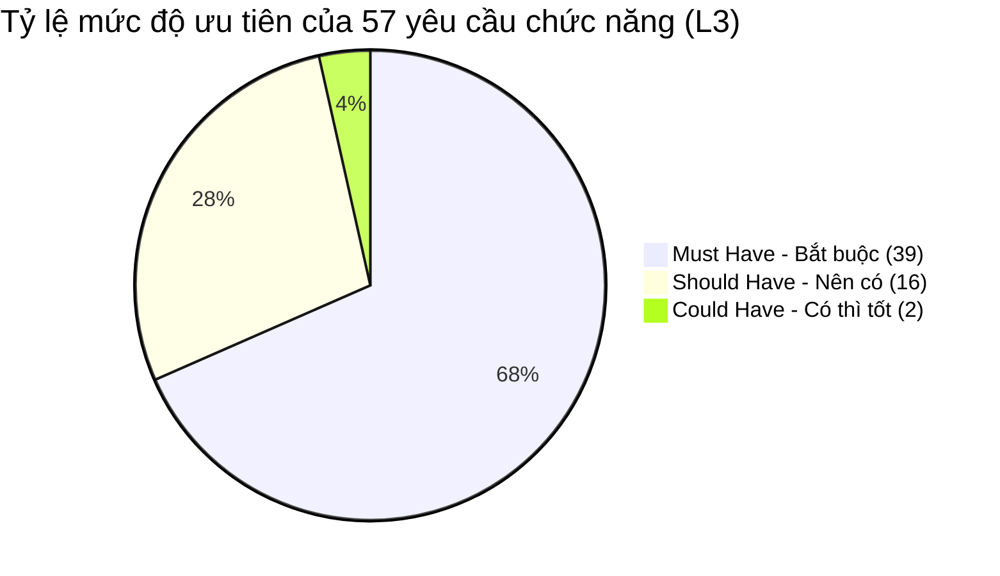
```mermaid
pie title Tỷ lệ mức độ ưu tiên của 57 yêu cầu chức năng (L3)
    "Must Have - Bắt buộc (39)" : 39
    "Should Have - Nên có (16)" : 16
    "Could Have - Có thì tốt (2)" : 2
```

| Phân hệ (L1) | Số lượng FR (L3) | Must Have | Should Have | Could Have |
|---|:---:|:---:|:---:|:---:|
| 1.0 Xác thực & Tài khoản | 6 | 5 | 1 | 0 |
| 2.0 Tài xế & Phương tiện | 6 | 4 | 2 | 0 |
| 3.0 Đặt xe & Chuyến đi | 9 | 9 | 0 | 0 |
| 4.0 Phân công & Ghép nối | 6 | 6 | 0 | 0 |
| 5.0 Tính cước & Thanh toán | 7 | 4 | 3 | 0 |
| 6.0 Định vị & Giám sát Real-time | 4 | 3 | 1 | 0 |
| 7.0 Trung tâm Thông báo | 5 | 2 | 3 | 0 |
| 8.0 Đánh giá & Phản hồi | 3 | 2 | 1 | 0 |
| 9.0 Quản trị & Báo cáo | 8 | 4 | 3 | 1 |
| 10.0 Bảo mật, RBAC & Audit | 5 | 4 | 1 | 0 |
| **TỔNG CỘNG** | **59** | **43** | **15** | **1** |

---

## Giai đoạn 3 – Quy tắc nghiệp vụ (Business Rules) & Xử lý ngoại lệ (Exception Handling)

---

### 3.1 Danh mục Quy tắc nghiệp vụ (Business Rules Catalog)

Quy tắc nghiệp vụ (Business Rules - `BRULE`) là các ràng buộc, công thức, điều kiện tiên quyết và chính sách vận hành bắt buộc hệ thống phải tuân thủ nghiêm ngặt trong mọi tình huống.

---

#### BRULE-01: Quy tắc Cấu hình Định giá Cước (Fare Calculation & Pricing Rule)
- **Mã quy tắc**: `BRULE-01`
- **Phân hệ áp dụng**: Phân hệ 5.0 (Tính cước & Thanh toán)
- **Nội dung quy tắc**:
  1. Tổng cước chuyến đi được tính theo công thức:
     $$\text{Fare} = \max\left(\text{BaseFare}, \text{BaseFare} + (d \times \text{PricePerKm}) + (t \times \text{PricePerMin})\right)$$
     Trong đó:
     - $d$: Quãng đường di chuyển thực tế (tính theo Km, làm tròn đến 1 chữ số thập phân).
     - $t$: Thời gian di chuyển thực tế (tính theo Phút, làm tròn lên).
     - $\text{BaseFare}$: Giá mở cửa tối thiểu (đã bao gồm 1 km đầu tiên).
  2. Bảng giá mặc định theo từng hạng xe trong giai đoạn MVP:
     | Hạng xe (Vehicle Type) | Số chỗ | Giá mở cửa (BaseFare) | Đơn giá / Km (PricePerKm) | Đơn giá / Phút (PricePerMin) |
     |---|:---:|:---:|:---:|:---:|
     | **Sedan (Tiêu chuẩn)** | 4 chỗ | 15.000 VNĐ | 12.000 VNĐ/km | 1.000 VNĐ/phút |
     | **SUV (Tiện lợi)** | 7 chỗ | 20.000 VNĐ | 15.000 VNĐ/km | 1.500 VNĐ/phút |
     | **Van (Tập thể)** | 16 chỗ | 35.000 VNĐ | 22.000 VNĐ/km | 2.500 VNĐ/phút |
  3. Giá ước tính hiển thị khi đặt xe dựa trên khoảng cách định tuyến lý thuyết từ Map Service và thời gian di chuyển ước tính. Số tiền thực tế thanh toán có thể chênh lệch dựa trên lộ trình thực tế.

---

#### BRULE-02: Quy tắc Quét & Ghép nối Tài xế (Driver Matching & Proximity Rule)
- **Mã quy tắc**: `BRULE-02`
- **Phân hệ áp dụng**: Phân hệ 4.0 (Matching Engine)
- **Nội dung quy tắc**:
  1. Chỉ các tài xế thỏa mãn đồng thời **4 điều kiện** sau mới được đưa vào danh sách ứng viên (Candidate Pool):
     - Có tài khoản đang hoạt động (`isActive = true`) và đã được phê duyệt hồ sơ (`isApproved = true`).
     - Trạng thái trực tuyến đang là `Available` (không bận chuyến khác, không offline).
     - Phương tiện đăng ký khớp chính xác với loại xe khách hàng yêu cầu (`VehicleType`).
     - Tọa độ GPS hiện tại cách điểm đón khách trong phạm vi bán kính $R \le 5.0\text{ km}$ (tính theo đường chim bay bằng công thức Haversine).
  2. Thứ tự ưu tiên gửi yêu cầu chuyến:
     - **Ưu tiên 1**: Khoảng cách từ tài xế đến điểm đón gần nhất ($d \rightarrow \min$).
     - **Ưu tiên 2 (khi khoảng cách tương đương $\pm 200\text{m}$)**: Tài xế có điểm đánh giá trung bình (`rating`) cao hơn.

---

#### BRULE-03: Quy tắc Thời gian Phản hồi & Thử lại Tự động (Dispatch Timeout & Max Retry Rule)
- **Mã quy tắc**: `BRULE-03`
- **Phân hệ áp dụng**: Phân hệ 4.0 (Matching Engine)
- **Nội dung quy tắc**:
  1. Mỗi tài xế nhận yêu cầu chuyến xe có chính xác **30 giây** đếm ngược để bấm "Chấp nhận" hoặc "Từ chối".
  2. Nếu tài xế bấm "Từ chối" hoặc hết 30 giây không phản hồi:
     - Hệ thống tự động ghi nhận là 1 lượt từ chối, loại tài xế này khỏi danh sách xét duyệt của cuốc xe hiện tại (Blacklist per Ride).
     - Tăng chỉ số thử lại: $\text{RetryCount} = \text{RetryCount} + 1$.
  3. Giới hạn thử lại tối đa: $\text{MaxRetries} = 5$.
     - Nếu $\text{RetryCount} < 5$ và còn tài xế hợp lệ: Ngay lập tức gửi yêu cầu cho tài xế kế tiếp.
     - Nếu $\text{RetryCount} \ge 5$ hoặc không còn tài xế nào trong bán kính: Ngừng tìm kiếm và chuyển trạng thái chuyến sang `no_driver`.

---

#### BRULE-04: Quy tắc Chuyển đổi Trạng thái Tài xế (Driver Status State Machine)
- **Mã quy tắc**: `BRULE-04`
- **Phân hệ áp dụng**: Phân hệ 2.0 (Quản lý Tài xế)
- **Nội dung quy tắc**:
  1. Tài xế chỉ có thể chuyển đổi trạng thái theo sơ đồ hợp lệ:
     ```mermaid
     stateDiagram-v2
         [*] --> Offline
         Offline --> Available: Bật Online (Nếu đã Approved & Active)
         Available --> Offline: Tắt Online
         Available --> Busy: Chấp nhận cuốc xe (accepted)
         Busy --> Available: Chuyến đi hoàn tất (completed / cancelled)
         Available --> Suspended: Admin khóa tài khoản
         Busy --> Suspended: Admin khóa (Sau khi chuyến kết thúc)
         Suspended --> Offline: Admin mở khóa
     ```
  2. Nghiêm cấm tài xế chuyển sang `Available` nếu chưa có thông tin phương tiện hợp lệ hoặc đang bị tạm đình chỉ (`isActive = false`).

---

#### BRULE-05: Quy tắc Vòng đời Chuyến đi (Trip Lifecycle Transitions)
- **Mã quy tắc**: `BRULE-05`
- **Phân hệ áp dụng**: Phân hệ 3.0 (Đặt xe & Chuyến đi)
- **Nội dung quy tắc**:
  1. Trạng thái của chuyến đi phải tuân thủ nghiêm ngặt thứ tự tuyến tính sau:
     ```mermaid
     stateDiagram-v2
         [*] --> requested: Khách tạo yêu cầu
         requested --> searching: Bắt đầu quét tài xế
         searching --> accepted: Tài xế nhận cuốc
         searching --> no_driver: Hết 5 lần retry hoặc hết tài xế
         accepted --> driver_arrived: Tài xế tới điểm đón
         driver_arrived --> in_progress: Đón khách & Bắt đầu chạy
         in_progress --> completed: Đến nơi trả khách
         
         requested --> cancelled: Khách hủy khi đang tạo
         searching --> cancelled: Khách hủy khi đang tìm
         accepted --> cancelled: Khách/Tài xế hủy trước khi đón
         driver_arrived --> cancelled: Khách/Tài xế hủy tại điểm đón
         
         completed --> [*]
         cancelled --> [*]
         no_driver --> [*]
     ```
  2. Bất kỳ bước nhảy trạng thái nào không đúng trình tự (VD: từ `accepted` nhảy thẳng lên `completed` mà không qua `in_progress`) đều bị từ chối và ghi nhận lỗi hệ thống.

---

#### BRULE-06: Quy tắc Chính sách Hủy Chuyến (Cancellation Policy Rule)
- **Mã quy tắc**: `BRULE-06`
- **Phân hệ áp dụng**: Phân hệ 3.0 (Đặt xe)
- **Nội dung quy tắc**:
  1. **Khách hàng hủy chuyến**:
     - Khi chuyến ở trạng thái `requested` hoặc `searching`: **Hủy miễn phí 100%**, tức thì.
     - Khi chuyến ở trạng thái `accepted` (Tài xế đang chạy đến đón): **Hủy miễn phí (MVP policy)**, phát thông báo cho tài xế và chuyển trạng thái tài xế về `Available`.
     - Khi chuyến đã chuyển sang `in_progress` (Khách đã lên xe): **Không cho phép hủy từ ứng dụng khách hàng**, bắt buộc tài xế phải kết thúc cuốc hoặc liên hệ Operator can thiệp.
  2. **Tài xế hủy chuyến**:
     - Chỉ được hủy khi ở trạng thái `accepted` hoặc `driver_arrived` kèm lý do cụ thể (xe hỏng, tai nạn, khách không xuất hiện).
     - Hệ thống ghi nhận tỷ lệ hủy (`cancellation_rate`) của tài xế vào hồ sơ đánh giá định kỳ.

---

#### BRULE-07: Quy tắc Thanh toán & Bảo mật Dữ liệu Tài chính (Payment & Security Rule)
- **Mã quy tắc**: `BRULE-07`
- **Phân hệ áp dụng**: Phân hệ 5.0 (Thanh toán)
- **Nội dung quy tắc**:
  1. **Thanh toán Tiền mặt (`Cash`)**:
     - Trạng thái Payment ban đầu là `PENDING`.
     - Chỉ chuyển sang `COMPLETED` khi tài xế bấm xác nhận "Đã nhận tiền mặt từ khách".
  2. **Thanh toán Điện tử (`E-Payment`)**:
     - Toàn bộ thao tác thanh toán thẻ/ví điện tử được ủy quyền xử lý qua cổng thanh toán bên thứ ba (hoặc Mock Payment Gateway).
     - Hệ thống CAB **tuyệt đối không lưu trữ** số thẻ ngân hàng (PAN), ngày hết hạn, mã bảo mật CVV/CVC trong cơ sở dữ liệu để tuân thủ tiêu chuẩn an toàn bảo mật.
     - Chỉ lưu trữ mã tham chiếu giao dịch (`TransactionId`), thời gian giao dịch và trạng thái trả về từ cổng thanh toán.

---

#### BRULE-08: Quy tắc Tính điểm Đánh giá Trung bình (Rating Calculation Rule)
- **Mã quy tắc**: `BRULE-08`
- **Phân hệ áp dụng**: Phân hệ 8.0 (Đánh giá & Phản hồi)
- **Nội dung quy tắc**:
  1. Khách hàng chỉ được đánh giá cuốc xe khi chuyến đi có trạng thái `completed` và giao dịch thanh toán đã `COMPLETED`.
  2. Mỗi chuyến đi chỉ được đánh giá duy nhất **1 lần**, điểm số là số nguyên từ $1$ đến $5$ sao.
  3. Công thức tính điểm đánh giá trung bình hiển thị của tài xế:
     $$\bar{R} = \frac{\sum_{i=1}^{N} \text{Star}_i}{N}$$
     (Làm tròn đến 1 chữ số thập phân, ví dụ: 4.85 $\rightarrow$ 4.9 sao).

---

#### BRULE-09: Quy tắc Phân quyền Vai trò Quản trị (Role-Based Access Control Rule)
- **Mã quy tắc**: `BRULE-09`
- **Phân hệ áp dụng**: Phân hệ 10.0 (Bảo mật & RBAC)
- **Nội dung quy tắc**:
  1. **Nhân viên vận hành (Operator)**:
     - Có quyền: Xem danh sách user, duyệt hồ sơ tài xế, xem bản đồ xe chạy, giám sát chuyến đi, tra cứu giao dịch, can thiệp cuốc xe sự cố.
     - **Không có quyền**: Thay đổi cấu hình giá cước, xóa vĩnh viễn dữ liệu người dùng, phân quyền Admin cho tài khoản khác, xem báo cáo doanh thu tài chính cấp cao.
  2. **Quản trị viên hệ thống (Admin)**:
     - Toàn quyền (`Superuser`): Cấu hình biểu phí, quản lý tài khoản nhân viên, xem toàn bộ báo cáo doanh thu, phân quyền, cấu hình hệ thống.

---

#### BRULE-10: Quy tắc Ghi vết Kiểm toán (Audit Trail Compliance Rule)
- **Mã quy tắc**: `BRULE-10`
- **Phân hệ áp dụng**: Phân hệ 10.0 (Kiểm toán)
- **Nội dung quy tắc**:
  1. Mọi thao tác làm thay đổi dữ liệu trọng yếu đều bắt buộc phải được ghi nhật ký kiểm toán (`AuditLog`) bao gồm:
     - Thay đổi cấu hình bảng giá cước.
     - Phê duyệt / Từ chối / Khóa tài khoản tài xế.
     - Can thiệp cưỡng chế hủy chuyến đi từ phía Operator/Admin.
     - Đổi vai trò hoặc quyền hạn người dùng.
  2. Dữ liệu nhật ký kiểm toán mang tính chất **Append-Only** (chỉ thêm mới, nghiêm cấm chỉnh sửa hoặc xóa bỏ).

---

### 3.2 Danh mục Trường hợp ngoại lệ & Cơ chế xử lý (Exception Handling & Edge Cases)

Các kịch bản bất thường (Exceptions) có thể phát sinh trong quá trình vận hành thực tế và giải pháp xử lý tương ứng của hệ thống:


```mermaid
graph TD
    subgraph Exceptions["⚠️ Các tình huống ngoại lệ chính"]
        E1["EX-01: Không tìm thấy tài xế"]
        E2["EX-02: Tài xế Timeout 30s"]
        E3["EX-03: Mất GPS / Mạng giữa chừng"]
        E4["EX-04: Khách hủy khi xe đang đến"]
        E5["EX-05: Khách không xuất hiện"]
        E6["EX-06: Xe hỏng / Tai nạn"]
        E7["EX-07: Lỗi thanh toán điện tử"]
        E8["EX-08: Tranh chấp nhận cuốc"]
        E9["EX-09: Khóa tài khoản giữa cuốc"]
        E10["EX-10: Cổng ngoại vi Outage"]
    end

    subgraph Solutions["🛡️ Cơ chế xử lý của hệ thống"]
        S1["Thông báo no_driver & Gợi ý thử lại"]
        S2["Tự động xoay vòng tài xế kế tiếp (Max 5)"]
        S3["Giữ trạng thái chuyến, buffer tọa độ & chờ 5p"]
        S4["Giải phóng tài xế về Available & Log"]
        S5["Cho phép tài xế hủy kèm lý do No-Show"]
        S6["Hủy cuốc khẩn cấp & Tự động gán xe thay thế"]
        S7["Chuyển hướng thử lại hoặc thanh toán tiền mặt"]
        S8["Khóa giao dịch bằng Distributed Lock / Atomic Update"]
        S9["Hoàn tất chuyến đi hiện tại rồi mới khóa"]
        S10["Graceful Degradation & Fallback cục bộ"]
    end

    E1 --> S1
    E2 --> S2
    E3 --> S3
    E4 --> S4
    E5 --> S5
    E6 --> S6
    E7 --> S7
    E8 --> S8
    E9 --> S9
    E10 --> S10
```

---

| Mã Ngoại lệ | Tình huống ngoại lệ (Scenario) | Hậu quả tiềm ẩn | Cơ chế phát hiện (Detection) | Giải pháp xử lý tự động & Thủ công (Handling Strategy) |
|---|---|---|---|---|
| **EX-01** | **Không tìm được tài xế khả dụng**<br>Quanh khu vực 5km không có tài xế nào trực tuyến hoặc tất cả tài xế trong vùng đều từ chối cuốc xe. | Khách hàng chờ đợi vô ích, giảm uy tín nền tảng. | Sau khi quét DB không có tài xế hoặc `RetryCount >= 5`. | • Hệ thống lập tức cập nhật trạng thái Ride sang `no_driver`.<br>• Bắn thông báo đẩy rõ ràng cho khách: *"Rất tiếc, hiện các tài xế quanh bạn đều đang bận. Vui lòng thử lại sau ít phút!"*<br>• Không trừ bất kỳ khoản phí nào của khách. |
| **EX-02** | **Tài xế không phản hồi trong 30 giây**<br>Tài xế không để ý điện thoại hoặc đang bận thao tác khác khi có yêu cầu chuyến mới. | Cuốc xe bị treo, khách hàng chờ lâu. | Server Timer (30s) hết hạn mà chưa nhận được gói tin `accept` từ tài xế. | • Hệ thống tự động hủy popup trên app tài xế cũ.<br>• Tăng `RetryCount` thêm 1, đưa tài xế vào danh sách loại trừ.<br>• Ngay lập tức gửi yêu cầu cho tài xế khả dụng tiếp theo trong danh sách đã xếp hạng. |
| **EX-03** | **Mất kết nối mạng / Mất tín hiệu GPS**<br>Điện thoại tài xế hoặc khách đi vào vùng mất sóng, hầm đường bộ hoặc hết pin giữa hành trình. | Mất dấu vết xe trên bản đồ, không thể cập nhật mốc hoàn thành. | Server không nhận được ping socket/GPS định kỳ quá 60 giây. | • Hệ thống giữ nguyên trạng thái cuốc xe hiện tại trong thời gian chờ 5 phút (`Connection Grace Period`).<br>• Phía Client tài xế lưu tạm các điểm tọa độ vào bộ nhớ đệm cục bộ (Local Cache). Khi có mạng trở lại, Client tự động đồng bộ bù (Sync Back) dữ liệu lên Server.<br>• Nếu mất kết nối > 5 phút: Hệ thống gắn cờ cảnh báo cuốc xe nghi vấn trên Dashboard Operator để nhân viên gọi điện xác minh. |
| **EX-04** | **Khách hàng hủy chuyến khi tài xế đang đến**<br>Tài xế đã chạy được một đoạn nhưng khách bấm hủy chuyến. | Tài xế tốn công di chuyển và xăng xe. | Khách hàng bấm nút "Hủy chuyến" trên giao diện khi trạng thái là `accepted` hoặc `driver_arrived`. | • Hệ thống đổi trạng thái cuốc sang `cancelled_by_customer`.<br>• Bắn thông báo tức thì kèm âm thanh báo động cho tài xế: *"Khách hàng đã hủy chuyến này"*, hiển thị lý do hủy.<br>• Lập tức chuyển trạng thái tài xế về `Available` để có thể nhận ngay cuốc xe khác. |
| **EX-05** | **Khách hàng không xuất hiện tại điểm đón (No-Show)**<br>Tài xế đã đến điểm đón quá 5-10 phút nhưng không thấy khách và không liên lạc được. | Lãng phí thời gian chờ đợi của tài xế. | Tài xế đã bấm `driver_arrived` được hơn 5 phút. | • Cho phép tài xế bấm nút "Hủy cuốc do khách không xuất hiện".<br>• Hệ thống chuyển trạng thái `cancelled_by_driver` với lý do `Customer No-Show`.<br>• Giải phóng tài xế về `Available`. |
| **EX-06** | **Xe hỏng / Tai nạn giữa hành trình**<br>Phương tiện gặp sự cố kỹ thuật (thủng lốp, chết máy) khi đang di chuyển chở khách. | Chuyến đi bị gián đoạn, nguy hiểm và gây trễ giờ của khách. | Tài xế bấm nút "Báo cáo sự cố khẩn cấp" trên ứng dụng. | • Hệ thống đổi trạng thái chuyến sang `interrupted_by_incident`.<br>• Hệ thống tính toán cước phí quãng đường đã đi thực tế đến thời điểm hỏng xe (hoặc miễn phí theo chính sách hỗ trợ).<br>• Tự động kích hoạt luồng đặt xe ưu tiên tìm tài xế khác gần đó đến đón tiếp khách hàng di chuyển tiếp. |
| **EX-07** | **Thanh toán Điện tử thất bại**<br>Tài khoản thẻ của khách không đủ số dư, thẻ hết hạn, hoặc cổng thanh toán bị timeout. | Doanh nghiệp không thu được tiền, tắc nghẽn hoàn tất chuyến. | Cổng thanh toán trả về mã lỗi (`ResponseCode != 00`). | • Hệ thống cập nhật bản ghi Payment sang `FAILED`.<br>• Hiển thị thông báo giải thích lý do thanh toán không thành công.<br>• Cung cấp giao diện 2 tùy chọn cho khách: **(1)** Đổi phương thức/nhập lại thẻ khác để thanh toán lại; **(2)** Chuyển đổi trực tiếp sang hình thức trả tiền mặt cho tài xế. |
| **EX-08** | **Xung đột nhận cuốc đồng thời (Race Condition)**<br>Nhiều tiến trình hoặc tài xế gửi yêu cầu nhận cùng 1 cuốc xe tại cùng một mili-giây. | 1 cuốc xe bị gán cho 2 tài xế khác nhau. | Truy vấn cập nhật trạng thái Ride trong cơ sở dữ liệu. | • Sử dụng kỹ thuật **Optimistic Locking** hoặc câu lệnh cập nhật nguyên tử (Atomic Update):<br>`UPDATE Rides SET driverId = :dId, status = 'accepted' WHERE id = :rId AND status = 'searching'`<br>• Chỉ tài xế đầu tiên có số bản ghi ảnh hưởng = 1 được nhận cuốc. Tài xế đến sau nhận thông báo: *"Cuốc xe đã được tài xế khác tiếp nhận"*. |
| **EX-09** | **Khóa tài khoản khi đang có chuyến xe chạy**<br>Admin khóa tài khoản khách hàng hoặc tài xế trong lúc cuốc xe đang diễn ra. | Giao diện bị văng, gián đoạn cuốc xe đang phục vụ. | Thao tác khóa tài khoản từ Admin Dashboard. | • Hệ thống vẫn cho phép chuyến đi hiện tại tiếp tục hoàn thành bình thường đến khi thanh toán xong.<br>• Lệnh khóa tài khoản chỉ có hiệu lực chặn các cuốc xe mới hoặc ngăn tài xế bật lại `Available` sau khi cuốc hiện tại kết thúc. |
| **EX-10** | **Cổng dịch vụ bên ngoài ngừng hoạt động (External Outage)**<br>Máy chủ OpenStreetMap hoặc Cổng thanh toán hoặc SMTP Server bị sập. | Toàn bộ hệ thống có nguy cơ tê liệt theo. | Bắt lỗi `Connection Exception` / `Timeout` từ các API bên ngoài. | • Áp dụng mô hình **Circuit Breaker** & **Graceful Degradation**:<br>  - Nếu Map API lỗi: Dùng tọa độ ước lượng đơn giản cục bộ để không chặn việc tạo cuốc.<br>  - Nếu Email SMTP lỗi: Bỏ qua việc gửi email, ghi log cảnh báo ngầm, quy trình đặt xe và thanh toán vẫn hoàn tất 100%.<br>  - Nếu Cổng thanh toán lỗi: Tạm thời vô hiệu hóa tùy chọn thanh toán thẻ, ép chuyển sang thanh toán Tiền mặt. |

---

### 3.3 Ma trận liên kết Quy tắc nghiệp vụ & Trường hợp ngoại lệ (Rule-Exception Traceability Matrix)

| Quy tắc nghiệp vụ (Business Rule) | Trường hợp ngoại lệ tương ứng (Exception) | Cơ chế đảm bảo tính toàn vẹn (Integrity Mechanism) |
|---|---|---|
| **BRULE-01 (Định giá cước)** | EX-06 (Xe hỏng giữa đường), EX-10 (Map API lỗi) | Fallback tính cước tối thiểu hoặc tính theo quãng đường GPS thực tế đã ghi nhận. |
| **BRULE-02 (Ghép nối tài xế)** | EX-01 (Không có tài xế quanh vùng), EX-08 (Tranh chấp nhận cuốc) | Atomic database query, thuật toán bán kính 5km, phân bổ tuần tự không gửi đại trà. |
| **BRULE-03 (Timeout & Retry)** | EX-02 (Tài xế quá 30s), EX-01 (Hết 5 lần retry) | Bộ đếm thời gian phân tán (Distributed Timer) và danh sách loại trừ tạm thời. |
| **BRULE-04 (Trạng thái tài xế)** | EX-04 (Khách hủy cuốc), EX-05 (Khách vắng mặt), EX-09 (Bị khóa tài khoản) | Tự động hoàn nguyên trạng thái về `Available` hoặc cưỡng chế về `Offline`. |
| **BRULE-05 (Vòng đời chuyến đi)** | EX-03 (Mất mạng giữa chừng), EX-06 (Sự cố tai nạn) | Máy trạng thái hữu hạn (FSM) ngăn chặn nhảy cóc trạng thái, cơ chế đồng bộ bù GPS. |
| **BRULE-06 (Chính sách hủy)** | EX-04 (Khách hủy sớm/muộn), EX-05 (Khách không ra xe) | Kiểm tra điều kiện trạng thái hiện tại trước khi thực hiện thao tác hủy. |
| **BRULE-07 (Thanh toán & Bảo mật)** | EX-07 (Lỗi thẻ/Cổng thanh toán), EX-10 (Cổng thanh toán sập) | Không lưu thông tin thẻ nhạy cảm, cơ chế Retry và Fallback sang tiền mặt. |
| **BRULE-08 (Đánh giá Rating)** | EX-06 (Chuyến bị gián đoạn/Hủy) | Chỉ kích hoạt form đánh giá khi chuyến đi kết thúc trọn vẹn và đã thanh toán. |
| **BRULE-09 (Phân quyền RBAC)** | EX-09 (Khóa tài khoản đột xuất) | Middleware JWT kiểm tra quyền mỗi request; trì hoãn thu hồi quyền cuốc đang chạy. |
| **BRULE-10 (Nhật ký kiểm toán)** | EX-06 (Sự cố khẩn cấp), EX-09 (Thao tác can thiệp Admin) | Tự động chèn bản ghi bất biến (Immutable Audit Log) vào cơ sở dữ liệu. |

---

## Giai đoạn 4 – Mô hình hóa dữ liệu (Data Modeling & Database Design)

Mô hình hóa dữ liệu là bước thiết kế cấu trúc lưu trữ thông tin của hệ thống CAB, đảm bảo tính toàn vẹn dữ liệu (Data Integrity), hiệu năng truy vấn cao cho các tác vụ địa không gian thời gian thực (Geospatial Real-time Queries), và khả năng mở rộng linh hoạt theo kiến trúc Document Model (MongoDB / Relational hybrid).

---

### 4.1 Sơ đồ Thực thể Liên kết (Entity Relationship Diagram - ERD)

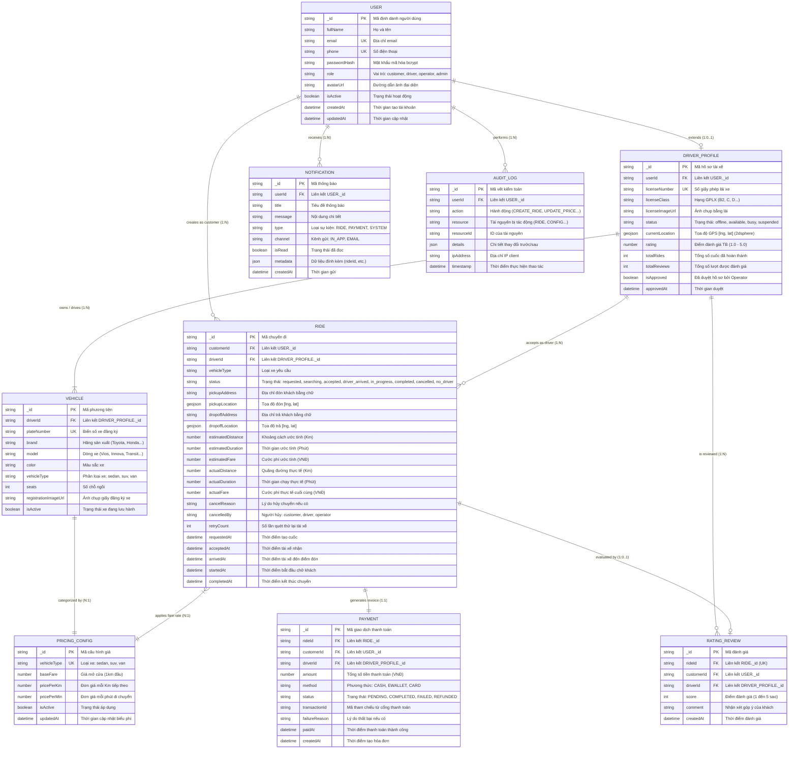
```mermaid
erDiagram
    USER ||--o| DRIVER_PROFILE : "extends (1:0..1)"
    USER ||--o{ RIDE : "creates as customer (1:N)"
    USER ||--o{ NOTIFICATION : "receives (1:N)"
    USER ||--o{ AUDIT_LOG : "performs (1:N)"
    
    DRIVER_PROFILE ||--|{ VEHICLE : "owns / drives (1:N)"
    DRIVER_PROFILE ||--o{ RIDE : "accepts as driver (1:N)"
    DRIVER_PROFILE ||--o{ RATING_REVIEW : "is reviewed (1:N)"
    
    VEHICLE ||--|| PRICING_CONFIG : "categorized by (N:1)"
    
    RIDE ||--|| PAYMENT : "generates invoice (1:1)"
    RIDE ||--o| RATING_REVIEW : "evaluated by (1:0..1)"
    RIDE }|--|| PRICING_CONFIG : "applies fare rate (N:1)"

    USER {
        string _id PK "Mã định danh người dùng"
        string fullName "Họ và tên"
        string email UK "Địa chỉ email"
        string phone UK "Số điện thoại"
        string passwordHash "Mật khẩu mã hóa bcrypt"
        string role "Vai trò: customer, driver, operator, admin"
        string avatarUrl "Đường dẫn ảnh đại diện"
        boolean isActive "Trạng thái hoạt động"
        datetime createdAt "Thời gian tạo tài khoản"
        datetime updatedAt "Thời gian cập nhật"
    }

    DRIVER_PROFILE {
        string _id PK "Mã hồ sơ tài xế"
        string userId FK "Liên kết USER._id"
        string licenseNumber UK "Số giấy phép lái xe"
        string licenseClass "Hạng GPLX (B2, C, D...)"
        string licenseImageUrl "Ảnh chụp bằng lái"
        string status "Trạng thái: offline, available, busy, suspended"
        geojson currentLocation "Tọa độ GPS [lng, lat] (2dsphere)"
        number rating "Điểm đánh giá TB (1.0 - 5.0)"
        int totalRides "Tổng số cuốc đã hoàn thành"
        int totalReviews "Tổng số lượt được đánh giá"
        boolean isApproved "Đã duyệt hồ sơ bởi Operator"
        datetime approvedAt "Thời gian duyệt"
    }

    VEHICLE {
        string _id PK "Mã phương tiện"
        string driverId FK "Liên kết DRIVER_PROFILE._id"
        string plateNumber UK "Biển số xe đăng ký"
        string brand "Hãng sản xuất (Toyota, Honda...)"
        string model "Dòng xe (Vios, Innova, Transit...)"
        string color "Màu sắc xe"
        string vehicleType "Phân loại xe: sedan, suv, van"
        int seats "Số chỗ ngồi"
        string registrationImageUrl "Ảnh chụp giấy đăng ký xe"
        boolean isActive "Trạng thái xe đang lưu hành"
    }

    PRICING_CONFIG {
        string _id PK "Mã cấu hình giá"
        string vehicleType UK "Loại xe: sedan, suv, van"
        number baseFare "Giá mở cửa (1km đầu)"
        number pricePerKm "Đơn giá mỗi Km tiếp theo"
        number pricePerMin "Đơn giá mỗi phút di chuyển"
        boolean isActive "Trạng thái áp dụng"
        datetime updatedAt "Thời gian cập nhật biểu phí"
    }

    RIDE {
        string _id PK "Mã chuyến đi"
        string customerId FK "Liên kết USER._id"
        string driverId FK "Liên kết DRIVER_PROFILE._id"
        string vehicleType "Loại xe yêu cầu"
        string status "Trạng thái: requested, searching, accepted, driver_arrived, in_progress, completed, cancelled, no_driver"
        string pickupAddress "Địa chỉ đón khách bằng chữ"
        geojson pickupLocation "Tọa độ đón [lng, lat]"
        string dropoffAddress "Địa chỉ trả khách bằng chữ"
        geojson dropoffLocation "Tọa độ trả [lng, lat]"
        number estimatedDistance "Khoảng cách ước tính (Km)"
        number estimatedDuration "Thời gian ước tính (Phút)"
        number estimatedFare "Cước phí ước tính (VNĐ)"
        number actualDistance "Quãng đường thực tế (Km)"
        number actualDuration "Thời gian chạy thực tế (Phút)"
        number actualFare "Cước phí thực tế cuối cùng (VNĐ)"
        string cancelReason "Lý do hủy chuyến nếu có"
        string cancelledBy "Người hủy: customer, driver, operator"
        int retryCount "Số lần quét thử lại tài xế"
        datetime requestedAt "Thời điểm tạo cuốc"
        datetime acceptedAt "Thời điểm tài xế nhận"
        datetime arrivedAt "Thời điểm tài xế đến điểm đón"
        datetime startedAt "Thời điểm bắt đầu chở khách"
        datetime completedAt "Thời điểm kết thúc chuyến"
    }

    PAYMENT {
        string _id PK "Mã giao dịch thanh toán"
        string rideId FK "Liên kết RIDE._id"
        string customerId FK "Liên kết USER._id"
        string driverId FK "Liên kết DRIVER_PROFILE._id"
        number amount "Tổng số tiền thanh toán (VNĐ)"
        string method "Phương thức: CASH, EWALLET, CARD"
        string status "Trạng thái: PENDING, COMPLETED, FAILED, REFUNDED"
        string transactionId "Mã tham chiếu từ cổng thanh toán"
        string failureReason "Lý do thất bại nếu có"
        datetime paidAt "Thời điểm thanh toán thành công"
        datetime createdAt "Thời điểm tạo hóa đơn"
    }

    RATING_REVIEW {
        string _id PK "Mã đánh giá"
        string rideId FK "Liên kết RIDE._id (UK)"
        string customerId FK "Liên kết USER._id"
        string driverId FK "Liên kết DRIVER_PROFILE._id"
        int score "Điểm đánh giá (1 đến 5 sao)"
        string comment "Nhận xét góp ý của khách"
        datetime createdAt "Thời điểm đánh giá"
    }

    NOTIFICATION {
        string _id PK "Mã thông báo"
        string userId FK "Liên kết USER._id"
        string title "Tiêu đề thông báo"
        string message "Nội dung chi tiết"
        string type "Loại sự kiện: RIDE, PAYMENT, SYSTEM"
        string channel "Kênh gửi: IN_APP, EMAIL"
        boolean isRead "Trạng thái đã đọc"
        json metadata "Dữ liệu đính kèm (rideId, etc.)"
        datetime createdAt "Thời gian gửi"
    }

    AUDIT_LOG {
        string _id PK "Mã vết kiểm toán"
        string userId FK "Liên kết USER._id"
        string action "Hành động (CREATE_RIDE, UPDATE_PRICE...)"
        string resource "Tài nguyên bị tác động (RIDE, CONFIG...)"
        string resourceId "ID của tài nguyên"
        json details "Chi tiết thay đổi trước/sau"
        string ipAddress "Địa chỉ IP client"
        datetime timestamp "Thời điểm thực hiện thao tác"
    }
```

---

### 4.2 Từ điển Dữ liệu Chi tiết (Data Dictionary / Schema Specification)

---

#### 4.2.1 Bảng `Users` (Người dùng hệ thống)
Lưu trữ định danh và thông tin xác thực của toàn bộ các tài khoản (Khách hàng, Tài xế, Nhân viên vận hành, Quản trị viên).

| Tên trường (Field) | Kiểu dữ liệu | Ràng buộc (Constraints) | Giá trị mặc định | Mô tả & Quy tắc nghiệp vụ |
|---|---|---|---|---|
| `_id` | ObjectId / String | Primary Key, Required | Auto-generated | Mã định danh duy nhất của người dùng |
| `fullName` | String | Required, Length: 2-100 | N/A | Họ và tên đầy đủ của người dùng |
| `email` | String | Required, Unique, Format: Email | N/A | Địa chỉ email dùng để đăng nhập và nhận thông báo |
| `phone` | String | Required, Unique, Regex: `^(0[3\|5\|7\|8\|9])+([0-9]{8})$` | N/A | Số điện thoại di động Việt Nam |
| `passwordHash` | String | Required | N/A | Mật khẩu băm một chiều qua thư viện `bcrypt` |
| `role` | String (Enum) | Required, Enum: `['customer', 'driver', 'operator', 'admin']` | `'customer'` | Vai trò người dùng trong hệ thống (RBAC) |
| `avatarUrl` | String | Optional, Format: URL | `null` | Đường dẫn ảnh đại diện cá nhân |
| `isActive` | Boolean | Required | `true` | Cờ trạng thái tài khoản (`false` = bị khóa) |
| `createdAt` | Date | Required | `Date.now()` | Thời điểm tạo tài khoản |
| `updatedAt` | Date | Required | `Date.now()` | Thời điểm cập nhật hồ sơ gần nhất |

---

#### 4.2.2 Bảng `DriverProfiles` (Hồ sơ Tài xế)
Lưu trữ thông tin bằng lái, trạng thái trực tuyến và định vị thời gian thực của tài xế.

| Tên trường (Field) | Kiểu dữ liệu | Ràng buộc (Constraints) | Giá trị mặc định | Mô tả & Quy tắc nghiệp vụ |
|---|---|---|---|---|
| `_id` | ObjectId / String | Primary Key, Required | Auto-generated | Mã định danh hồ sơ tài xế |
| `userId` | ObjectId / String | Foreign Key $\rightarrow$ `Users._id`, Unique, Required | N/A | Liên kết 1-1 với tài khoản User |
| `licenseNumber` | String | Required, Unique, Length: 12 | N/A | Số giấy phép lái xe (GPLX) |
| `licenseClass` | String | Required, Enum: `['B1', 'B2', 'C', 'D', 'E']` | `'B2'` | Hạng giấy phép lái xe |
| `licenseImageUrl` | String | Required, Format: URL | N/A | Đường dẫn ảnh chụp bằng lái gốc |
| `status` | String (Enum) | Required, Enum: `['offline', 'available', 'busy', 'suspended']` | `'offline'` | Trạng thái sẵn sàng nhận cuốc của tài xế |
| `currentLocation` | GeoJSON Point | Required, Format: `{ type: "Point", coordinates: [lng, lat] }` | `[106.660172, 10.762622]` | Vị trí GPS kinh độ - vĩ độ hiện tại (Tạo 2dsphere Index) |
| `rating` | Number | Min: 1.0, Max: 5.0 | `5.0` | Điểm đánh giá sao trung bình (Làm tròn 1 số lẻ) |
| `totalRides` | Number (Int) | Min: 0 | `0` | Tổng số chuyến đi đã hoàn thành |
| `totalReviews` | Number (Int) | Min: 0 | `0` | Tổng số lượt khách hàng đã đánh giá |
| `isApproved` | Boolean | Required | `false` | Trạng thái phê duyệt hồ sơ bởi Operator |
| `approvedAt` | Date | Optional | `null` | Mốc thời gian được phê duyệt hoạt động |

---

#### 4.2.3 Bảng `Vehicles` (Phương tiện vận tải)
Lưu trữ thông tin xe thuộc quyền sở hữu hoặc sử dụng của tài xế.

| Tên trường (Field) | Kiểu dữ liệu | Ràng buộc (Constraints) | Giá trị mặc định | Mô tả & Quy tắc nghiệp vụ |
|---|---|---|---|---|
| `_id` | ObjectId / String | Primary Key, Required | Auto-generated | Mã định danh phương tiện |
| `driverId` | ObjectId / String | Foreign Key $\rightarrow$ `DriverProfiles._id`, Required | N/A | Liên kết với tài xế sở hữu |
| `plateNumber` | String | Required, Unique, Format: Biển số VN (VD: `51G-123.45`) | N/A | Biển số đăng ký xe |
| `brand` | String | Required (VD: Toyota, Hyundai...) | N/A | Hãng sản xuất xe |
| `model` | String | Required (VD: Vios, Accent, Fortuner...) | N/A | Dòng xe |
| `color` | String | Required (VD: Trắng, Bạc, Đen...) | N/A | Màu sắc nhận diện của xe |
| `vehicleType` | String (Enum) | Required, Enum: `['sedan', 'suv', 'van']` | `'sedan'` | Phân loại phân khúc xe phục vụ đặt chuyến |
| `seats` | Number (Int) | Required, Min: 4, Max: 16 | `4` | Số chỗ ngồi cho phép |
| `registrationImageUrl` | String | Optional, Format: URL | `null` | Ảnh chụp cà-vẹt / giấy đăng ký xe |
| `isActive` | Boolean | Required | `true` | Trạng thái xe đang lưu hành (`false` = xe bảo dưỡng) |

---

#### 4.2.4 Bảng `PricingConfigs` (Cấu hình Bảng giá Dịch vụ)
Bảng tham số cấu hình biểu phí động theo từng phân khúc xe.

| Tên trường (Field) | Kiểu dữ liệu | Ràng buộc (Constraints) | Giá trị mặc định | Mô tả & Quy tắc nghiệp vụ |
|---|---|---|---|---|
| `_id` | ObjectId / String | Primary Key, Required | Auto-generated | Mã cấu hình biểu giá |
| `vehicleType` | String (Enum) | Required, Unique, Enum: `['sedan', 'suv', 'van']` | N/A | Loại xe áp dụng mức giá |
| `baseFare` | Number | Required, Min: 0 | `15000` | Giá mở cửa cố định (bao gồm 1 km đầu tiên) |
| `pricePerKm` | Number | Required, Min: 0 | `12000` | Đơn giá cước mỗi Km di chuyển tiếp theo |
| `pricePerMin` | Number | Required, Min: 0 | `1000` | Đơn giá cước mỗi phút thời gian di chuyển |
| `isActive` | Boolean | Required | `true` | Trạng thái bảng giá có hiệu lực |
| `updatedAt` | Date | Required | `Date.now()` | Thời điểm cập nhật giá gần nhất |

---

#### 4.2.5 Bảng `Rides` (Chuyến đi / Cuốc xe)
Bảng dữ liệu trung tâm quản lý toàn bộ vòng đời và lộ trình của từng chuyến xe.

| Tên trường (Field) | Kiểu dữ liệu | Ràng buộc (Constraints) | Giá trị mặc định | Mô tả & Quy tắc nghiệp vụ |
|---|---|---|---|---|
| `_id` | ObjectId / String | Primary Key, Required | Auto-generated | Mã định danh cuốc xe |
| `customerId` | ObjectId / String | Foreign Key $\rightarrow$ `Users._id`, Required | N/A | Khách hàng khởi tạo cuốc xe |
| `driverId` | ObjectId / String | Foreign Key $\rightarrow$ `DriverProfiles._id`, Optional | `null` | Tài xế tiếp nhận cuốc xe (`null` khi đang tìm) |
| `vehicleType` | String (Enum) | Required, Enum: `['sedan', 'suv', 'van']` | `'sedan'` | Hạng xe khách hàng yêu cầu |
| `status` | String (Enum) | Required, Enum: `['requested', 'searching', 'accepted', 'driver_arrived', 'in_progress', 'completed', 'cancelled', 'no_driver']` | `'requested'` | Trạng thái tiến trình của chuyến đi |
| `pickupAddress` | String | Required, Length: 5-255 | N/A | Tên địa chỉ đón khách hiển thị |
| `pickupLocation` | GeoJSON Point | Required, Format: `{ type: "Point", coordinates: [lng, lat] }` | N/A | Tọa độ GPS điểm đón (2dsphere Index) |
| `dropoffAddress` | String | Required, Length: 5-255 | N/A | Tên địa chỉ trả khách hiển thị |
| `dropoffLocation` | GeoJSON Point | Required, Format: `{ type: "Point", coordinates: [lng, lat] }` | N/A | Tọa độ GPS điểm trả (2dsphere Index) |
| `estimatedDistance` | Number | Required, Min: 0 | `0` | Khoảng cách lộ trình ước tính (Km) |
| `estimatedDuration` | Number | Required, Min: 0 | `0` | Thời gian di chuyển ước tính (Phút) |
| `estimatedFare` | Number | Required, Min: 0 | `0` | Tiền cước ước tính hiển thị lúc đặt (VNĐ) |
| `actualDistance` | Number | Optional, Min: 0 | `null` | Quãng đường thực tế GPS đo được (Km) |
| `actualDuration` | Number | Optional, Min: 0 | `null` | Thời gian chạy thực tế từ lúc đón đến trả (Phút) |
| `actualFare` | Number | Optional, Min: 0 | `null` | Tiền cước thực tế cuối cùng phải trả (VNĐ) |
| `cancelReason` | String | Optional | `null` | Lý do hủy cuốc nếu chuyến bị hủy |
| `cancelledBy` | String (Enum) | Optional, Enum: `['customer', 'driver', 'operator']` | `null` | Tác nhân thực hiện hành động hủy |
| `retryCount` | Number (Int) | Min: 0, Max: 5 | `0` | Số lần hệ thống đã thử tìm tài xế khác |
| `requestedAt` | Date | Required | `Date.now()` | Thời điểm tạo yêu cầu đặt xe |
| `acceptedAt` | Date | Optional | `null` | Thời điểm tài xế bấm nhận chuyến |
| `arrivedAt` | Date | Optional | `null` | Thời điểm tài xế tới điểm đón |
| `startedAt` | Date | Optional | `null` | Thời điểm đón khách lên xe và bắt đầu chạy |
| `completedAt` | Date | Optional | `null` | Thời điểm trả khách và hoàn thành chuyến |

---

#### 4.2.6 Bảng `Payments` (Giao dịch Thanh toán)
Lưu trữ hóa đơn và kết quả giao dịch thanh toán cho mỗi cuốc xe.

| Tên trường (Field) | Kiểu dữ liệu | Ràng buộc (Constraints) | Giá trị mặc định | Mô tả & Quy tắc nghiệp vụ |
|---|---|---|---|---|
| `_id` | ObjectId / String | Primary Key, Required | Auto-generated | Mã định danh hóa đơn thanh toán |
| `rideId` | ObjectId / String | Foreign Key $\rightarrow$ `Rides._id`, Unique, Required | N/A | Mỗi cuốc xe liên kết với duy nhất 1 Payment |
| `customerId` | ObjectId / String | Foreign Key $\rightarrow$ `Users._id`, Required | N/A | Người chịu trách nhiệm thanh toán |
| `driverId` | ObjectId / String | Foreign Key $\rightarrow$ `DriverProfiles._id`, Optional | `null` | Tài xế nhận thu nhập từ cuốc xe |
| `amount` | Number | Required, Min: 0 | `0` | Tổng số tiền thanh toán thực tế (VNĐ) |
| `method` | String (Enum) | Required, Enum: `['CASH', 'EWALLET', 'CARD']` | `'CASH'` | Phương thức thanh toán lựa chọn |
| `status` | String (Enum) | Required, Enum: `['PENDING', 'COMPLETED', 'FAILED', 'REFUNDED']` | `'PENDING'` | Trạng thái xử lý thu tiền |
| `transactionId` | String | Optional | `null` | Mã tham chiếu giao dịch từ Mock Payment Gateway |
| `failureReason` | String | Optional | `null` | Mã lỗi / Lý do nếu giao dịch thanh toán thất bại |
| `paidAt` | Date | Optional | `null` | Mốc thời gian hoàn tất giao dịch thanh toán |
| `createdAt` | Date | Required | `Date.now()` | Thời điểm tạo bản ghi hóa đơn |

---

#### 4.2.7 Bảng `RatingReviews` (Đánh giá & Nhận xét)
Lưu trữ điểm sao và phản hồi của khách hàng sau khi hoàn thành chuyến đi.

| Tên trường (Field) | Kiểu dữ liệu | Ràng buộc (Constraints) | Giá trị mặc định | Mô tả & Quy tắc nghiệp vụ |
|---|---|---|---|---|
| `_id` | ObjectId / String | Primary Key, Required | Auto-generated | Mã định danh đánh giá |
| `rideId` | ObjectId / String | Foreign Key $\rightarrow$ `Rides._id`, Unique, Required | N/A | Ràng buộc 1 chuyến chỉ được đánh giá 1 lần |
| `customerId` | ObjectId / String | Foreign Key $\rightarrow$ `Users._id`, Required | N/A | Khách hàng thực hiện đánh giá |
| `driverId` | ObjectId / String | Foreign Key $\rightarrow$ `DriverProfiles._id`, Required | N/A | Tài xế được đánh giá |
| `score` | Number (Int) | Required, Min: 1, Max: 5 | `5` | Điểm số đánh giá (1 đến 5 sao) |
| `comment` | String | Optional, Length: 0-500 | `""` | Nội dung nhận xét góp ý |
| `createdAt` | Date | Required | `Date.now()` | Thời điểm gửi đánh giá |

---

#### 4.2.8 Bảng `Notifications` (Hộp thư Thông báo)
Lưu trữ các thông báo đẩy trong ứng dụng cho người dùng.

| Tên trường (Field) | Kiểu dữ liệu | Ràng buộc (Constraints) | Giá trị mặc định | Mô tả & Quy tắc nghiệp vụ |
|---|---|---|---|---|
| `_id` | ObjectId / String | Primary Key, Required | Auto-generated | Mã định danh thông báo |
| `userId` | ObjectId / String | Foreign Key $\rightarrow$ `Users._id`, Required | N/A | Người nhận thông báo |
| `title` | String | Required, Length: 2-100 | N/A | Tiêu đề thông báo ngắn |
| `message` | String | Required, Length: 2-500 | N/A | Nội dung chi tiết của thông báo |
| `type` | String (Enum) | Required, Enum: `['RIDE', 'PAYMENT', 'ACCOUNT', 'SYSTEM']` | `'RIDE'` | Phân loại nghiệp vụ của sự kiện thông báo |
| `channel` | String (Enum) | Required, Enum: `['IN_APP', 'EMAIL']` | `'IN_APP'` | Kênh phân phối thông báo |
| `isRead` | Boolean | Required | `false` | Cờ trạng thái người dùng đã xem thông báo |
| `metadata` | Object (JSON) | Optional | `{}` | Dữ liệu ngữ cảnh đính kèm (chứa `rideId`, URL...) |
| `createdAt` | Date | Required | `Date.now()` | Thời điểm phát sinh thông báo |

---

#### 4.2.9 Bảng `AuditLogs` (Nhật ký Kiểm toán Hệ thống)
Bảng ghi vết Append-Only phục vụ công tác thanh tra và bảo mật hệ thống.

| Tên trường (Field) | Kiểu dữ liệu | Ràng buộc (Constraints) | Giá trị mặc định | Mô tả & Quy tắc nghiệp vụ |
|---|---|---|---|---|
| `_id` | ObjectId / String | Primary Key, Required | Auto-generated | Mã định danh bản ghi kiểm toán |
| `userId` | ObjectId / String | Foreign Key $\rightarrow$ `Users._id`, Required | N/A | Tác nhân thực hiện hành động |
| `action` | String | Required (VD: `CREATE_RIDE`, `UPDATE_PRICE`, `BAN_USER`) | N/A | Mã định danh hành động nghiệp vụ |
| `resource` | String | Required (VD: `PricingConfigs`, `Users`, `Rides`) | N/A | Bảng/Tài nguyên bị tác động |
| `resourceId` | String | Optional | `null` | Khóa chính của đối tượng bị thay đổi |
| `details` | Object (JSON) | Optional | `{}` | Dữ liệu chi tiết trước và sau thay đổi |
| `ipAddress` | String | Optional | `null` | Địa chỉ IP của máy khách gửi yêu cầu |
| `timestamp` | Date | Required | `Date.now()` | Thời điểm chính xác thực hiện hành động |

---

### 4.3 Chiến lược Chỉ mục & Tối ưu hóa Truy vấn Địa không gian (Indexes & Geospatial Strategy)

Để đảm bảo hệ thống đạt hiệu năng phản hồi $< 200\text{ms}$ khi tìm kiếm tài xế trong hàng chục ngàn bản ghi, các chỉ mục (Indexes) sau bắt buộc phải được thiết lập trên MongoDB / Database:

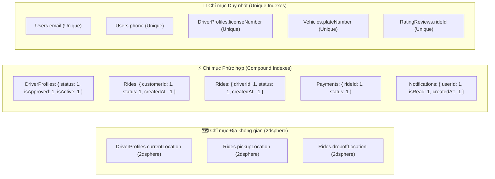
```mermaid
graph LR
    subgraph GeoIndexes["🗺️ Chỉ mục Địa không gian (2dsphere)"]
        G1["DriverProfiles.currentLocation (2dsphere)"]
        G2["Rides.pickupLocation (2dsphere)"]
        G3["Rides.dropoffLocation (2dsphere)"]
    end

    subgraph CompoundIndexes["⚡ Chỉ mục Phức hợp (Compound Indexes)"]
        C1["DriverProfiles: { status: 1, isApproved: 1, isActive: 1 }"]
        C2["Rides: { customerId: 1, status: 1, createdAt: -1 }"]
        C3["Rides: { driverId: 1, status: 1, createdAt: -1 }"]
        C4["Payments: { rideId: 1, status: 1 }"]
        C5["Notifications: { userId: 1, isRead: 1, createdAt: -1 }"]
    end

    subgraph UniqueIndexes["🔑 Chỉ mục Duy nhất (Unique Indexes)"]
        U1["Users.email (Unique)"]
        U2["Users.phone (Unique)"]
        U3["DriverProfiles.licenseNumber (Unique)"]
        U4["Vehicles.plateNumber (Unique)"]
        U5["RatingReviews.rideId (Unique)"]
    end
```

**Bảng kê chi tiết các Indexes cần tạo:**

| Bộ sưu tập (Collection) | Tên chỉ mục (Index Fields) | Kiểu chỉ mục (Type) | Mục đích tối ưu hóa truy vấn |
|---|---|---|---|
| `DriverProfiles` | `currentLocation: "2dsphere"` | **2dsphere** | Hỗ trợ toán tử `$nearSphere` / `$geoNear` tìm tài xế bán kính 5km cực nhanh |
| `DriverProfiles` | `{ status: 1, isApproved: 1 }` | Compound Index | Lọc nhanh danh sách tài xế đang `Available` và đã được phê duyệt |
| `Rides` | `pickupLocation: "2dsphere"` | **2dsphere** | Truy vấn thống kê mật độ điểm đón theo khu vực địa lý |
| `Rides` | `{ customerId: 1, createdAt: -1 }` | Compound Index | Tối ưu hóa màn hình xem lịch sử chuyến đi của khách hàng |
| `Rides` | `{ driverId: 1, createdAt: -1 }` | Compound Index | Tối ưu hóa màn hình xem lịch sử chuyến và thu nhập của tài xế |
| `Rides` | `{ status: 1, createdAt: -1 }` | Compound Index | Dashboard Operator theo dõi danh sách các chuyến đang chạy |
| `Payments` | `{ rideId: 1 }` | Unique Index | Truy vấn hóa đơn của chuyến đi, đảm bảo tính duy nhất 1-1 |
| `Notifications` | `{ userId: 1, isRead: 1, createdAt: -1 }` | Compound Index | Đếm số lượng thông báo chưa đọc và lấy danh sách thông báo mới nhất |
| `AuditLogs` | `{ timestamp: -1, action: 1 }` | Compound Index | Tra cứu nhanh nhật ký thao tác gần nhất của quản trị viên |

---

## Giai đoạn 5 – Yêu cầu phi chức năng (Non-Functional Requirements - NFRs)

Yêu cầu phi chức năng (NFRs) đặc tả các tiêu chuẩn chất lượng dịch vụ, hiệu năng, độ tin cậy, bảo mật và khả năng mở rộng của hệ thống CAB, đảm bảo nền tảng hoạt động ổn định, mượt mà dưới tải cao và tuân thủ các quy chuẩn kỹ thuật theo tiêu chuẩn **ISO/IEC 25010**.

---

### 5.1 Hiệu năng & Khả năng đáp ứng (Performance & Latency)

| Mã NFR | Tiêu chí chất lượng | Mô tả chi tiết & Chỉ số định lượng (KPI) | Phương pháp kiểm chứng (Verification) | Mức ưu tiên |
|---|---|---|---|---|
| **NFR-PERF-01** | **Thời gian phản hồi API (API Latency)** | • 95% các yêu cầu HTTP thông thường (CRUD, Profile, Pricing) phải phản hồi trong thời gian **$< 300\text{ ms}$**.<br>• 99% các yêu cầu HTTP phức tạp (báo cáo, tra cứu lịch sử phân trang) phản hồi trong **$< 800\text{ ms}$**. | Kiểm thử tự động bằng Apache JMeter / k6 với tải 500 RPS. | Must Have |
| **NFR-PERF-02** | **Độ trễ truyền phát GPS (Real-time GPS Latency)** | Tọa độ GPS của tài xế khi bắn qua WebSocket (Socket.IO) phải được chuyển tiếp và hiển thị trên màn hình bản đồ khách hàng với độ trễ **$< 1.5\text{ giây}$**. | Đo đạc Timestamp truyền tải giữa 2 Client qua Socket Server. | Must Have |
| **NFR-PERF-03** | **Thời gian thực thi tìm tài xế (Matching Execution Time)** | Thuật toán quét và sắp xếp tài xế quanh bán kính 5km (sử dụng MongoDB 2dsphere index) phải hoàn tất trong vòng **$< 200\text{ ms}$** cho tập dữ liệu 10.000 tài xế. | Benchmark truy vấn `$nearSphere` trên DB test. | Must Have |
| **NFR-PERF-04** | **Năng lực chịu tải đồng thời (Concurrency Capacity)** | Hệ thống MVP phải duy trì hoạt động ổn định, không suy giảm hiệu năng khi có:<br>• **$\ge 1.000$** người dùng hoạt động đồng thời (Active Users).<br>• **$\ge 500$** tài xế đang trực tuyến và phát sóng GPS liên tục.<br>• Xử lý tối thiểu **$50$ cuốc xe khởi tạo/phút**. | Load testing k6 kịch bản tăng dần tải lên 1.500 VUs. | Must Have |
| **NFR-PERF-05** | **Tối ưu hóa dung lượng truyền tải mạng (Payload Footprint)** | Gói tin tọa độ GPS gửi định kỳ giữa Driver $\rightarrow$ Server $\rightarrow$ Customer có kích thước tối đa **$< 500\text{ Bytes}$** để tiết kiệm dung lượng 3G/4G trên thiết bị di động. | Phân tích Network Packet qua Chrome DevTools. | Should Have |

---

### 5.2 Bảo mật & Quyền riêng tư (Security & Privacy)

| Mã NFR | Tiêu chí chất lượng | Mô tả chi tiết & Quy chuẩn bảo mật | Phương pháp kiểm chứng (Verification) | Mức ưu tiên |
|---|---|---|---|---|
| **NFR-SEC-01** | **Xác thực & Quản lý phiên (Authentication & Tokens)** | • Áp dụng cơ chế **JWT (JSON Web Token)** với chữ ký bảo mật thuật toán HMAC-SHA256.<br>• **Access Token** có thời hạn sống ngắn: **15 phút**.<br>• **Refresh Token** có thời hạn **7 ngày**, lưu trữ an toàn trong DB và hỗ trợ cơ chế thu hồi phiên tức thì khi đăng xuất. | Unit Test luồng xác thực và kiểm thử hết hạn Token. | Must Have |
| **NFR-SEC-02** | **Mã hóa dữ liệu mật khẩu (Password Hashing)** | Mật khẩu người dùng bắt buộc phải được mã hóa một chiều bằng thư viện `bcrypt` với **Salt Rounds $\ge 10$** trước khi lưu vào DB. Tuyệt đối không lưu mật khẩu dạng văn bản thô (Plain Text). | Rà soát mã nguồn (Code Review) và kiểm tra dữ liệu mẫu trong DB. | Must Have |
| **NFR-SEC-03** | **Mã hóa đường truyền (Data in Transit)** | 100% kết nối giữa Client $\leftrightarrow$ Server bắt buộc phải được mã hóa qua giao thức **HTTPS / TLS 1.3** và **WSS (WebSocket Secure)**. Tự động chuyển hướng toàn bộ HTTP sang HTTPS. | Quét chứng chỉ SSL/TLS bằng SSL Labs (Đạt điểm A). | Must Have |
| **NFR-SEC-04** | **Tuân thủ bảo mật tài chính (PCI-DSS Zero Storage)** | Hệ thống **tuyệt đối KHÔNG lưu trữ** bất kỳ thông tin nhạy cảm nào liên quan đến thẻ thanh toán (Số thẻ 16 số, Ngày hết hạn, Mã bảo mật CVV/CVC). Toàn bộ giao dịch thẻ được token hóa qua Mock Payment Gateway. | Kiểm tra schema DB đảm bảo không có trường lưu thẻ nhạy cảm. | Must Have |
| **NFR-SEC-05** | **Phân quyền truy cập nghiêm ngặt (Strict RBAC)** | Middleware kiểm tra quyền theo 4 vai trò (`customer`, `driver`, `operator`, `admin`). Chặn đứng mọi hành vi tấn công IDOR (Insecure Direct Object References) hoặc leo thang đặc quyền trái phép (trả về `403 Forbidden`). | Viết Automated Integration Tests cho từng Endpoint với các Role khác nhau. | Must Have |
| **NFR-SEC-06** | **Chống Brute-force & Giới hạn tần suất (Rate Limiting)** | Áp dụng `express-rate-limit` trên các Endpoint nhạy cảm:<br>• Đăng nhập / Đổi mật khẩu: Tối đa **5 lần thử sai / phút / IP**, nếu quá sẽ khóa tạm 15 phút.<br>• Khởi tạo cuốc xe: Tối đa **10 yêu cầu / phút / User**. | Viết kịch bản test tấn công brute-force liên tục bằng Postman. | Should Have |

---

### 5.3 Độ tin cậy, Tính sẵn sàng & Dung lỗi (Reliability & Fault Tolerance)

| Mã NFR | Tiêu chí chất lượng | Mô tả chi tiết & Giải pháp kỹ thuật | Phương pháp kiểm chứng (Verification) | Mức ưu tiên |
|---|---|---|---|---|
| **NFR-REL-01** | **Tính sẵn sàng của hệ thống (System Availability / Uptime)** | Hệ thống cam kết mức độ sẵn sàng tối thiểu **$\ge 99.5\%$** trong giai đoạn MVP (thời gian ngừng hoạt động tối đa $< 3.6$ giờ/tháng). | Giám sát Uptime bằng UptimeRobot / Pingdom. | Must Have |
| **NFR-REL-02** | **Cách ly lỗi thành phần (Fault Isolation & Circuit Breaker)** | Sự cố sập hoặc timeout ở các dịch vụ ngoại vi (Cổng thanh toán, Map Service, Mail Server) **KHÔNG được phép làm tê liệt** luồng nghiệp vụ đặt xe cốt lõi. Áp dụng mô hình **Graceful Degradation** (Fallback sang tiền mặt, bỏ qua gửi mail). | Kiểm thử ngắt kết nối giả lập đến Cổng thanh toán / Map API. | Must Have |
| **NFR-REL-03** | **Thời gian phục hồi sự cố (MTTR - Mean Time To Recovery)** | Khi Server gặp sự cố crash đột ngột, tiến trình quản lý (PM2 / Docker Restart Policy) phải tự động khởi động lại dịch vụ trong thời gian **$< 15\text{ giây}$**. | Thử nghiệm lệnh `kill -9` trên tiến trình server Node.js. | Must Have |
| **NFR-REL-04** | **Sao lưu dữ liệu định kỳ (Automated Backup & Recovery)** | Cơ sở dữ liệu MongoDB được tự động snapshot sao lưu **hàng ngày (Daily Backup)** vào lúc 02:00 AM, lưu trữ bản sao tối thiểu 30 ngày và kiểm tra tính toàn vẹn định kỳ. | Diễn tập phục hồi dữ liệu từ bản snapshot sao lưu. | Should Have |
| **NFR-REL-05** | **Toàn vẹn trạng thái khi mất mạng (Grace Period & Sync Back)** | Khi Client tài xế hoặc khách hàng mất mạng tạm thời trong chuyến đi, hệ thống giữ nguyên ngữ cảnh trong **5 phút**. Dữ liệu GPS được lưu đệm ở Client và đồng bộ bù khi có mạng trở lại. | Thử nghiệm ngắt kết nối Wifi/4G trên máy tài xế trong 2 phút rồi bật lại. | Must Have |

---

### 5.4 Khả năng mở rộng & Kiến trúc (Scalability & Architecture)

| Mã NFR | Tiêu chí chất lượng | Mô tả chi tiết & Định hướng thiết kế | Phương pháp kiểm chứng (Verification) | Mức ưu tiên |
|---|---|---|---|---|
| **NFR-SCL-01** | **Kiến trúc Modular Monolith sạch** | Mã nguồn Backend được cấu trúc theo dạng Modular Monolith: Mỗi phân hệ (Auth, Driver, Ride, Payment, Notification) được đóng gói độc lập theo mô hình Routes $\rightarrow$ Controller $\rightarrow$ Service $\rightarrow$ Model, sẵn sàng tách ra Microservices khi tải tăng. | Code Review kiến trúc và kiểm tra tính độc lập giữa các module. | Must Have |
| **NFR-SCL-02** | **Mở rộng theo chiều ngang (Stateless Horizontal Scaling)** | Server Backend được thiết kế hoàn toàn không lưu trạng thái phiên làm việc cục bộ (Stateless). Phiên làm việc được xác thực qua JWT, cho phép nhân bản nhiều instance chạy song song phía sau Load Balancer (Nginx). | Triển khai 2 instance Backend qua Nginx Load Balancer. | Should Have |
| **NFR-SCL-03** | **Khả năng mở rộng kênh dịch vụ (Provider Pattern)** | Phân hệ Thông báo (Notification) và Thanh toán (Payment) được thiết kế theo **Design Pattern: Provider / Strategy**, cho phép bổ sung thêm Cổng thanh toán mới (VNPay, MoMo) hoặc Kênh thông báo mới (SMS, Firebase FCM) trong **$< 2\text{ ngày làm việc}$** mà không sửa đổi mã nguồn nghiệp vụ lõi. | Thử nghiệm cắm thêm một Mock Provider mới. | Must Have |

---

### 5.5 Khả năng sử dụng & Trải nghiệm người dùng (Usability & UX)

| Mã NFR | Tiêu chí chất lượng | Mô tả chi tiết & Tiêu chuẩn giao diện | Phương pháp kiểm chứng (Verification) | Mức ưu tiên |
|---|---|---|---|---|
| **NFR-USE-01** | **Giao diện đáp ứng đa thiết bị (Responsive Web Design)** | Ứng dụng Web hoạt động mượt mà, tự động co giãn giao diện tương thích trên: Desktop (Màn hình $1920\times 1080$, $1366\times 768$), Máy tính bảng ($768\text{px}$), và Điện thoại di động (iOS Safari, Android Chrome từ $375\text{px}$ trở lên). | Kiểm thử giao diện trên Chrome DevTools Device Mode và thiết bị thật. | Must Have |
| **NFR-USE-02** | **Quy trình đặt xe tối giản (3-Step Booking)** | Khách hàng có thể hoàn thành toàn bộ thao tác đặt xe trong tối đa **3 bước** và dưới **60 giây**: (1) Nhập điểm đón/trả $\rightarrow$ (2) Chọn hạng xe $\rightarrow$ (3) Bấm "Đặt xe". | Đo lường thời gian thao tác của người dùng thử nghiệm. | Must Have |
| **NFR-USE-03** | **Thao tác lái xe an toàn (One-Touch Driver Action)** | Giao diện tài xế được thiết kế với các nút bấm to, rõ ràng, màu sắc tương phản cao; chấp nhận/từ chối cuốc xe hoặc cập nhật mốc trạng thái chỉ bằng **1 chạm (Single Tap)** để không gây xao nhãng khi lái xe. | Đánh giá UX giao diện trên màn hình điện thoại di động. | Must Have |
| **NFR-USE-04** | **Bản địa hóa ngôn ngữ & Tiền tệ (Localization)** | Giao diện sử dụng 100% tiếng Việt chuẩn, định dạng tiền tệ Việt Nam Đồng (VD: `50.000 VNĐ`), định dạng ngày giờ chuẩn Việt Nam (`DD/MM/YYYY HH:mm:ss`). | Kiểm tra tính nhất quán hiển thị trên toàn bộ màn hình. | Must Have |

---

### 5.6 Khả năng bảo trì, Kiểm toán & Giám sát (Maintainability & Observability)

| Mã NFR | Tiêu chí chất lượng | Mô tả chi tiết & Yêu cầu kỹ thuật | Phương pháp kiểm chứng (Verification) | Mức ưu tiên |
|---|---|---|---|---|
| **NFR-MNT-01** | **Nhật ký hệ thống có cấu trúc (Structured Logging)** | Toàn bộ lỗi phát sinh ở Server bắt buộc phải được ghi log dưới định dạng chuẩn JSON qua thư viện `winston` / `morgan`, bao gồm: `timestamp`, `level` (INFO, WARN, ERROR), `requestId`, `endpoint`, `errorMessage`, `stackTrace`. | Kiểm tra file log hoặc console output khi kích hoạt lỗi. | Must Have |
| **NFR-MNT-02** | **Nhật ký kiểm toán bất biến (Immutable Audit Logging)** | 100% các hành động của quản trị viên (đổi giá cước, khóa tài khoản, duyệt tài xế, can thiệp cuốc) được tự động ghi vào bảng `AuditLogs` dạng Append-Only, phục vụ thanh tra và đối soát nội bộ. | Thực hiện thao tác đổi giá và kiểm tra bản ghi tương ứng trong bảng AuditLogs. | Must Have |
| **NFR-MNT-03** | **Điểm kiểm tra sức khỏe hệ thống (Health Check Endpoints)** | Cung cấp sẵn các endpoint kiểm tra trạng thái hoạt động: `/api/health` (trả về trạng thái Node.js server) và `/api/health/db` (trả về trạng thái kết nối MongoDB). | Gọi lệnh `curl http://localhost:5000/api/health`. | Must Have |
| **NFR-MNT-04** | **Tài liệu hóa mã nguồn & API (API Documentation)** | 100% các RESTful API được tài liệu hóa rõ ràng (Swagger / Postman Collection), mô tả đầy đủ: Headers, Request Body, Response Schema, Status Codes và Error Codes. | Kiểm tra file Postman Collection / Swagger UI của dự án. | Should Have |

---

### 5.7 Ma trận Truy xuất NFRs với Business Goals (NFR-BG Traceability Matrix)

Ma trận chứng minh mỗi yêu cầu phi chức năng đều phục vụ trực tiếp cho các Mục tiêu nghiệp vụ (Business Goals) đã đề ra ở Giai đoạn 1:

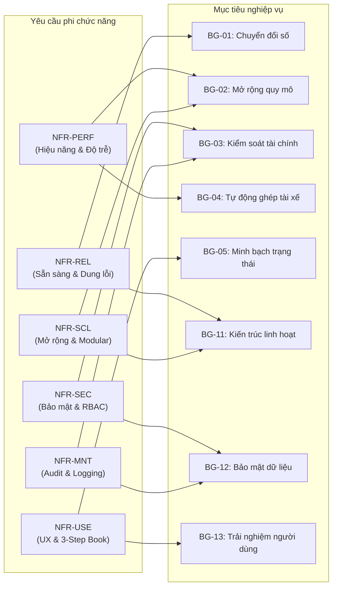
```mermaid
flowchart LR
    subgraph NFRs["Yêu cầu phi chức năng"]
        NFR_PERF["NFR-PERF\n(Hiệu năng & Độ trễ)"]
        NFR_SEC["NFR-SEC\n(Bảo mật & RBAC)"]
        NFR_REL["NFR-REL\n(Sẵn sàng & Dung lỗi)"]
        NFR_SCL["NFR-SCL\n(Mở rộng & Modular)"]
        NFR_USE["NFR-USE\n(UX & 3-Step Book)"]
        NFR_MNT["NFR-MNT\n(Audit & Logging)"]
    end

    subgraph BusinessGoals["Mục tiêu nghiệp vụ"]
        BG01["BG-01: Chuyển đổi số"]
        BG02["BG-02: Mở rộng quy mô"]
        BG03["BG-03: Kiểm soát tài chính"]
        BG04["BG-04: Tự động ghép tài xế"]
        BG05["BG-05: Minh bạch trạng thái"]
        BG11["BG-11: Kiến trúc linh hoạt"]
        BG12["BG-12: Bảo mật dữ liệu"]
        BG13["BG-13: Trải nghiệm người dùng"]
    end

    NFR_PERF --> BG02
    NFR_PERF --> BG04
    NFR_SEC --> BG12
    NFR_SEC --> BG03
    NFR_REL --> BG01
    NFR_REL --> BG11
    NFR_SCL --> BG02
    NFR_SCL --> BG11
    NFR_USE --> BG05
    NFR_USE --> BG13
    NFR_MNT --> BG12
    NFR_MNT --> BG03
```

| Nhóm Yêu cầu Phi chức năng | Mã NFR cụ thể | Mục tiêu Nghiệp vụ phục vụ (Business Goals) |
|---|---|---|
| **Hiệu năng & Độ trễ (Performance)** | `NFR-PERF-01` $\rightarrow$ `NFR-PERF-05` | **BG-02** (Mở rộng quy mô), **BG-04** (Tự động phân công tài xế $< 2\text{ phút}$) |
| **Bảo mật & Quyền riêng tư (Security)** | `NFR-SEC-01` $\rightarrow$ `NFR-SEC-06` | **BG-12** (Bảo mật dữ liệu & RBAC), **BG-03** (Kiểm soát tài chính) |
| **Độ tin cậy & Sẵn sàng (Reliability)** | `NFR-REL-01` $\rightarrow$ `NFR-REL-05` | **BG-01** (Chuyển đổi số ổn định), **BG-11** (Kiến trúc linh hoạt, cách ly lỗi) |
| **Khả năng mở rộng (Scalability)** | `NFR-SCL-01` $\rightarrow$ `NFR-SCL-03` | **BG-02** (Mở rộng phục vụ lớn), **BG-11** (Kiến trúc cắm rút Provider) |
| **Khả năng sử dụng (Usability)** | `NFR-USE-01` $\rightarrow$ `NFR-USE-04` | **BG-05** (Minh bạch trạng thái), **BG-13** (Trải nghiệm người dùng tối ưu) |
| **Bảo trì & Giám sát (Maintainability)** | `NFR-MNT-01` $\rightarrow$ `NFR-MNT-04` | **BG-03** (Đối soát tài chính), **BG-12** (Ghi vết kiểm toán thanh tra) |

---

## Giai đoạn 6 – Mô hình hóa Use Case (Use Case Modeling & Diagrams)

Mô hình hóa Use Case mô tả trực quan các tương tác giữa các **Tác nhân (Actors)** và **Hệ thống CAB (CAB Platform)** nhằm đạt được các mục tiêu nghiệp vụ cụ thể.

---

### 6.1 Danh mục Tác nhân (Actor Catalog)

| Tác nhân (Actor) | Phân loại | Mô tả vai trò & Trách nhiệm chính trong hệ thống |
|---|:---:|---|
| **Khách hàng (Customer)** | Primary Actor | Người dùng đầu cuối sử dụng ứng dụng để tìm địa chỉ, xem giá cước, đặt chuyến, theo dõi tài xế trên bản đồ thời gian thực, thanh toán và đánh giá chất lượng dịch vụ. |
| **Tài xế (Driver)** | Primary Actor | Đối tác vận chuyển đăng ký hồ sơ xe, bật trạng thái trực tuyến nhận cuốc, tiếp nhận/từ chối cuốc xe, cập nhật các mốc hành trình di chuyển, phát tọa độ GPS và xác nhận thu cước tiền mặt. |
| **Nhân viên vận hành (Operator)** | Primary Actor | Nhân viên nội bộ chịu trách nhiệm vận hành hàng ngày: duyệt hồ sơ tài xế mới, giám sát toàn cảnh bản đồ xe trực tuyến, hỗ trợ xử lý khiếu nại hoặc can thiệp cuốc xe sự cố. |
| **Quản trị viên (Admin)** | Primary Actor | Người nắm quyền cao nhất trong hệ thống: cấu hình biểu phí xe, phân quyền tài khoản, khóa tài khoản vi phạm, xem toàn bộ báo cáo doanh thu tài chính và tra cứu nhật ký kiểm toán. |
| **Cổng thanh toán (Payment Gateway)** | Supporting Actor | Hệ thống bên thứ ba (hoặc Mock Gateway) tiếp nhận yêu cầu thanh toán thẻ/ví điện tử, xác thực giao dịch và trả kết quả thành công/thất bại về cho CAB Platform. |
| **Dịch vụ Bản đồ (Map Service)** | Supporting Actor | Dịch vụ bên ngoài (OpenStreetMap / Nominatim) cung cấp dữ liệu bản đồ nền, Geocoding (chuyển chữ sang tọa độ), tính toán lộ trình khoảng cách và thời gian di chuyển. |
| **Dịch vụ Email (Email Service)** | Supporting Actor | Hệ thống SMTP / Nodemailer tiếp nhận yêu cầu gửi email xác nhận đăng ký, email chào mừng và hóa đơn điện tử sau chuyến đi. |

---

### 6.2 Sơ đồ Use Case Tổng thể (System-Level Use Case Diagram)

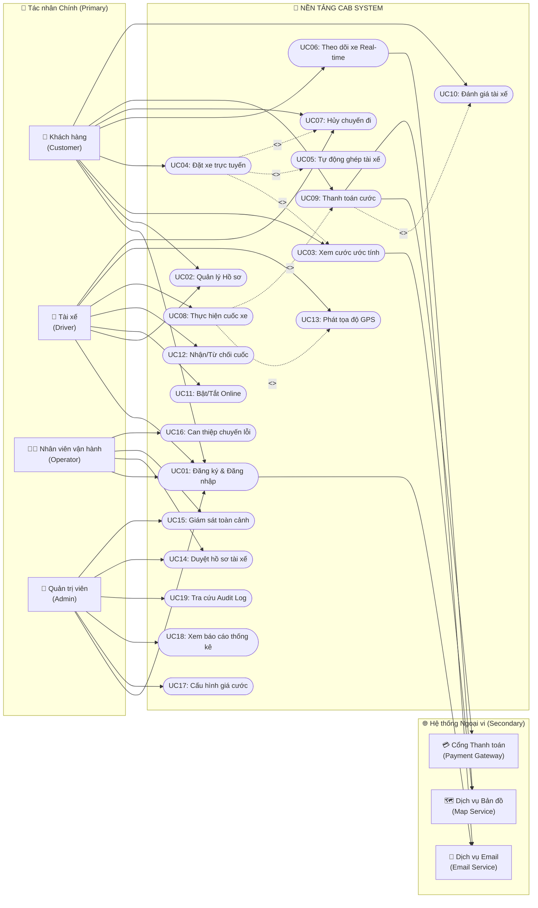
```mermaid
graph LR
    %% Actors
    subgraph Primary_Actors["👥 Tác nhân Chính (Primary)"]
        Cust["🧑 Khách hàng\n(Customer)"]
        Drv["🚗 Tài xế\n(Driver)"]
        Op["👨‍💼 Nhân viên vận hành\n(Operator)"]
        Adm["👑 Quản trị viên\n(Admin)"]
    end

    subgraph External_Actors["🌐 Hệ thống Ngoại vi (Secondary)"]
        MapAPI["🗺️ Dịch vụ Bản đồ\n(Map Service)"]
        PayGW["💳 Cổng Thanh toán\n(Payment Gateway)"]
        MailSvc["📧 Dịch vụ Email\n(Email Service)"]
    end

    %% System Boundary
    subgraph CAB_Platform["🚖 NỀN TẢNG CAB SYSTEM"]
        %% Auth Use Cases
        UC_Auth(["UC01: Đăng ký & Đăng nhập"])
        UC_Profile(["UC02: Quản lý Hồ sơ"])

        %% Core Ride Use Cases
        UC_Estimate(["UC03: Xem cước ước tính"])
        UC_Book(["UC04: Đặt xe trực tuyến"])
        UC_Match(["UC05: Tự động ghép tài xế"])
        UC_Track(["UC06: Theo dõi xe Real-time"])
        UC_Cancel(["UC07: Hủy chuyến đi"])
        UC_Execute(["UC08: Thực hiện cuốc xe"])
        
        %% Payment & Review
        UC_Pay(["UC09: Thanh toán cước"])
        UC_Review(["UC10: Đánh giá tài xế"])
        
        %% Driver Ops
        UC_Online(["UC11: Bật/Tắt Online"])
        UC_Accept(["UC12: Nhận/Từ chối cuốc"])
        UC_GPS(["UC13: Phát tọa độ GPS"])

        %% Admin & Operator Ops
        UC_ApproveDrv(["UC14: Duyệt hồ sơ tài xế"])
        UC_Monitor(["UC15: Giám sát toàn cảnh"])
        UC_Intervene(["UC16: Can thiệp chuyến lỗi"])
        UC_Pricing(["UC17: Cấu hình giá cước"])
        UC_Report(["UC18: Xem báo cáo thống kê"])
        UC_Audit(["UC19: Tra cứu Audit Log"])
    end

    %% Customer Connections
    Cust --> UC_Auth
    Cust --> UC_Profile
    Cust --> UC_Estimate
    Cust --> UC_Book
    Cust --> UC_Track
    Cust --> UC_Cancel
    Cust --> UC_Pay
    Cust --> UC_Review

    %% Driver Connections
    Drv --> UC_Auth
    Drv --> UC_Profile
    Drv --> UC_Online
    Drv --> UC_Accept
    Drv --> UC_Execute
    Drv --> UC_GPS
    Drv --> UC_Cancel

    %% Operator Connections
    Op --> UC_Auth
    Op --> UC_ApproveDrv
    Op --> UC_Monitor
    Op --> UC_Intervene

    %% Admin Connections (Admin inherits Operator capabilities)
    Adm --> UC_Auth
    Adm --> UC_Pricing
    Adm --> UC_Report
    Adm --> UC_Audit
    Adm --> UC_ApproveDrv
    Adm --> UC_Monitor

    %% Includes & Extends Relationships
    UC_Book -.->|"<<include>>"| UC_Estimate
    UC_Book -.->|"<<include>>"| UC_Match
    UC_Execute -.->|"<<include>>"| UC_GPS
    UC_Execute -.->|"<<include>>"| UC_Pay
    UC_Pay -.->|"<<extend>>"| UC_Review
    UC_Book -.->|"<<extend>>"| UC_Cancel

    %% External Systems Connections
    UC_Estimate --> MapAPI
    UC_Track --> MapAPI
    UC_Pay --> PayGW
    UC_Auth --> MailSvc
    UC_Pay --> MailSvc
```

---

### 6.3 Sơ đồ Use Case theo từng Nhóm Tác nhân

---

#### 6.3.1 Sơ đồ Use Case Phân hệ Khách hàng (Customer Subsystem)

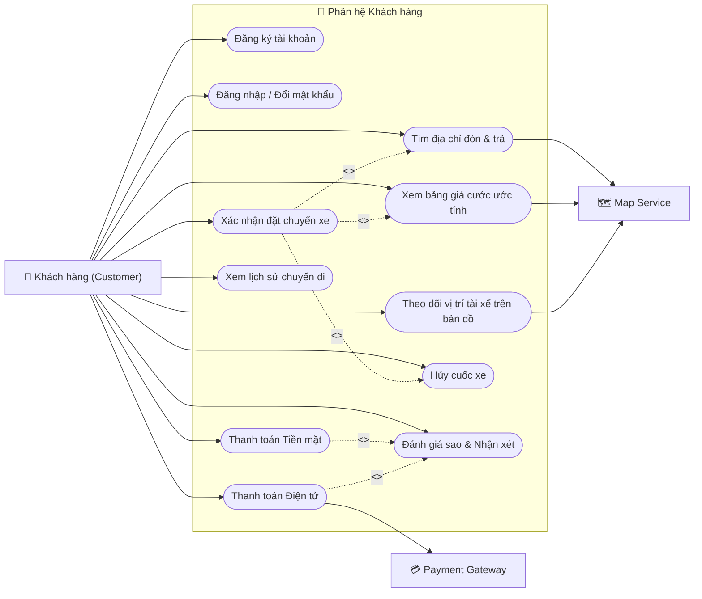
```mermaid
graph LR
    Customer["🧑 Khách hàng (Customer)"]
    MapService["🗺️ Map Service"]
    PaymentGateway["💳 Payment Gateway"]

    subgraph Customer_UseCases["📱 Phân hệ Khách hàng"]
        UC_C1(["Đăng ký tài khoản"])
        UC_C2(["Đăng nhập / Đổi mật khẩu"])
        UC_C3(["Tìm địa chỉ đón & trả"])
        UC_C4(["Xem bảng giá cước ước tính"])
        UC_C5(["Xác nhận đặt chuyến xe"])
        UC_C6(["Theo dõi vị trí tài xế trên bản đồ"])
        UC_C7(["Hủy cuốc xe"])
        UC_C8(["Thanh toán Tiền mặt"])
        UC_C9(["Thanh toán Điện tử"])
        UC_C10(["Đánh giá sao & Nhận xét"])
        UC_C11(["Xem lịch sử chuyến đi"])
    end

    Customer --> UC_C1
    Customer --> UC_C2
    Customer --> UC_C3
    Customer --> UC_C4
    Customer --> UC_C5
    Customer --> UC_C6
    Customer --> UC_C7
    Customer --> UC_C8
    Customer --> UC_C9
    Customer --> UC_C10
    Customer --> UC_C11

    UC_C3 --> MapService
    UC_C4 --> MapService
    UC_C6 --> MapService
    UC_C9 --> PaymentGateway

    UC_C5 -.->|"<<include>>"| UC_C3
    UC_C5 -.->|"<<include>>"| UC_C4
    UC_C5 -.->|"<<extend>>"| UC_C7
    UC_C8 -.->|"<<extend>>"| UC_C10
    UC_C9 -.->|"<<extend>>"| UC_C10
```

---

#### 6.3.2 Sơ đồ Use Case Phân hệ Tài xế (Driver Subsystem)

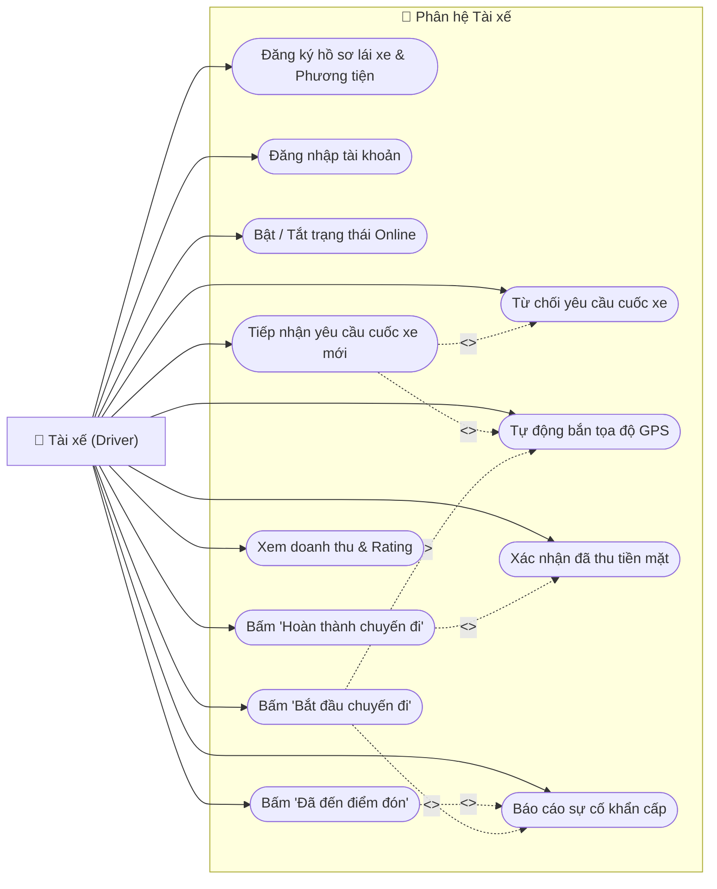
```mermaid
graph LR
    Driver["🚗 Tài xế (Driver)"]

    subgraph Driver_UseCases["📱 Phân hệ Tài xế"]
        UC_D1(["Đăng ký hồ sơ lái xe & Phương tiện"])
        UC_D2(["Đăng nhập tài khoản"])
        UC_D3(["Bật / Tắt trạng thái Online"])
        UC_D4(["Tiếp nhận yêu cầu cuốc xe mới"])
        UC_D5(["Từ chối yêu cầu cuốc xe"])
        UC_D6(["Bấm 'Đã đến điểm đón'"])
        UC_D7(["Bấm 'Bắt đầu chuyến đi'"])
        UC_D8(["Bấm 'Hoàn thành chuyến đi'"])
        UC_D9(["Tự động bắn tọa độ GPS"])
        UC_D10(["Xác nhận đã thu tiền mặt"])
        UC_D11(["Báo cáo sự cố khẩn cấp"])
        UC_D12(["Xem doanh thu & Rating"])
    end

    Driver --> UC_D1
    Driver --> UC_D2
    Driver --> UC_D3
    Driver --> UC_D4
    Driver --> UC_D5
    Driver --> UC_D6
    Driver --> UC_D7
    Driver --> UC_D8
    Driver --> UC_D9
    Driver --> UC_D10
    Driver --> UC_D11
    Driver --> UC_D12

    UC_D4 -.->|"<<include>>"| UC_D9
    UC_D7 -.->|"<<include>>"| UC_D9
    UC_D8 -.->|"<<include>>"| UC_D10
    UC_D4 -.->|"<<extend>>"| UC_D5
    UC_D6 -.->|"<<extend>>"| UC_D11
    UC_D7 -.->|"<<extend>>"| UC_D11
```

---

#### 6.3.3 Sơ đồ Use Case Phân hệ Vận hành & Quản trị (Operator & Admin Subsystem)

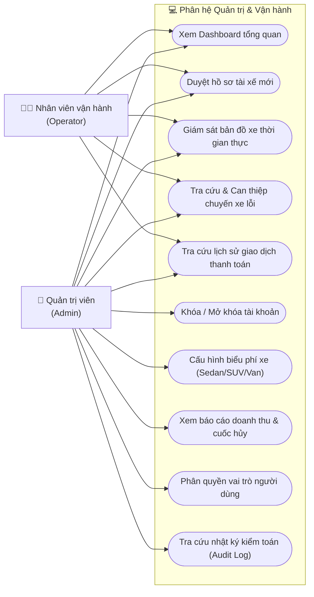
```mermaid
graph LR
    Operator["👨‍💼 Nhân viên vận hành\n(Operator)"]
    Admin["👑 Quản trị viên\n(Admin)"]

    subgraph Management_UseCases["💻 Phân hệ Quản trị & Vận hành"]
        UC_M1(["Xem Dashboard tổng quan"])
        UC_M2(["Duyệt hồ sơ tài xế mới"])
        UC_M3(["Giám sát bản đồ xe thời gian thực"])
        UC_M4(["Tra cứu & Can thiệp chuyến xe lỗi"])
        UC_M5(["Tra cứu lịch sử giao dịch thanh toán"])
        UC_M6(["Khóa / Mở khóa tài khoản"])
        UC_M7(["Cấu hình biểu phí xe (Sedan/SUV/Van)"])
        UC_M8(["Xem báo cáo doanh thu & cuốc hủy"])
        UC_M9(["Phân quyền vai trò người dùng"])
        UC_M10(["Tra cứu nhật ký kiểm toán (Audit Log)"])
    end

    Operator --> UC_M1
    Operator --> UC_M2
    Operator --> UC_M3
    Operator --> UC_M4
    Operator --> UC_M5

    Admin --> UC_M1
    Admin --> UC_M2
    Admin --> UC_M3
    Admin --> UC_M4
    Admin --> UC_M5
    Admin --> UC_M6
    Admin --> UC_M7
    Admin --> UC_M8
    Admin --> UC_M9
    Admin --> UC_M10
```

---

### 6.4 Bảng Đặc tả Chi tiết các Use Case Cốt lõi (Use Case Specifications)

---

#### 📋 UC-01: Đặt xe trực tuyến & Tự động ghép nối tài xế (Book a Ride & Match Driver)

| Thuộc tính | Nội dung đặc tả chi tiết |
|---|---|
| **Mã Use Case** | `UC-01` |
| **Tên Use Case** | Đặt xe trực tuyến & Tự động ghép nối tài xế |
| **Tác nhân chính (Primary Actor)** | Khách hàng (Customer) |
| **Tác nhân hỗ trợ (Supporting Actors)** | Tài xế (Driver), Dịch vụ Bản đồ (Map Service), Hệ thống CAB |
| **Mô tả tóm tắt** | Khách hàng nhập địa chỉ đón, địa chỉ đến, chọn loại xe (Sedan/SUV/Van), xem giá ước tính và bấm đặt xe. Hệ thống tự động quét và điều phối tài xế phù hợp gần nhất trong vòng bán kính 5km. |
| **Tiền điều kiện (Preconditions)** | 1. Khách hàng đã đăng nhập tài khoản thành công.<br>2. Thiết bị khách hàng có kết nối Internet ổn định. |
| **Hậu điều kiện (Postconditions)** | 1. Bản ghi chuyến đi (Ride) được tạo với trạng thái `accepted`.<br>2. Tài xế nhận cuốc chuyển sang trạng thái `Busy`.<br>3. Khách hàng và tài xế nhận thông báo ghép cuốc thành công kèm vị trí và ETA. |
| **Luồng sự kiện chính (Main Success Scenario - Happy Path)** | 1. Khách hàng mở màn hình Đặt xe, nhập Điểm đón và Điểm đến.<br>2. Hệ thống gọi Map Service để định vị tọa độ và vẽ lộ trình mẫu.<br>3. Khách hàng chọn hạng xe mong muốn (Sedan 4 chỗ / SUV 7 chỗ / Van 16 chỗ).<br>4. Hệ thống áp dụng `BRULE-01` tính toán và hiển thị cước phí ước tính cùng thời gian di chuyển dự kiến.<br>5. Khách hàng chọn phương thức thanh toán dự kiến và bấm nút **"Xác nhận đặt xe"**.<br>6. Hệ thống tạo Ride với trạng thái `searching`.<br>7. Hệ thống thực hiện `BRULE-02` quét danh sách tài xế `Available` trong bán kính 5km, sắp xếp theo khoảng cách gần nhất.<br>8. Hệ thống gửi thông báo mời cuốc kèm đếm ngược 30 giây đến Tài xế ưu tiên số 1 qua Socket.<br>9. Tài xế bấm nút **"Chấp nhận"** trong vòng 30 giây.<br>10. Hệ thống cập nhật trạng thái Ride sang `accepted`, chuyển tài xế sang `Busy`.<br>11. Hệ thống phát socket thông báo ghép xe thành công cho Khách hàng kèm tên, SĐT, biển số xe và tọa độ GPS tài xế. |
| **Luồng nhánh (Alternative Flows)** | **A1: Tài xế đầu tiên từ chối hoặc quá 30 giây không bấm nhận (`BRULE-03` / `EX-02`)**<br>1. Tại bước 9, nếu tài xế bấm "Từ chối" hoặc hết 30s không phản hồi.<br>2. Hệ thống loại trừ tài xế này, tăng `RetryCount + 1`.<br>3. Hệ thống tự động chuyển yêu cầu cuốc xe sang Tài xế tiếp theo trong danh sách đã xếp hạng.<br>4. Lặp lại bước 8-9 cho đến khi có tài xế bấm Chấp nhận. |
| **Luồng ngoại lệ (Exception Flows)** | **E1: Không có tài xế nào quanh khu vực hoặc hết 5 lượt thử lại (`EX-01`)**<br>1. Tại bước 7 hoặc A1, nếu không còn tài xế khả dụng hoặc `RetryCount >= 5`.<br>2. Hệ thống chuyển trạng thái Ride sang `no_driver`.<br>3. Hiển thị thông báo xin lỗi khách hàng: *"Hiện các tài xế đều đang bận, vui lòng thử lại sau ít phút!"*<br>4. Kết thúc Use Case mà không trừ bất kỳ chi phí nào.<br><br>**E2: Khách hàng bấm Hủy chuyến khi đang tìm kiếm (`BRULE-06`)**<br>1. Khách hàng bấm nút "Hủy tìm xe" trên màn hình chờ.<br>2. Hệ thống chuyển trạng thái Ride sang `cancelled_by_customer`.<br>3. Hủy bỏ tiến trình quét tìm tài xế, kết thúc Use Case. |

---

#### 📋 UC-02: Thực hiện chuyến đi & Giám sát vị trí Real-time (Execute Ride & Live Tracking)

| Thuộc tính | Nội dung đặc tả chi tiết |
|---|---|
| **Mã Use Case** | `UC-02` |
| **Tên Use Case** | Thực hiện chuyến đi & Giám sát vị trí Real-time |
| **Tác nhân chính (Primary Actor)** | Tài xế (Driver), Khách hàng (Customer) |
| **Tác nhân hỗ trợ (Supporting Actors)** | Hệ thống CAB (Socket Server, Geolocation Engine) |
| **Mô tả tóm tắt** | Quản lý toàn bộ tiến trình di chuyển từ khi tài xế xuất phát đón khách đến khi chở khách đến nơi an toàn, đồng thời phát sóng tọa độ GPS liên tục lên bản đồ trực tiếp. |
| **Tiền điều kiện (Preconditions)** | Cuốc xe đang ở trạng thái `accepted`. |
| **Hậu điều kiện (Postconditions)** | Cuốc xe chuyển sang trạng thái `completed`, sẵn sàng chuyển sang bước tính cước và thanh toán. |
| **Luồng sự kiện chính (Main Success Scenario - Happy Path)** | 1. Tài xế bắt đầu di chuyển tới điểm hẹn, app tài xế tự động phát tọa độ GPS định kỳ mỗi 5-10s (`NFR-PERF-02`).<br>2. Bản đồ của khách hàng hiển thị biểu tượng xe di chuyển mượt mà về phía điểm đón kèm thời gian dự kiến đến (ETA).<br>3. Khi tới nơi đón, Tài xế bấm nút **"Đã đến điểm đón"**.<br>4. Hệ thống đổi trạng thái cuốc sang `driver_arrived`, phát âm thanh thông báo cho khách hàng.<br>5. Khách hàng bước lên xe. Tài xế bấm nút **"Bắt đầu chuyến đi"**.<br>6. Hệ thống đổi trạng thái cuốc sang `in_progress`, ghi nhận mốc thời gian `startedAt`.<br>7. Tài xế lái xe theo lộ trình di chuyển tới điểm trả khách. GPS tiếp tục phát sóng thời gian thực.<br>8. Khi đến đúng điểm đến, Tài xế bấm nút **"Hoàn thành chuyến đi"**.<br>9. Hệ thống ghi nhận mốc thời gian `completedAt`, tổng quãng đường thực tế và chuyển sang trạng thái `completed`. |
| **Luồng nhánh (Alternative Flows)** | **A1: Khách hàng hủy chuyến trước khi tài xế đến nơi (`EX-04`)**<br>1. Tại bước 1-2, khách hàng bấm "Hủy chuyến".<br>2. Hệ thống đổi trạng thái sang `cancelled_by_customer`.<br>3. Phát còi cảnh báo trên app tài xế, tự động đưa tài xế về lại trạng thái `Available`. |
| **Luồng ngoại lệ (Exception Flows)** | **E1: Khách không ra điểm đón quá 5 phút (`EX-05`)**<br>1. Tại bước 4, sau khi tài xế chờ quá 5 phút mà không liên lạc được khách.<br>2. Tài xế bấm nút "Hủy do khách vắng mặt".<br>3. Hệ thống đổi trạng thái sang `cancelled_by_driver (No-Show)`, giải phóng tài xế.<br><br>**E2: Mất tín hiệu mạng / GPS giữa đường (`EX-03`)**<br>1. Thiết bị tài xế mất sóng 3G/4G trong hành trình.<br>2. App tài xế tự động chuyển sang chế độ lưu đệm tọa độ ngoại tuyến (Offline Buffer).<br>3. Khi có mạng trở lại, app tự động gửi đồng bộ bù toàn bộ chuỗi tọa độ lên máy chủ. |

---

#### 📋 UC-03: Tính cước & Thanh toán Đa phương thức (Calculate Fare & Process Payment)

| Thuộc tính | Nội dung đặc tả chi tiết |
|---|---|
| **Mã Use Case** | `UC-03` |
| **Tên Use Case** | Tính cước & Thanh toán Đa phương thức |
| **Tác nhân chính (Primary Actor)** | Khách hàng (Customer), Tài xế (Driver) |
| **Tác nhân hỗ trợ (Supporting Actors)** | Cổng thanh toán (Payment Gateway), Dịch vụ Email (Email Service) |
| **Mô tả tóm tắt** | Hệ thống tự động tính cước phí thực tế dựa trên quãng đường và thời gian di chuyển, xuất hóa đơn điện tử và xử lý thu tiền qua Tiền mặt hoặc Cổng thanh toán điện tử. |
| **Tiền điều kiện (Preconditions)** | Cuốc xe vừa chuyển sang trạng thái `completed`. |
| **Hậu điều kiện (Postconditions)** | Bản ghi Payment chuyển sang trạng thái `COMPLETED`, hóa đơn được gửi qua Email cho khách hàng. |
| **Luồng sự kiện chính (Main Success Scenario - Happy Path)** | 1. Hệ thống áp dụng công thức `BRULE-01` tự động tính toán tổng tiền cước cuối cùng `actualFare`.<br>2. Hệ thống tạo hóa đơn `Payment` ở trạng thái `PENDING`, hiển thị chi tiết biểu phí lên màn hình của Khách hàng và Tài xế.<br>3. Khách hàng lựa chọn phương thức thanh toán:<br>&nbsp;&nbsp;&nbsp;&nbsp;• **Trường hợp Tiền mặt (`Cash`)**: Khách đưa tiền mặt cho Tài xế. Tài xế nhận đủ tiền và bấm nút **"Xác nhận đã thu tiền"**.<br>&nbsp;&nbsp;&nbsp;&nbsp;• **Trường hợp Điện tử (`E-Payment`)**: Khách chọn Thẻ/Ví $\rightarrow$ Hệ thống gọi API Cổng thanh toán $\rightarrow$ Cổng thanh toán trả về mã giao dịch `TransactionId` thành công.<br>4. Hệ thống cập nhật trạng thái Payment sang `COMPLETED`, ghi nhận `paidAt`.<br>5. Hệ thống gửi biên lai thanh toán qua Email cho khách hàng.<br>6. Màn hình tự động chuyển sang giao diện Đánh giá sao (Rating). |
| **Luồng nhánh (Alternative Flows)** | **A1: Khách hàng đổi phương thức thanh toán tại chỗ**<br>1. Tại bước 3, ban đầu khách chọn thẻ nhưng muốn đổi sang trả tiền mặt.<br>2. Khách bấm nút "Chuyển sang trả Tiền mặt" trên ứng dụng.<br>3. Hệ thống cập nhật phương thức thanh toán sang `CASH` và hiển thị yêu cầu thu tiền trên app tài xế. |
| **Luồng ngoại lệ (Exception Flows)** | **E1: Giao dịch thanh toán điện tử thất bại (`EX-07`)**<br>1. Cổng thanh toán trả về mã lỗi (thẻ hết tiền, timeout).<br>2. Hệ thống đổi trạng thái Payment sang `FAILED`.<br>3. Hiển thị thông báo lỗi và đưa ra 2 nút bấm: (1) "Thử lại thanh toán thẻ khác" hoặc (2) "Chuyển sang trả tiền mặt". |

---

#### 📋 UC-04: Xét duyệt Hồ sơ & Quản lý Tài xế (Approve & Manage Driver Profiles)

| Thuộc tính | Nội dung đặc tả chi tiết |
|---|---|
| **Mã Use Case** | `UC-04` |
| **Tên Use Case** | Xét duyệt Hồ sơ & Quản lý Tài xế |
| **Tác nhân chính (Primary Actor)** | Nhân viên vận hành (Operator), Quản trị viên (Admin) |
| **Tác nhân hỗ trợ (Supporting Actors)** | Dịch vụ Email (Email Service), Hệ thống CAB |
| **Mô tả tóm tắt** | Nhân viên vận hành kiểm tra giấy phép lái xe, thông tin phương tiện đăng ký của tài xế mới và đưa ra quyết định Phê duyệt hoặc Từ chối gia nhập hệ thống. |
| **Tiền điều kiện (Preconditions)** | 1. Operator/Admin đã đăng nhập vào Dashboard quản trị.<br>2. Có tài xế đã nộp hồ sơ ở trạng thái `Pending_Approval`. |
| **Hậu điều kiện (Postconditions)** | Hồ sơ tài xế chuyển sang `Approved` (được phép bật Online nhận cuốc) hoặc `Rejected` (kèm email thông báo lý do). |
| **Luồng sự kiện chính (Main Success Scenario - Happy Path)** | 1. Operator truy cập mục "Quản lý Tài xế" $\rightarrow$ Tab "Hồ sơ chờ duyệt".<br>2. Hệ thống hiển thị danh sách tài xế nộp đơn mới nhất.<br>3. Operator chọn xem chi tiết một hồ sơ: xem ảnh chụp bằng lái, hạng bằng, biển số xe, ảnh xe.<br>4. Operator đối soát tính hợp lệ của thông tin và bấm nút **"Phê duyệt hồ sơ"**.<br>5. Hệ thống cập nhật `isApproved = true`, ghi nhận thời gian `approvedAt`.<br>6. Hệ thống tự động ghi nhật ký kiểm toán vào bảng `AuditLogs` (`BRULE-10`).<br>7. Hệ thống kích hoạt Email Service gửi thư thông báo chúc mừng tới email của tài xế. |
| **Luồng nhánh (Alternative Flows)** | **A1: Operator từ chối hồ sơ không hợp lệ**<br>1. Tại bước 4, Operator phát hiện bằng lái mờ hoặc hết hạn.<br>2. Operator bấm nút "Từ chối hồ sơ", nhập lý do từ chối vào ô ghi chú.<br>3. Hệ thống cập nhật `isApproved = false`.<br>4. Hệ thống gửi email thông báo lý do từ chối và hướng dẫn tài xế chụp lại ảnh để nộp lại. |
| **Luồng ngoại lệ (Exception Flows)** | **E1: Tài khoản tài xế có dấu hiệu gian lận bị phát hiện sau khi duyệt**<br>1. Admin phát hiện tài xế đã được duyệt có hành vi vi phạm chính sách.<br>2. Admin bấm nút "Khóa tài khoản tài xế" trên bảng quản trị.<br>3. Hệ thống đổi `isActive = false`, ngắt kết nối socket của tài xế và ghi log kiểm toán. |

---

*Document prepared by: Vo Tat Thien (22652711)*  
*Last updated: 2026-08-20*  
*Phase: Giai đoạn 6 – Mô hình hóa Use Case (Use Case Modeling & Diagrams)*


